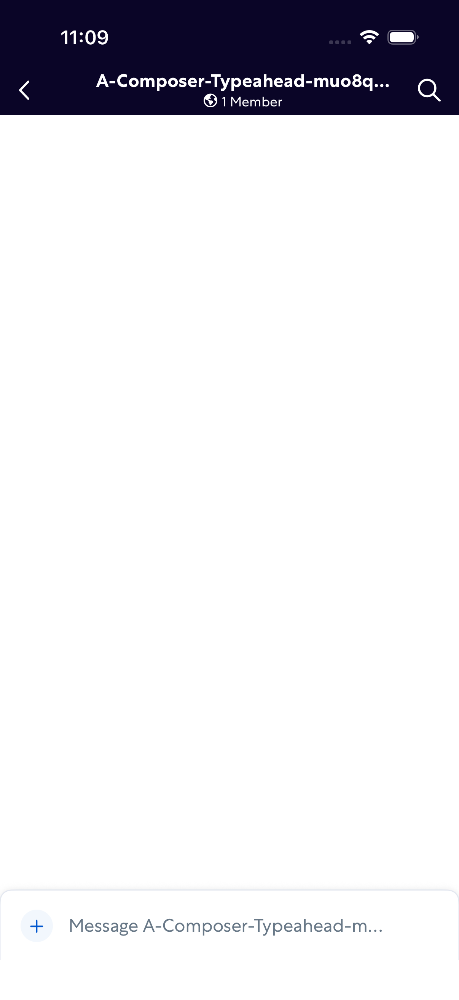
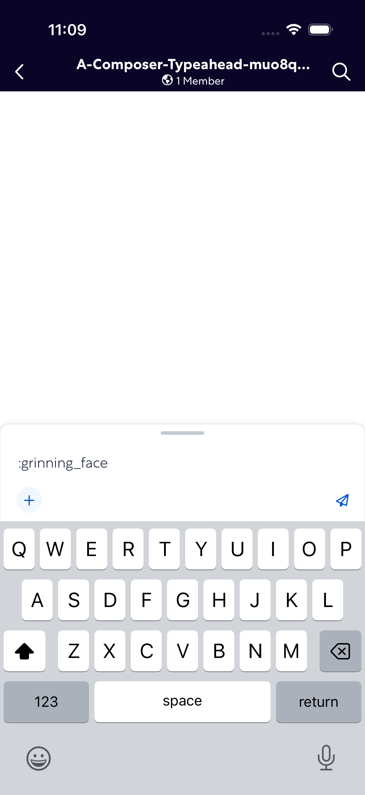

# ComposerTypeahead

- Status: FAIL
- Duration: 1m 8s
- Lane: ConversationView
- Logical category: ConversationView
- Device: iPhone 17
- Appium port: 4727
- Started: 2026-09-30T15:08:25.725Z
- Finished: 2026-09-30T15:09:33.761Z

## Failure

```text
Visible control with source label ":grinning_face:" did not appear
```

## Phase Timings

| Phase | Duration |
| --- | --- |
| Session creation | 0ms |
| Login/readiness | 27s |
| Test body | 41s |
| Screenshot capture | 242ms |
| Recovery | 148ms |
| Report generation | 0ms |

## Steps

### Step 1: Room Opened



### Step 2: ERROR - Failed here



**Failure at this step:**

```text
Visible control with source label ":grinning_face:" did not appear
```
