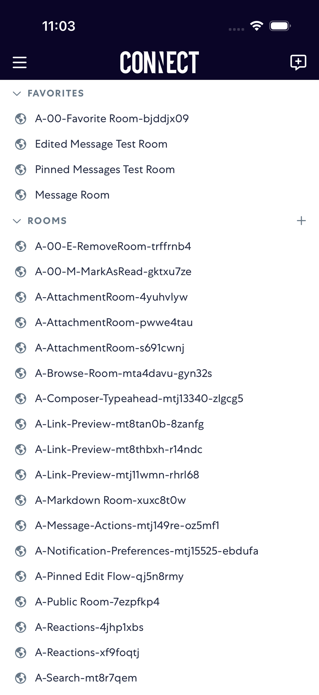

# CreateRoom

- Status: FAIL
- Duration: 36s
- Lane: main-suite
- Logical category: main-suite
- Device: iPhone 17 Pro
- Appium port: 4723
- Started: 2026-09-30T15:02:36.744Z
- Finished: 2026-09-30T15:03:13.081Z

## Failure

```text
element ("~createRoomButton") still not displayed after 20000ms
```

## Phase Timings

| Phase | Duration |
| --- | --- |
| Session creation | 0ms |
| Login/readiness | 5s |
| Test body | 31s |
| Screenshot capture | 334ms |
| Recovery | 3s |
| Report generation | 0ms |

## Steps

### Step 1: ERROR - Failed here



**Failure at this step:**

```text
element ("~createRoomButton") still not displayed after 20000ms
```
