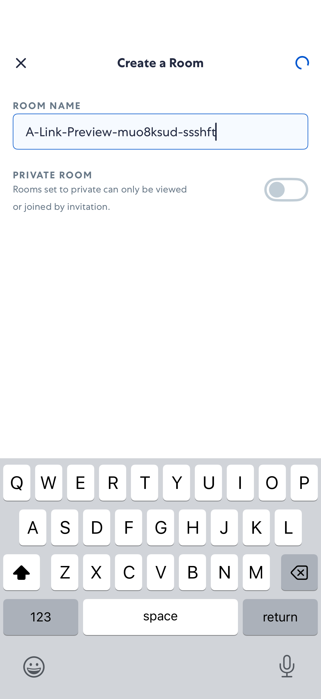

# LinkPreviews

- Status: FAIL
- Duration: 41s
- Lane: ConversationView
- Logical category: ConversationView
- Device: iPhone 17
- Appium port: 4727
- Started: 2026-09-30T15:04:30.932Z
- Finished: 2026-09-30T15:05:11.888Z

## Failure

```text
element ("-ios predicate string:(type == "XCUIElementTypeButton" OR type == "XCUIElementTypeStaticText") AND (label == "Skip for now" OR name == "Skip for now")") still not displayed after 20000ms
```

## Phase Timings

| Phase | Duration |
| --- | --- |
| Session creation | 0ms |
| Login/readiness | 5s |
| Test body | 36s |
| Screenshot capture | 385ms |
| Recovery | 176ms |
| Report generation | 0ms |

## Steps

### Step 1: ERROR - Failed here



**Failure at this step:**

```text
element ("-ios predicate string:(type == "XCUIElementTypeButton" OR type == "XCUIElementTypeStaticText") AND (label == "Skip for now" OR name == "Skip for now")") still not displayed after 20000ms
```
