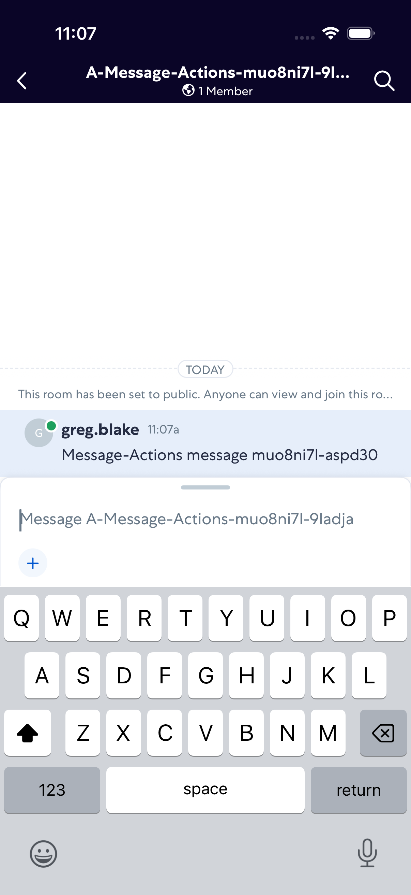
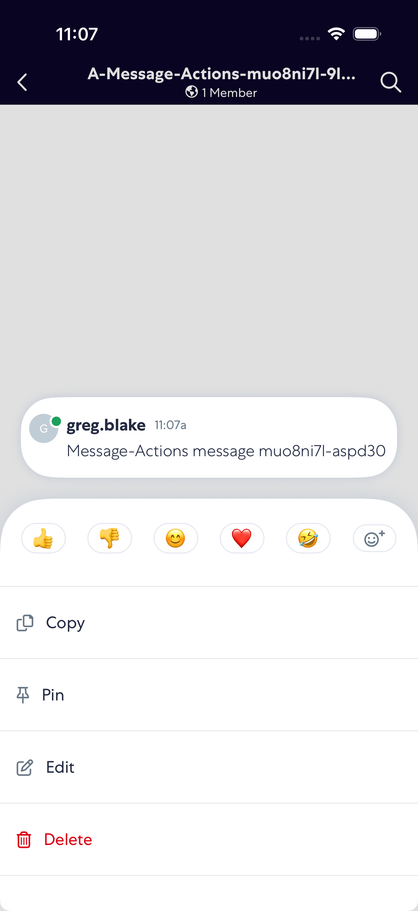
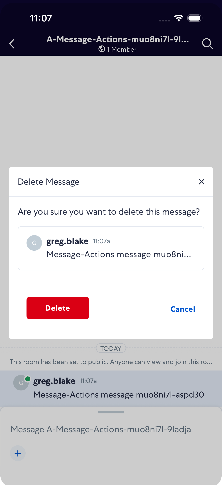
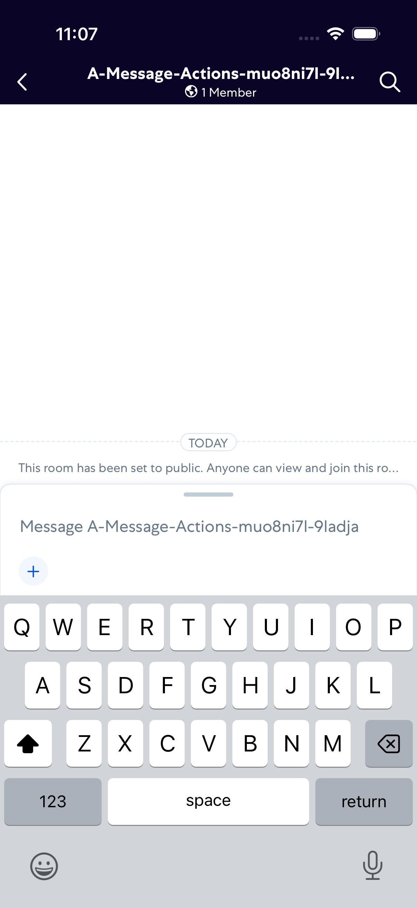

# MessageActions

- Status: PASS
- Duration: 1m 17s
- Lane: main-suite
- Logical category: ConversationView
- Device: iPhone 17 Pro
- Appium port: 4723
- Started: 2026-09-30T15:06:11.038Z
- Finished: 2026-09-30T15:07:28.039Z

## Phase Timings

| Phase | Duration |
| --- | --- |
| Session creation | 0ms |
| Login/readiness | 31s |
| Test body | 45s |
| Screenshot capture | 780ms |
| Recovery | 0ms |
| Report generation | 0ms |
| Room creation (test-owned) | 6s |

## Steps

### Step 1: Message Sent

### Step 2: Copy Action Open

### Step 3: Delete Action Open

### Step 4: Delete Confirmation

### Step 5: Message Deleted

