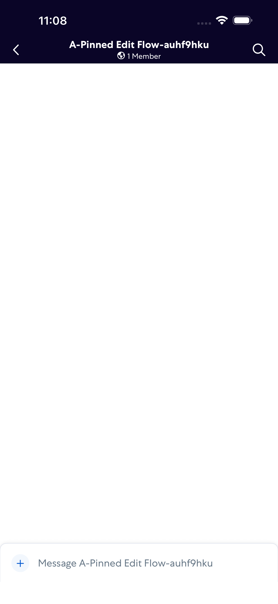
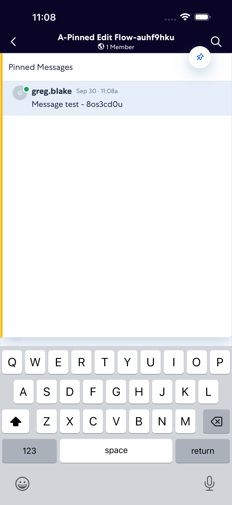

# PinnedMessageEditFlow

- Status: FAIL
- Duration: 55s
- Lane: Conversation-List
- Logical category: ConversationView
- Device: iPhone 17 Pro Max
- Appium port: 4725
- Started: 2026-09-30T15:07:40.146Z
- Finished: 2026-09-30T15:08:34.762Z

## Failure

```text
Pinned messages panel did not open
```

## Phase Timings

| Phase | Duration |
| --- | --- |
| Session creation | 0ms |
| Login/readiness | 5s |
| Test body | 49s |
| Screenshot capture | 367ms |
| Recovery | 432ms |
| Report generation | 0ms |

## Steps

### Step 1: Room Opened



### Step 2: ERROR - Failed here



**Failure at this step:**

```text
Pinned messages panel did not open
```
