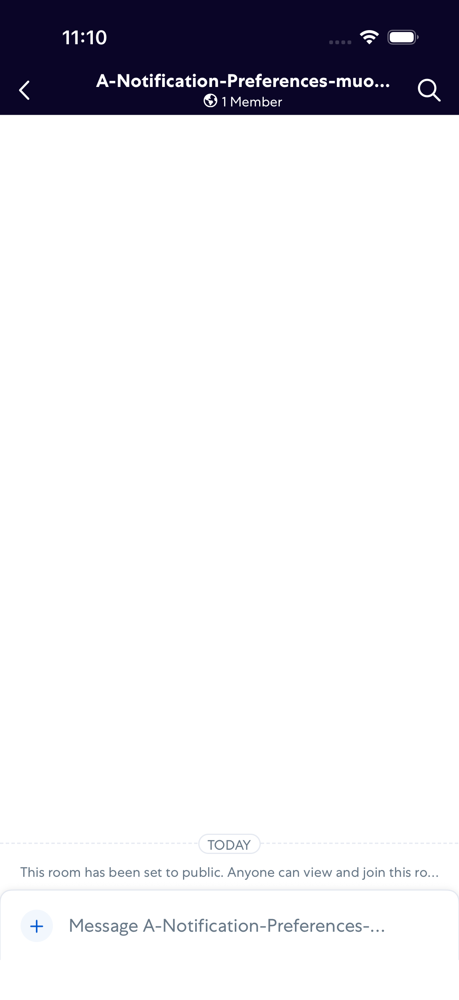
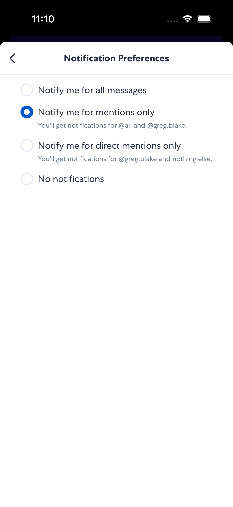
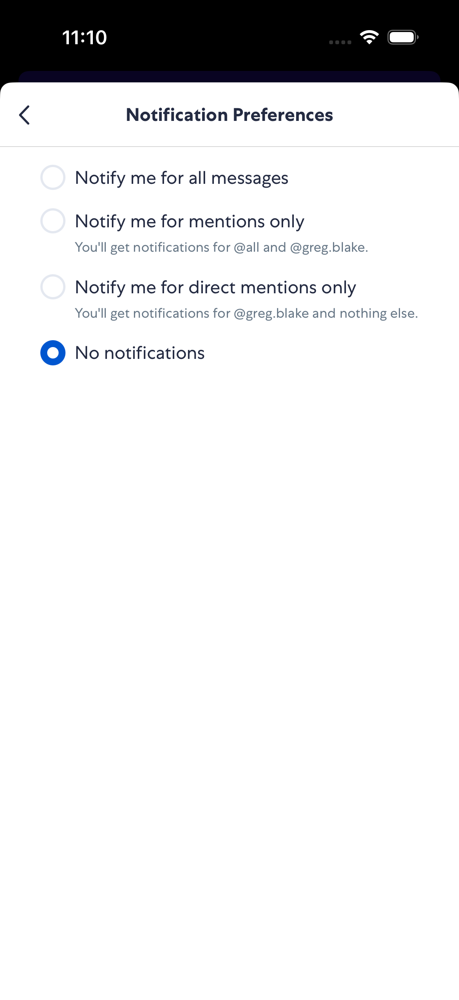
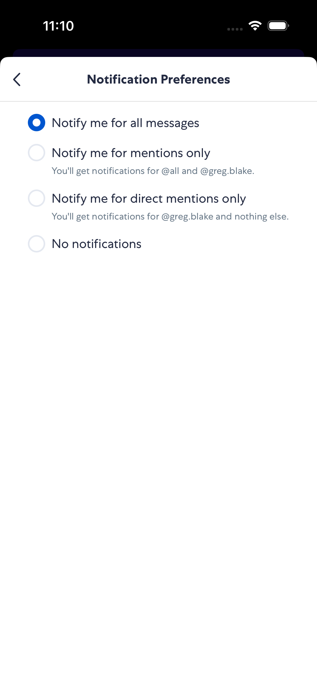

# RoomNotificationPreferences

- Status: PASS
- Duration: 59s
- Lane: ConversationView
- Logical category: ConversationView
- Device: iPhone 17
- Appium port: 4727
- Started: 2026-09-30T15:09:33.914Z
- Finished: 2026-09-30T15:10:32.451Z

## Phase Timings

| Phase | Duration |
| --- | --- |
| Session creation | 0ms |
| Login/readiness | 15s |
| Test body | 43s |
| Screenshot capture | 583ms |
| Recovery | 0ms |
| Report generation | 0ms |
| Room creation (test-owned) | 4s |

## Steps

### Step 1: Room Opened

### Step 2: Preferences Open

### Step 3: Preference Selected

### Step 4: Preference Persisted

### Step 5: Restore Persisted

