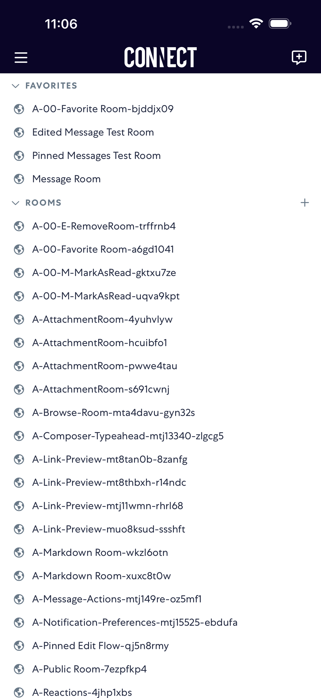

# markAsRead

- Status: FAIL
- Duration: 1m 33s
- Lane: Conversation-List
- Logical category: Conversation-List
- Device: iPhone 17 Pro Max
- Appium port: 4725
- Started: 2026-09-30T15:05:13.701Z
- Finished: 2026-09-30T15:06:46.280Z

## Failure

```text
WebDriverError: Request with GET/HEAD method cannot have body. when running "element/70020000-0000-0000-5579-000000000000/screenshot" with method "GET" and args "{"scroll":true}"
```

## Phase Timings

| Phase | Duration |
| --- | --- |
| Session creation | 0ms |
| Login/readiness | 45s |
| Test body | 47s |
| Screenshot capture | 285ms |
| Recovery | 397ms |
| Report generation | 0ms |

## Steps

### Step 1: ERROR - Failed here



**Failure at this step:**

```text
WebDriverError: Request with GET/HEAD method cannot have body. when running "element/70020000-0000-0000-5579-000000000000/screenshot" with method "GET" and args "{"scroll":true}"
```
