# markdowns

- Status: PASS
- Duration: 1m 41s
- Lane: main-suite
- Logical category: ConversationView
- Device: iPhone 17 Pro
- Appium port: 4723
- Started: 2026-09-30T15:03:15.614Z
- Finished: 2026-09-30T15:04:56.729Z

## Phase Timings

| Phase | Duration |
| --- | --- |
| Session creation | 0ms |
| Login/readiness | 5s |
| Test body | 1m 34s |
| Screenshot capture | 2s |
| Recovery | 0ms |
| Report generation | 0ms |

## Steps

### Step 1: Headings

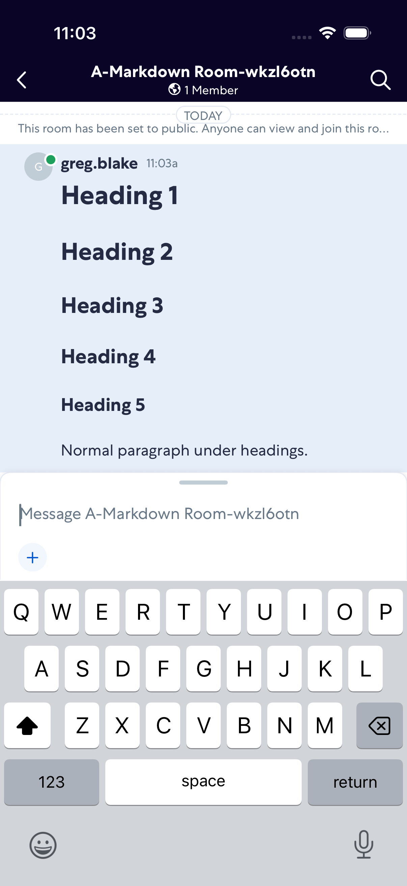

### Step 2: Room Opened

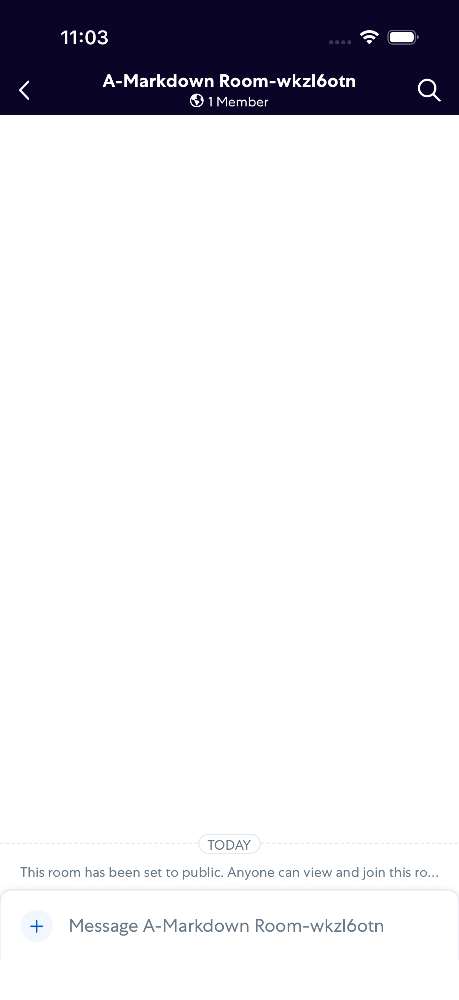

### Step 3: Emphasis

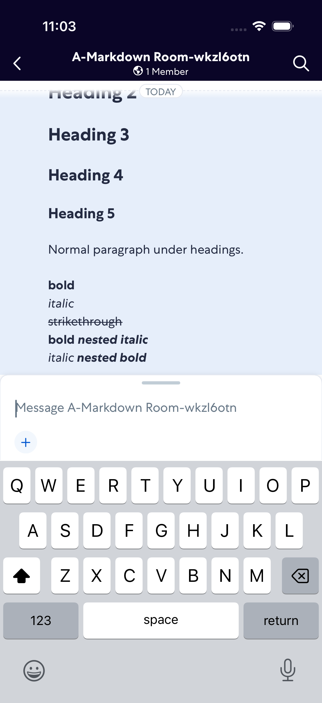

### Step 4: Links

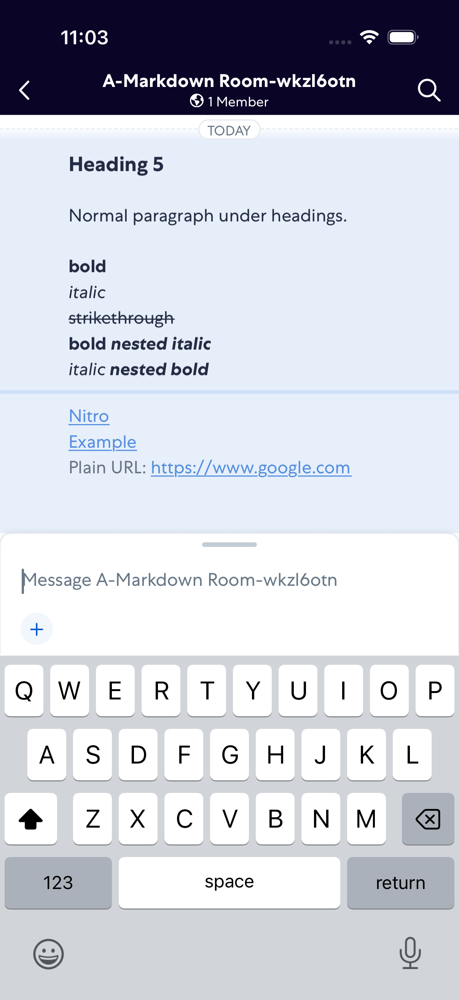

### Step 5: Inline Code

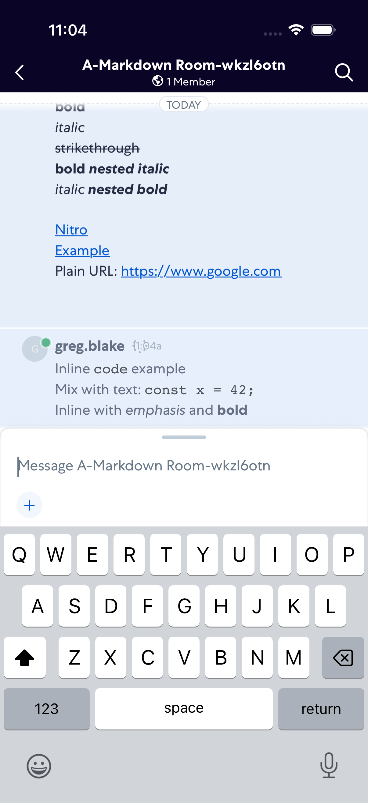

### Step 6: Code Block

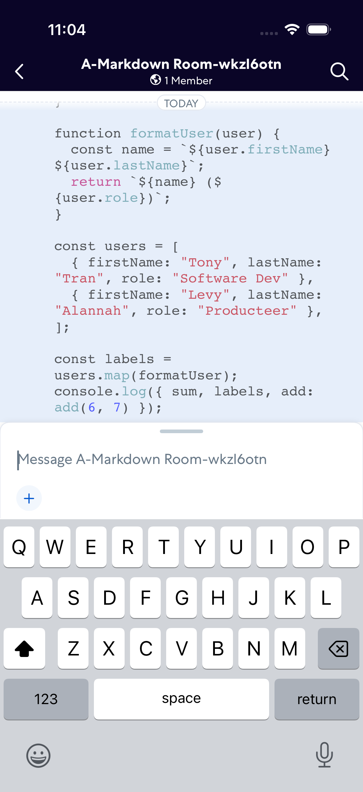

### Step 7: Lists

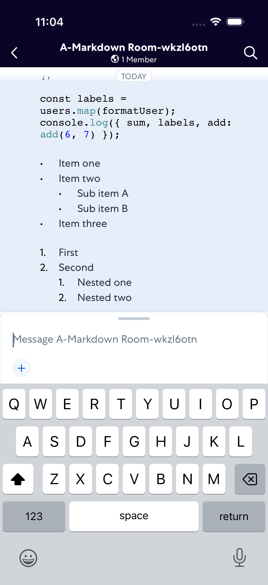

### Step 8: Blockquote

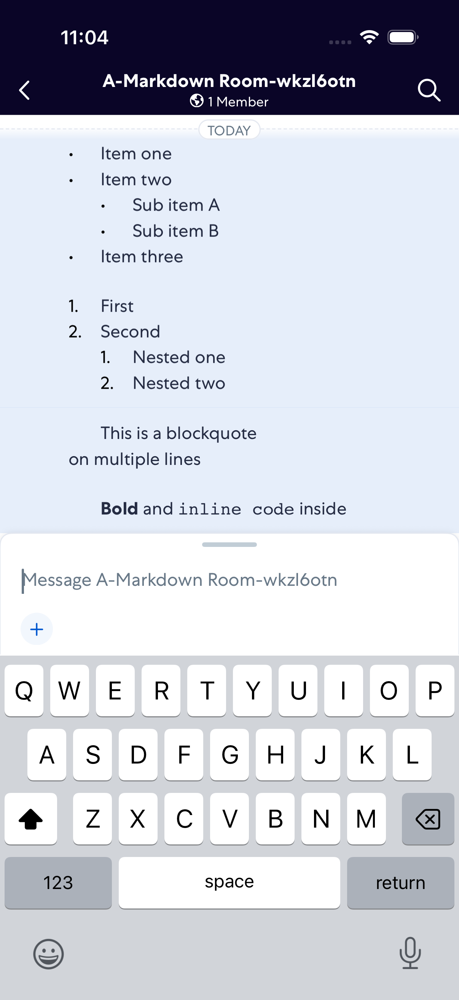

### Step 9: Mixed

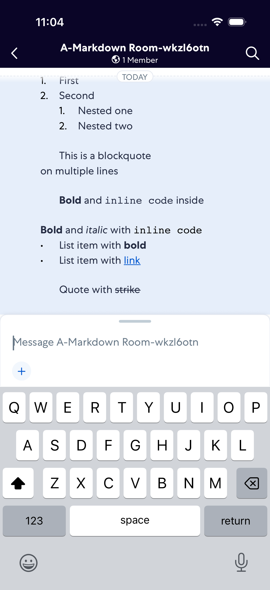

### Step 10: Emojis

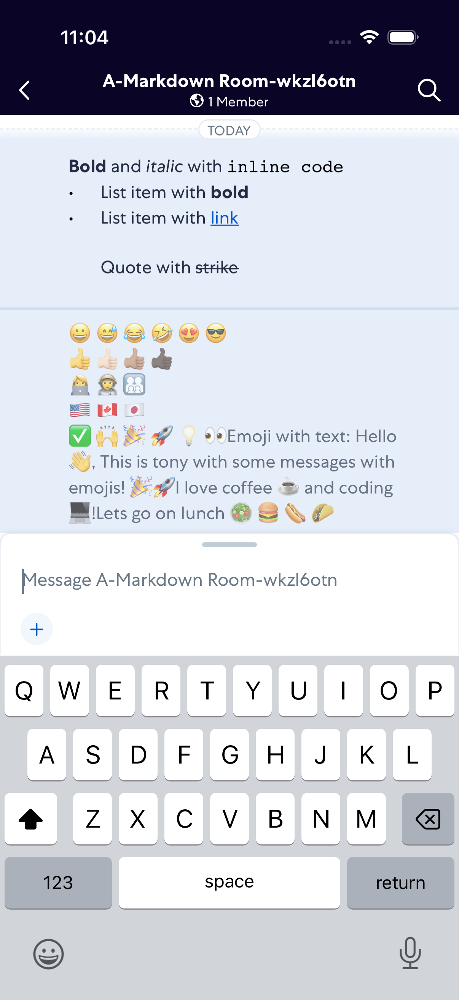

### Step 11: Appointments

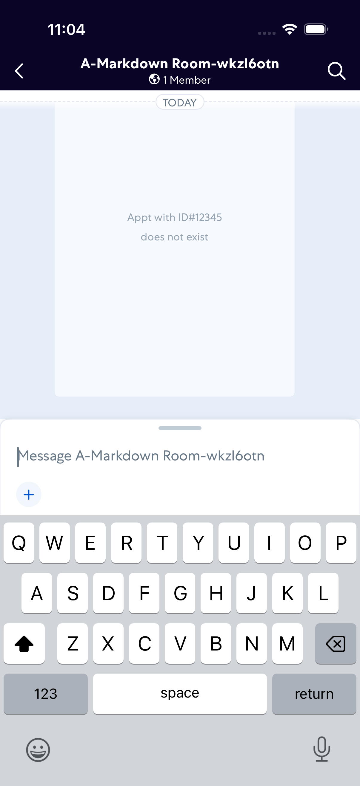
