# AudienceFilters

- Status: PASS
- Duration: 1m 48s
- Lane: AudienceFilters-latest
- Appium port: 4723
- Started: 2026-09-09T14:52:35.595Z
- Finished: 2026-09-09T14:54:23.993Z

## Phase Timings

| Phase | Duration |
| --- | --- |
| Session creation | 0ms |
| Login/readiness | 5s |
| Test body | 1m 42s |
| Screenshot capture | 1s |
| Recovery | 0ms |
| Report generation | 0ms |
| Room creation (test-owned) | 622ms |

## Steps

### Step 1: Add Members Sheet

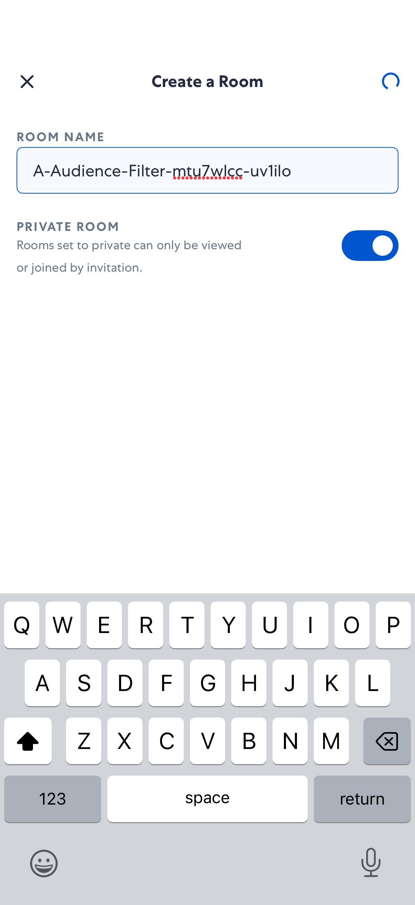

### Step 2: Filter Members Open

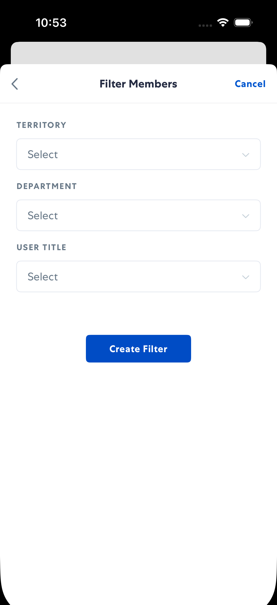

### Step 3: Create Filter Ready

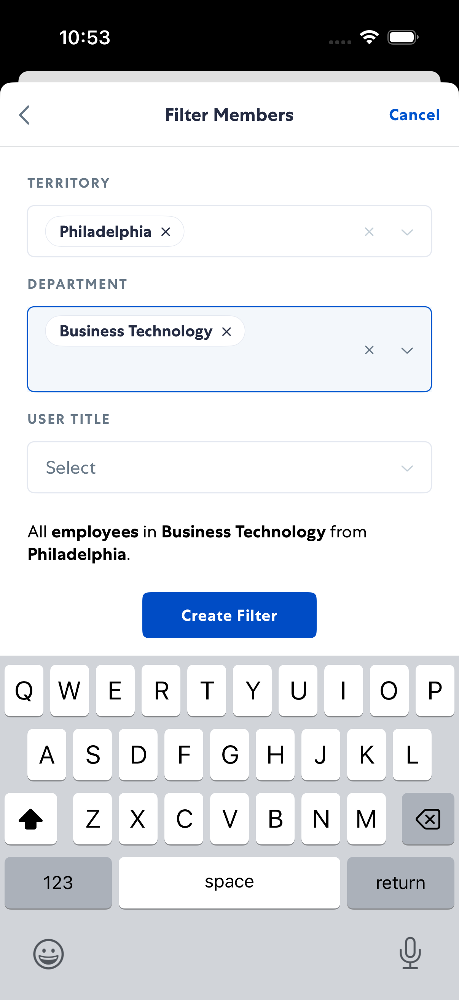

### Step 4: Filter Created

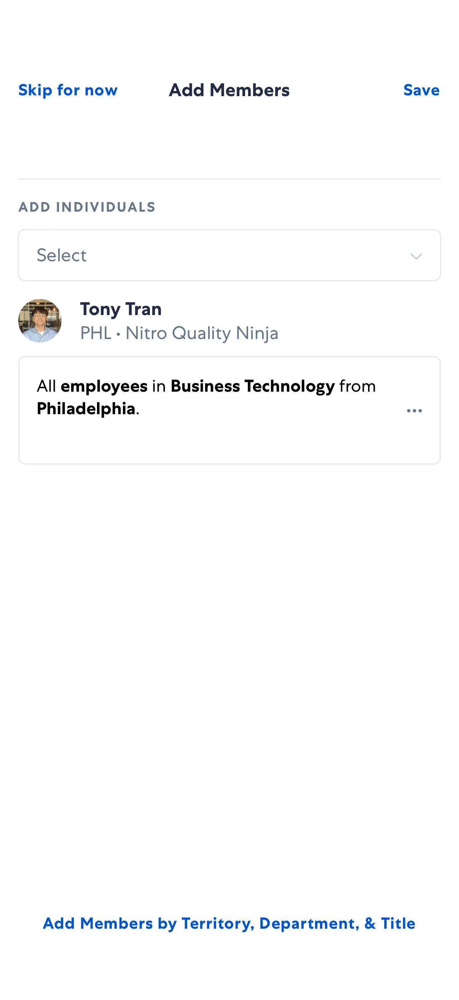

### Step 5: Filter Actions

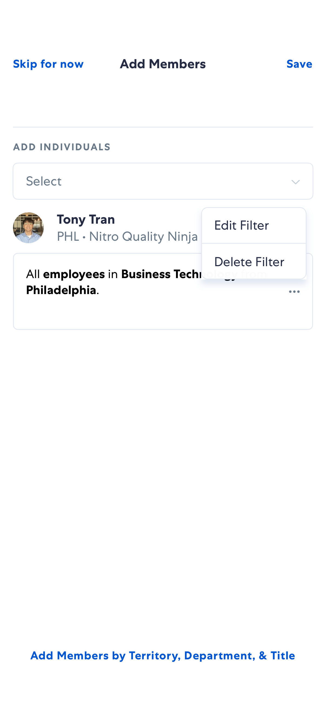

### Step 6: Edit Filter Ready

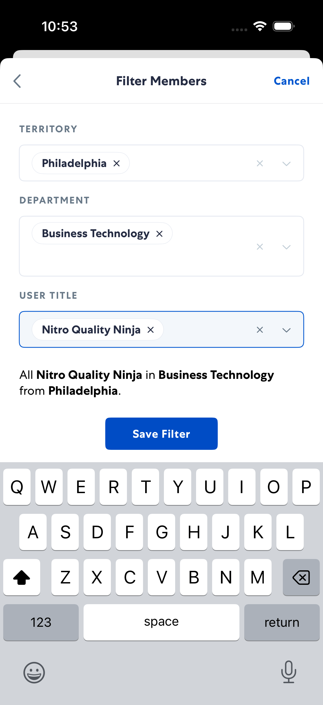

### Step 7: Filter Edited

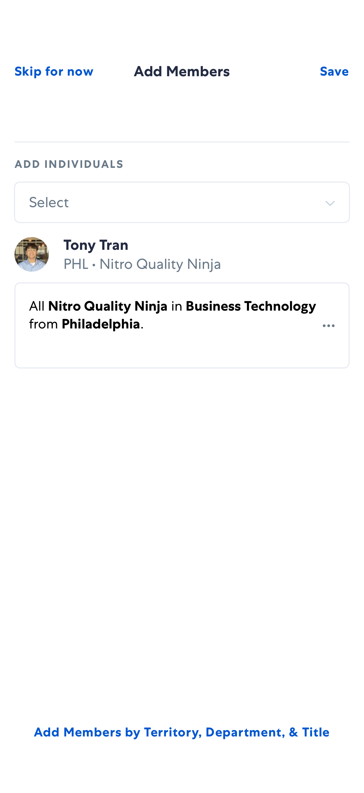

### Step 8: Filter Applied Room Open

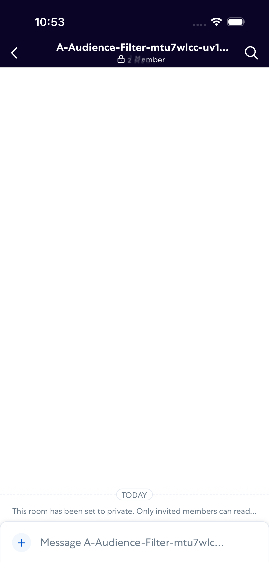

### Step 9: Audience Members Loaded

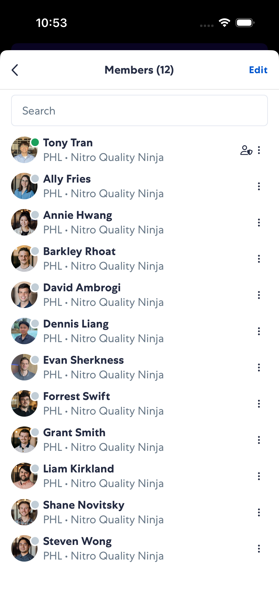

### Step 10: Filter Persisted In Members

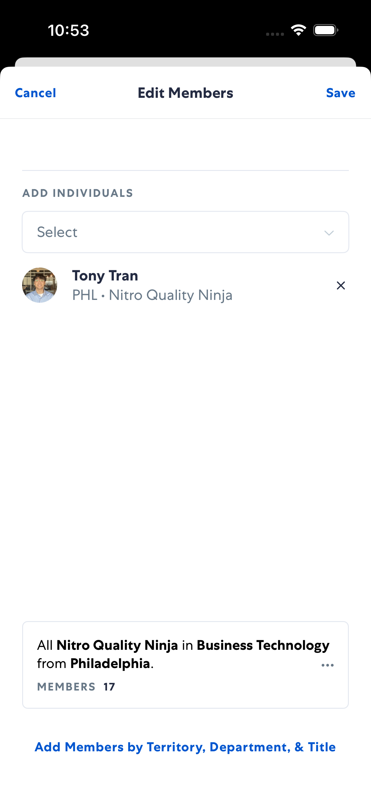

### Step 11: Filter Deleted For Cleanup

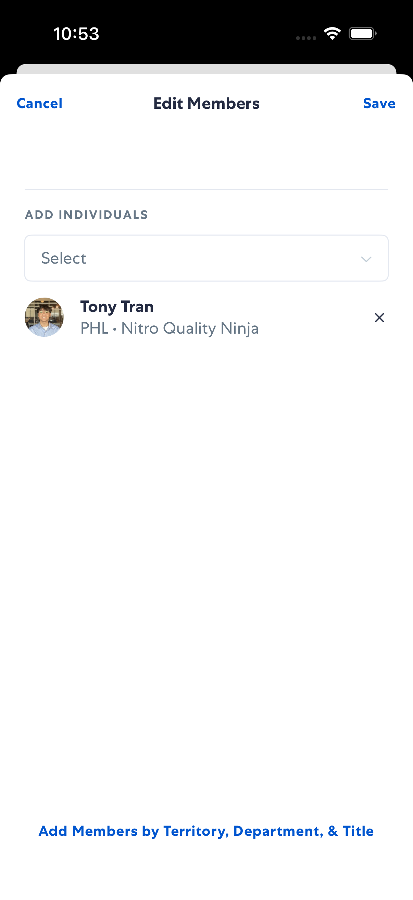
