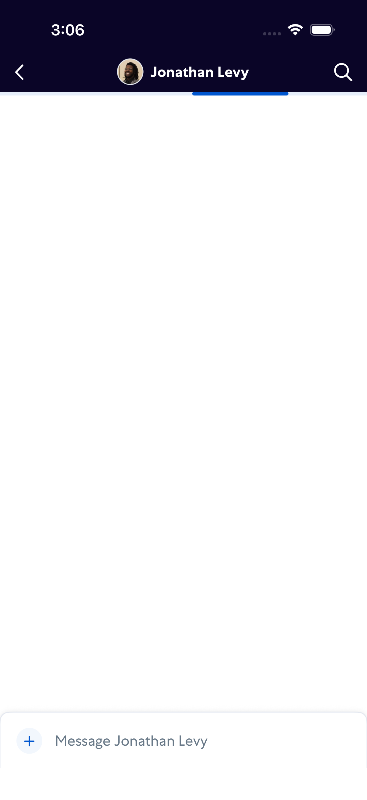
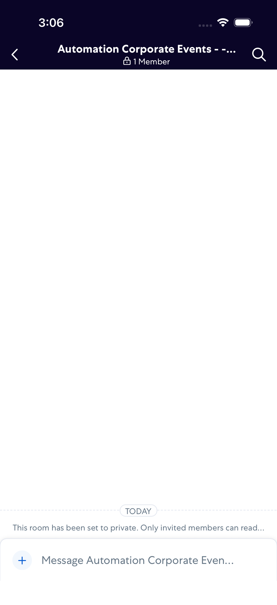
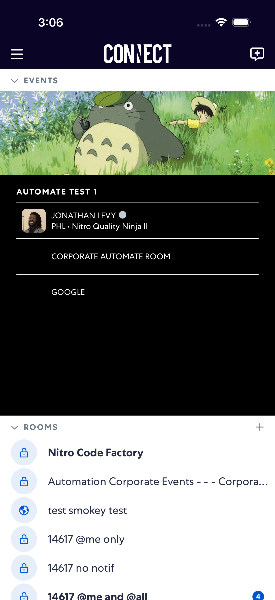

# CorporateEvents

- Status: FAIL
- Duration: 57s
- Lane: CorporateEvents-latest
- Appium port: 4723
- Started: 2026-09-22T19:06:04.707Z
- Finished: 2026-09-22T19:07:02.111Z

## Failure

```text
Corporate Event URL item "GOOGLE" did not open an external app. Verify the event uses a fully qualified URL such as https://www.google.com.
```

## Phase Timings

| Phase | Duration |
| --- | --- |
| Session creation | 0ms |
| Login/readiness | 5s |
| Test body | 51s |
| Screenshot capture | 1s |
| Recovery | 7s |
| Report generation | 0ms |

## Steps

### Step 1: Events Expanded


### Step 2: Dm Item Opened



### Step 3: Returned After Dm


### Step 4: Room Item Opened



### Step 5: Returned After Room



### Step 6: ERROR - Failed here


**Failure at this step:**

```text
Corporate Event URL item "GOOGLE" did not open an external app. Verify the event uses a fully qualified URL such as https://www.google.com.
```
