# Reactions

- Status: PASS
- Duration: 55s
- Lane: Reactions-latest
- Appium port: 4723
- Started: 2026-09-28T18:01:31.440Z
- Finished: 2026-09-28T18:02:26.098Z

## Phase Timings

| Phase | Duration |
| --- | --- |
| Session creation | 0ms |
| Login/readiness | 5s |
| Test body | 48s |
| Screenshot capture | 2s |
| Recovery | 0ms |
| Report generation | 0ms |

## Steps

### Step 1: Room Opened

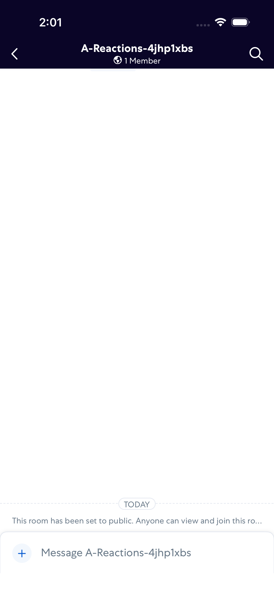

### Step 2: Message Sent

### Step 3: Reaction Picker Open

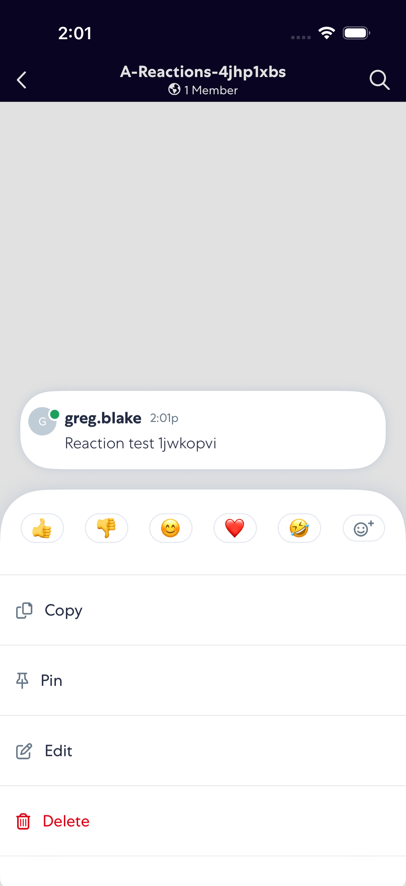

### Step 4: Thumbs Up Added

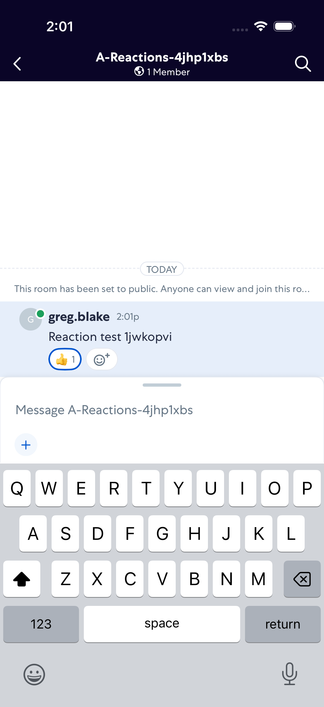

### Step 5: Thumbs Down Added

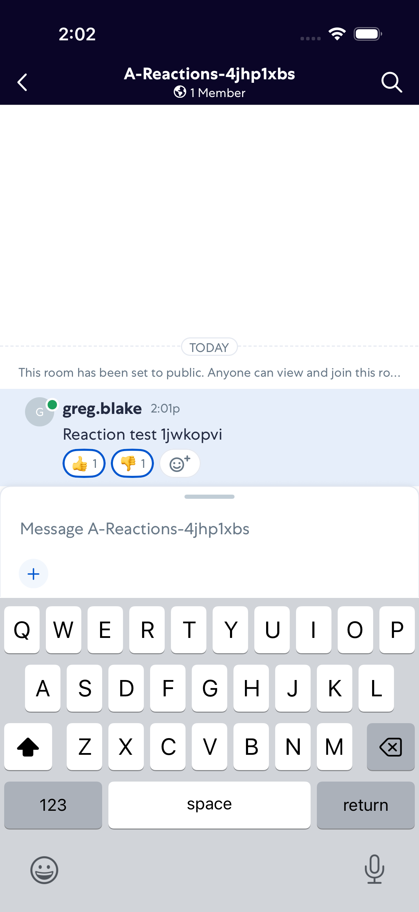

### Step 6: Smile Added

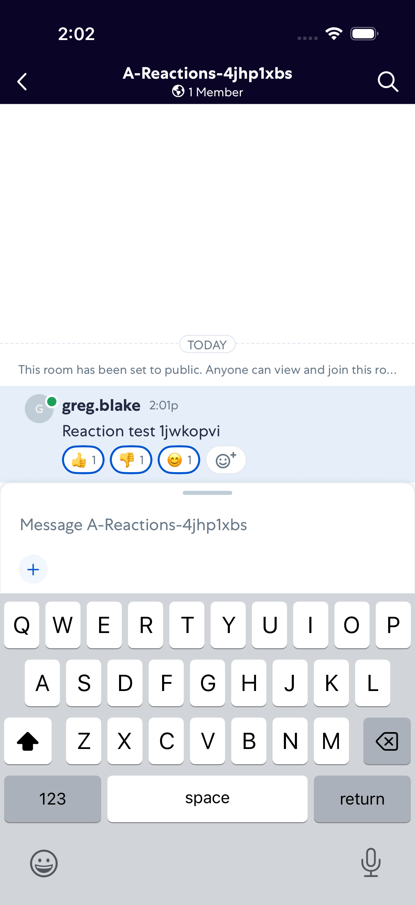

### Step 7: Heart Added

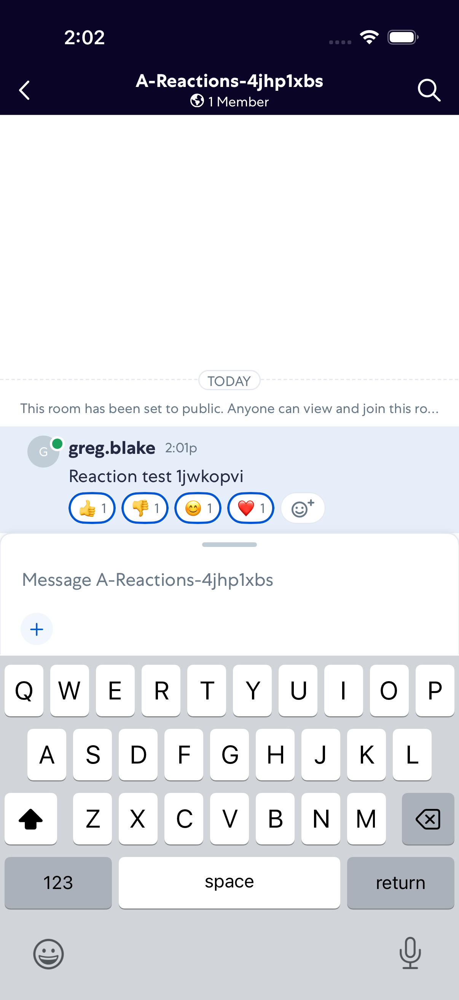

### Step 8: Laugh Added

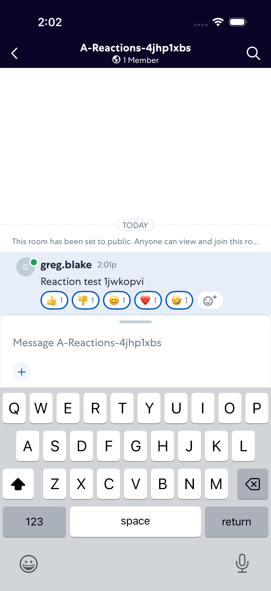

### Step 9: Thumbs Up Removed

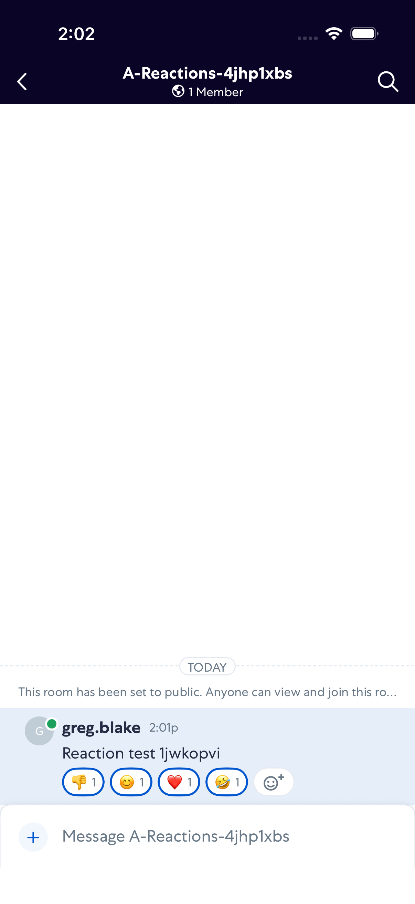

### Step 10: Thumbs Down Removed

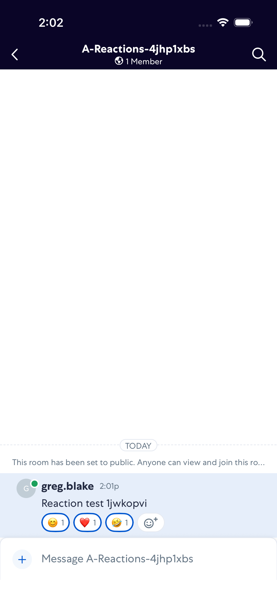

### Step 11: Smile Removed

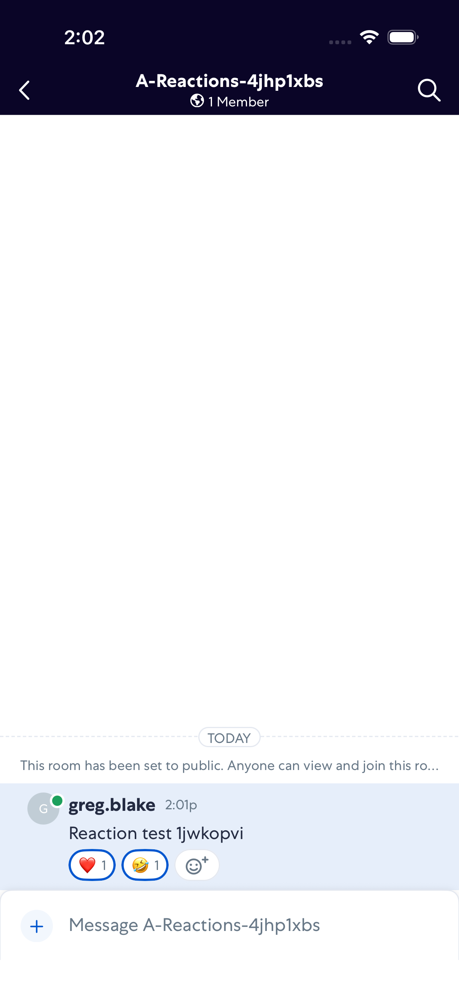

### Step 12: Heart Removed

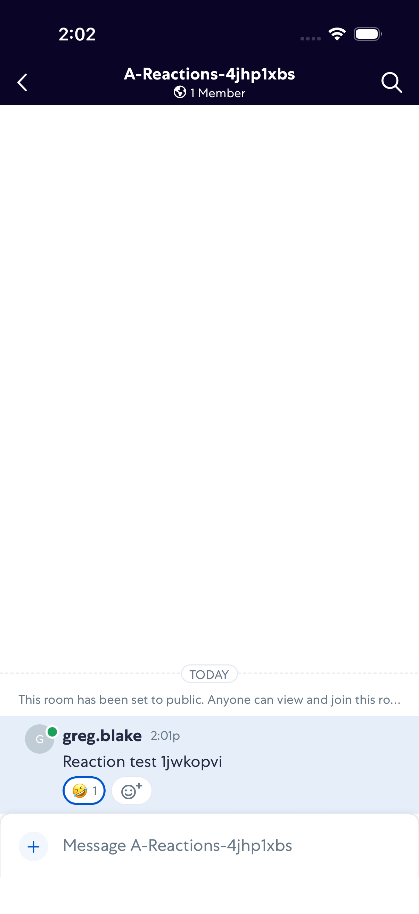

### Step 13: Laugh Removed

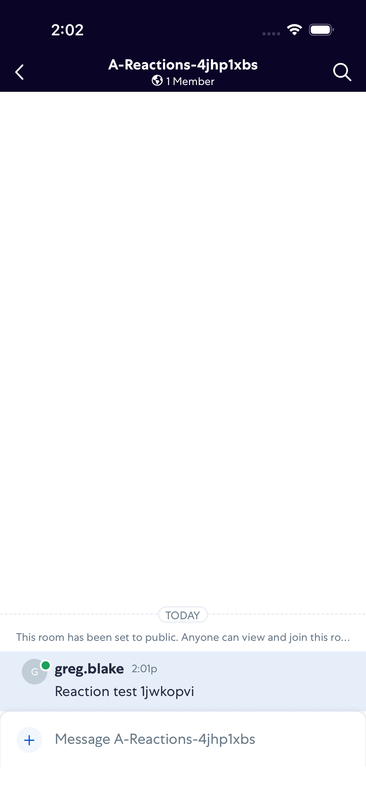
