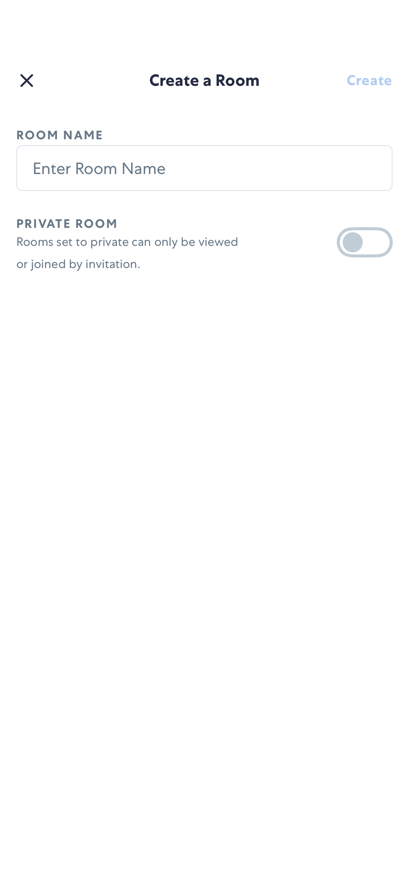
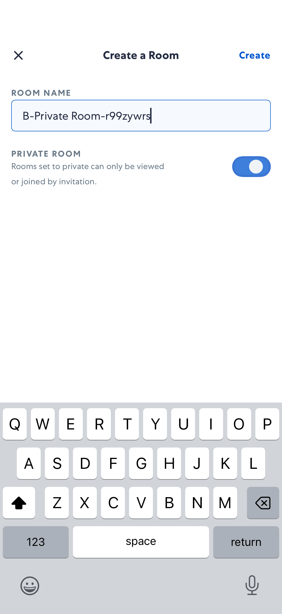
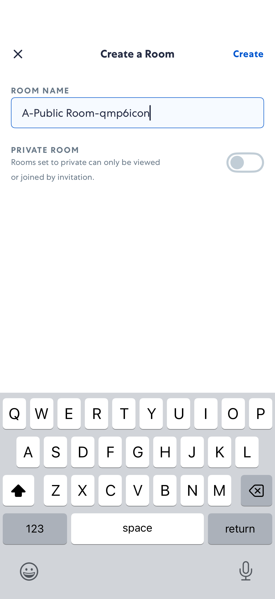
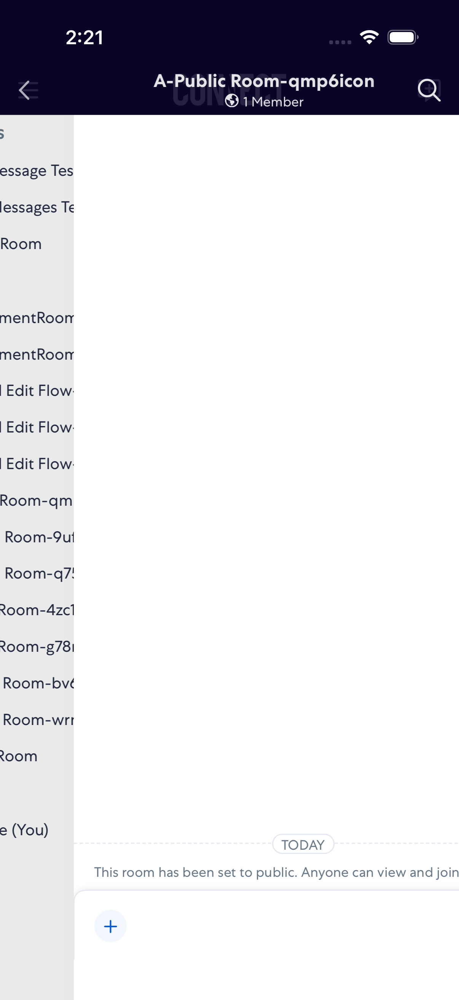

# CreateRoom

- Status: PASS
- Duration: 48s
- Lane: main-suite
- Device: iPhone 17 Pro
- Appium port: 4723
- Started: 2026-07-27T18:21:20.280Z
- Finished: 2026-07-27T18:22:08.408Z

## Steps

### Step 1: Private Create Room

### Step 2: Private Room Toggle

### Step 3: Public Create Room

### Step 4: Public Room Name

### Step 5: Rooms List After Public

