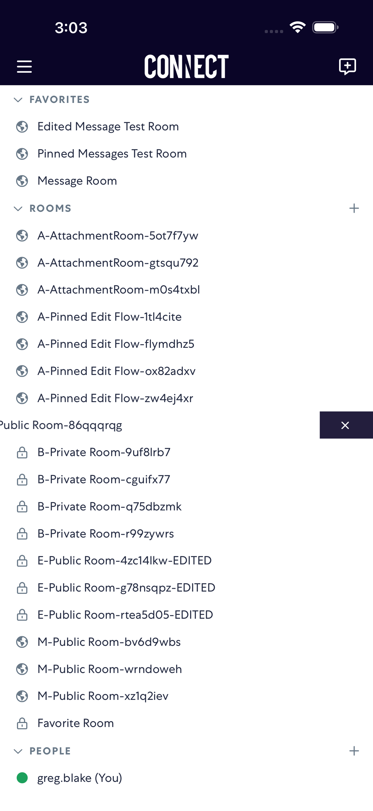
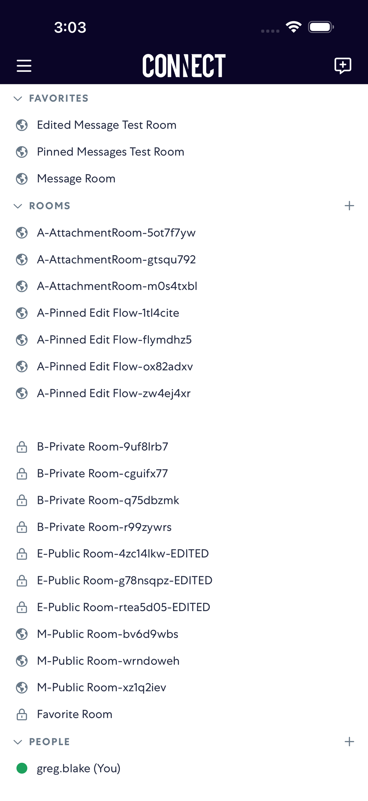
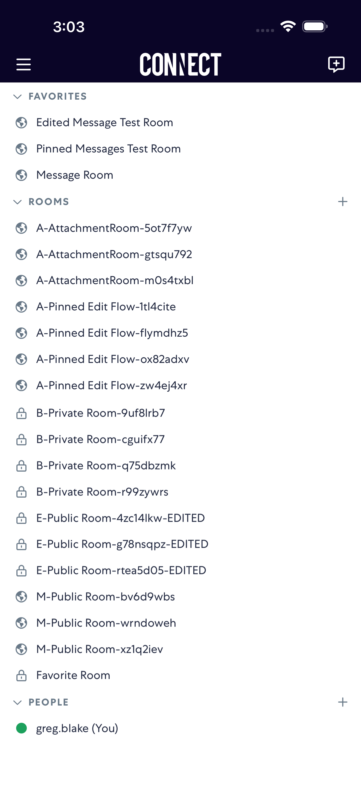

# removeRoom

- Status: PASS
- Duration: 9s
- Lane: Conversation-List
- Device: iPhone 17 Pro Max
- Appium port: 4725
- Started: 2026-07-27T19:03:11.451Z
- Finished: 2026-07-27T19:03:20.602Z

## Steps

### Step 1: Before Swipe Left

### Step 2: After Swipe Left

### Step 3: After Tap Remove

### Step 4: After Room Removed

