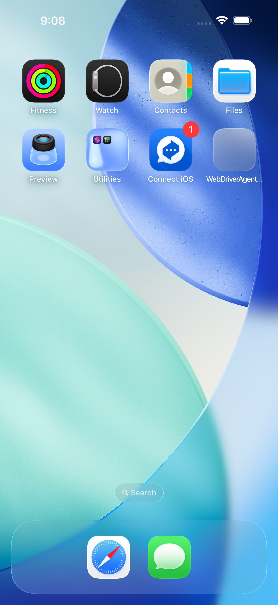
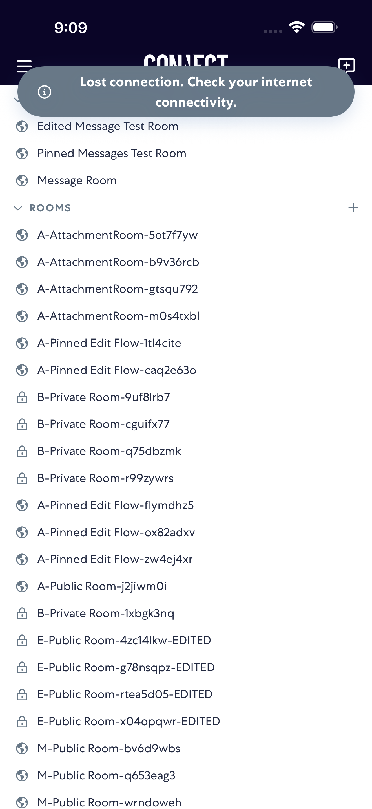

# notifications

- Status: FAIL
- Duration: 40s
- Lane: Conversation-List
- Device: iPhone 17 Pro Max
- Appium port: 4725
- Started: 2026-07-28T13:08:38.527Z
- Finished: 2026-07-28T13:09:18.973Z

## Failure

```text
notifications: expected in-app UI after tapping notification within 15000ms
```

## Steps

### Step 1: Before Push


### Step 2: After Push



### Step 3: After Tap Notification



### Step 4: ERROR - Failed here


**Failure at this step:**

```text
notifications: expected in-app UI after tapping notification within 15000ms
```
