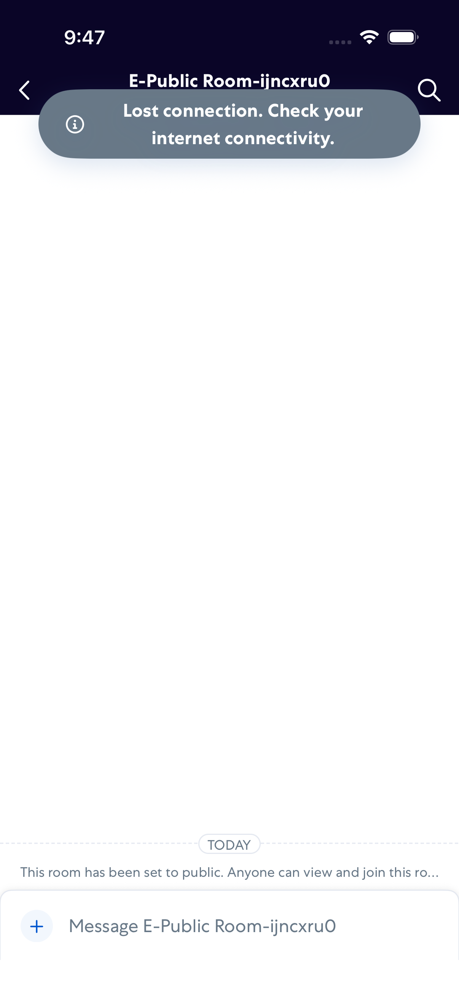
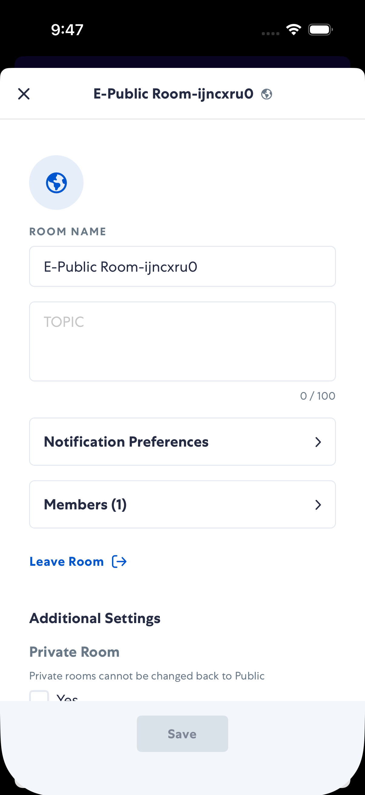
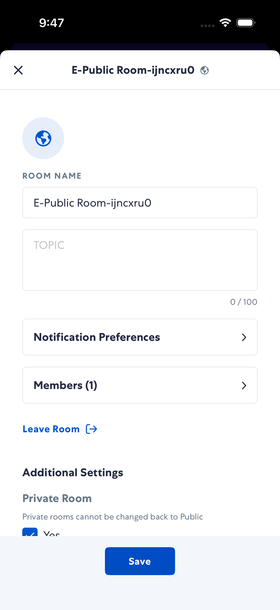
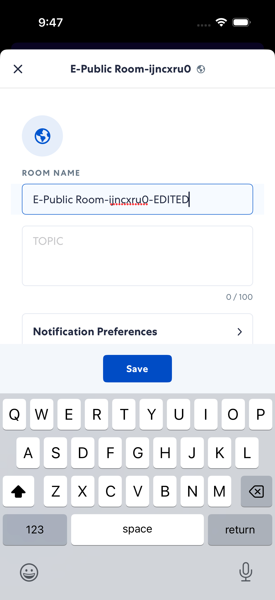
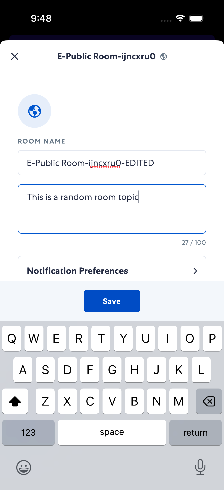
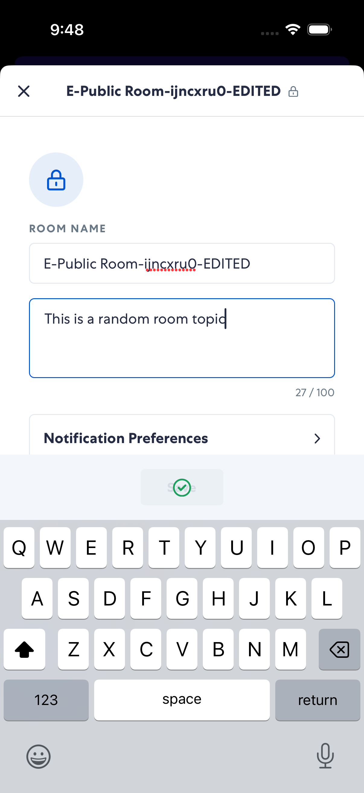
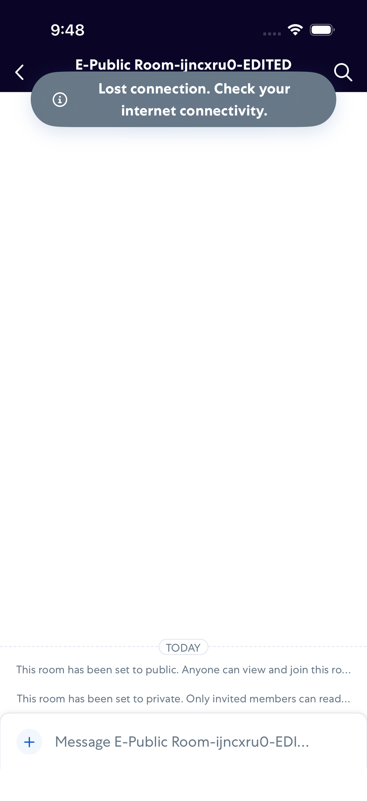
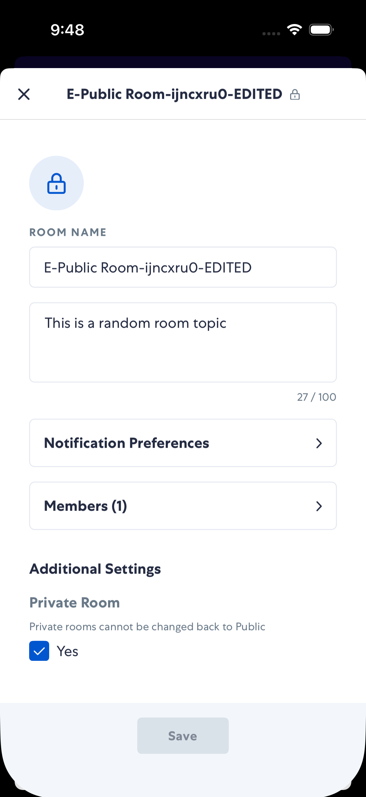

# editRoom

- Status: PASS
- Duration: 41s
- Lane: ConversationView
- Device: iPhone 17
- Appium port: 4727
- Started: 2026-07-28T13:47:28.537Z
- Finished: 2026-07-28T13:48:09.982Z

## Steps

### Step 1: In Room

### Step 2: Edit Modal Open

### Step 3: After Toggle Private

### Step 4: After Name Edited

### Step 5: After Topic Filled

### Step 6: After Save

### Step 7: After Close

### Step 8: Reopened Saved Settings

