# markdowns

- Status: PASS
- Duration: 1m 27s
- Lane: ConversationView
- Device: iPhone 17
- Appium port: 4727
- Started: 2026-07-28T13:57:35.160Z
- Finished: 2026-07-28T13:59:02.409Z

## Steps

### Step 1: Headings

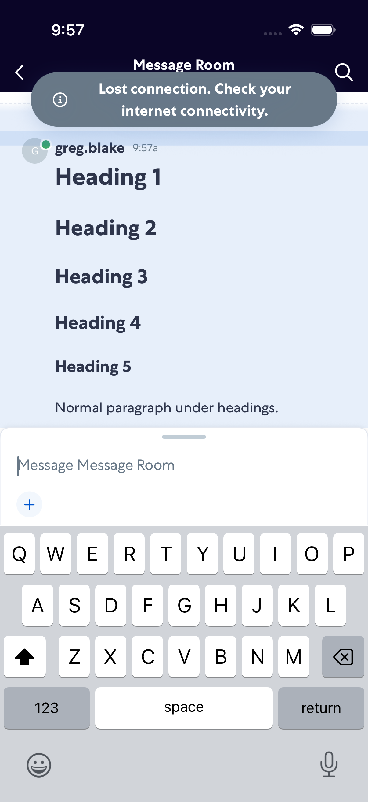

### Step 2: Room Opened

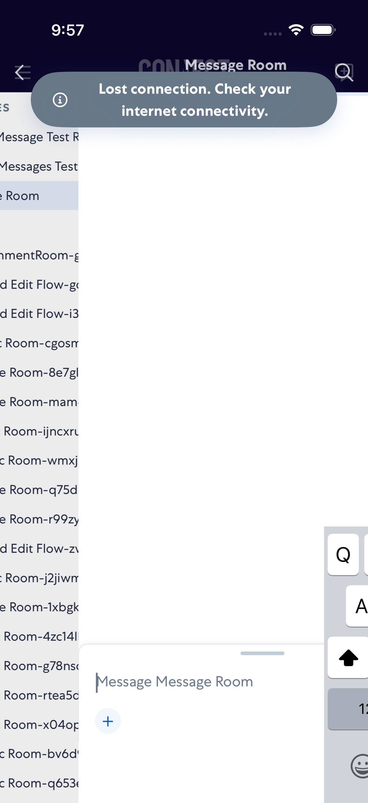

### Step 3: Emphasis

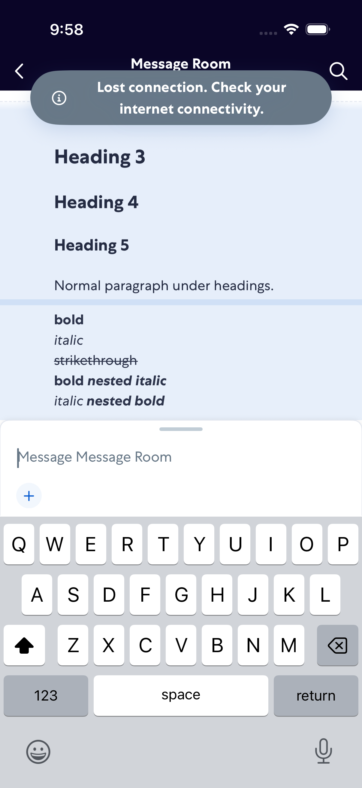

### Step 4: Links

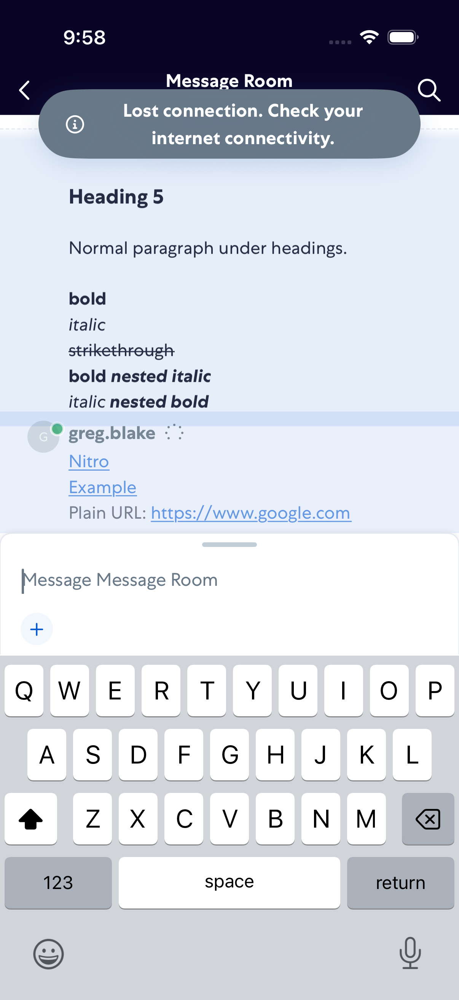

### Step 5: Inline Code

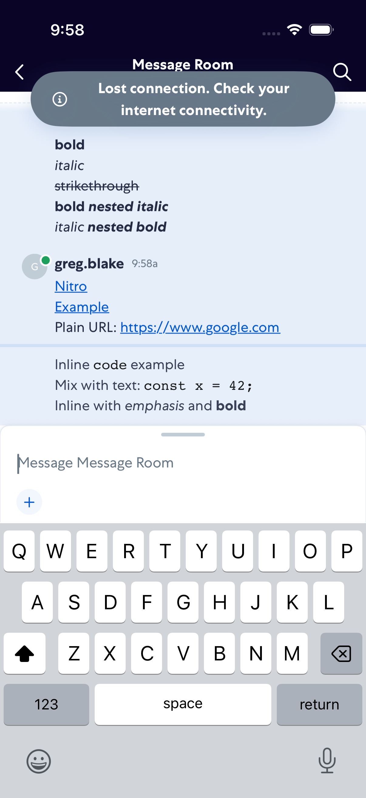

### Step 6: Code Block

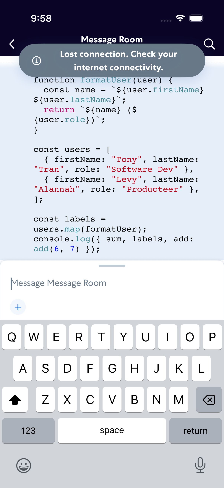

### Step 7: Lists

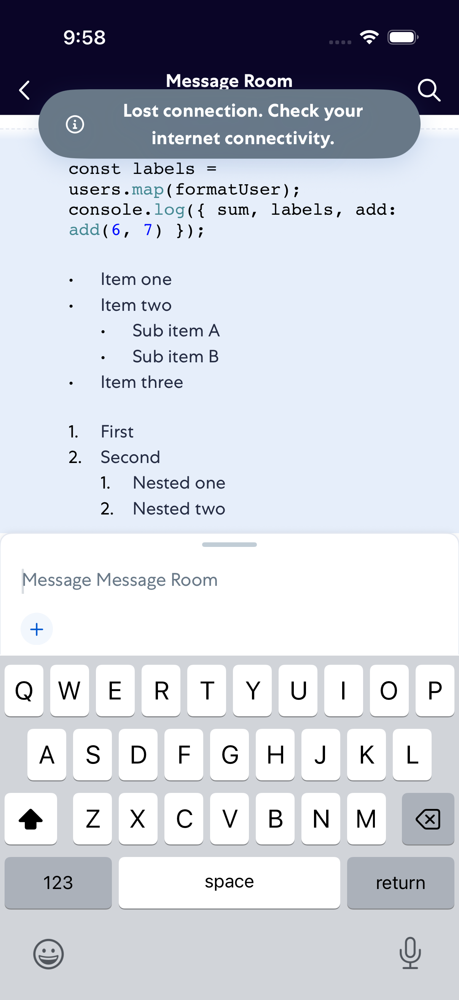

### Step 8: Blockquote

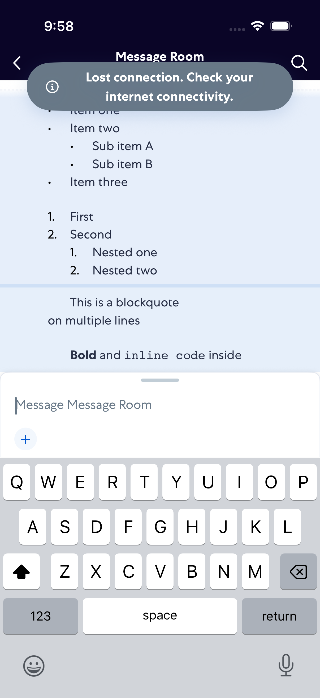

### Step 9: Mixed

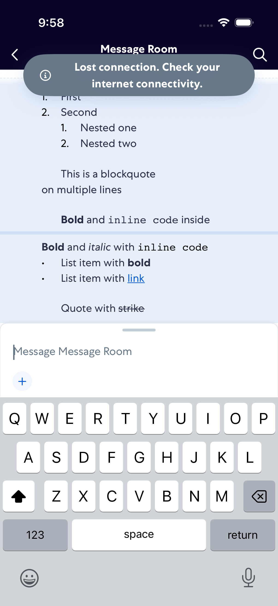

### Step 10: Emojis

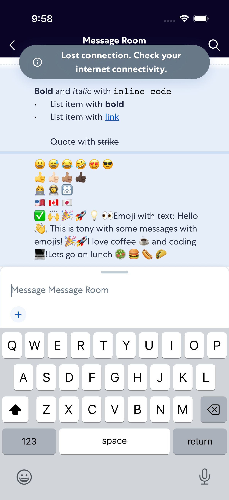

### Step 11: Appointments

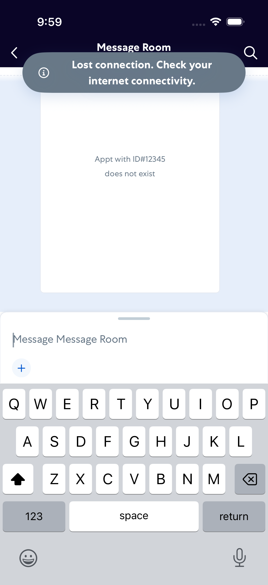
