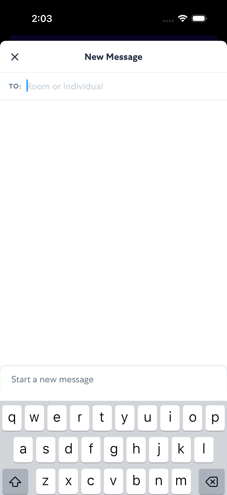
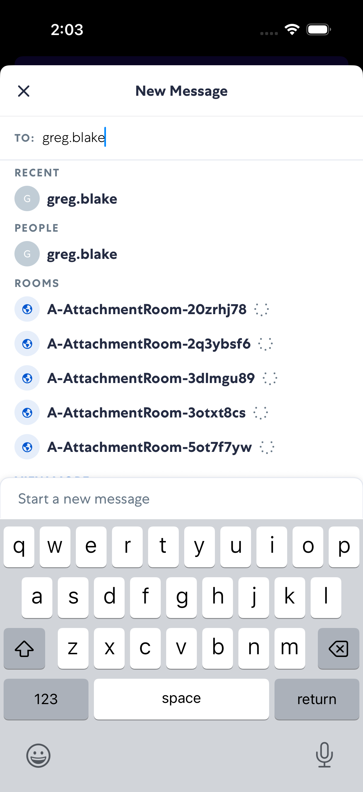
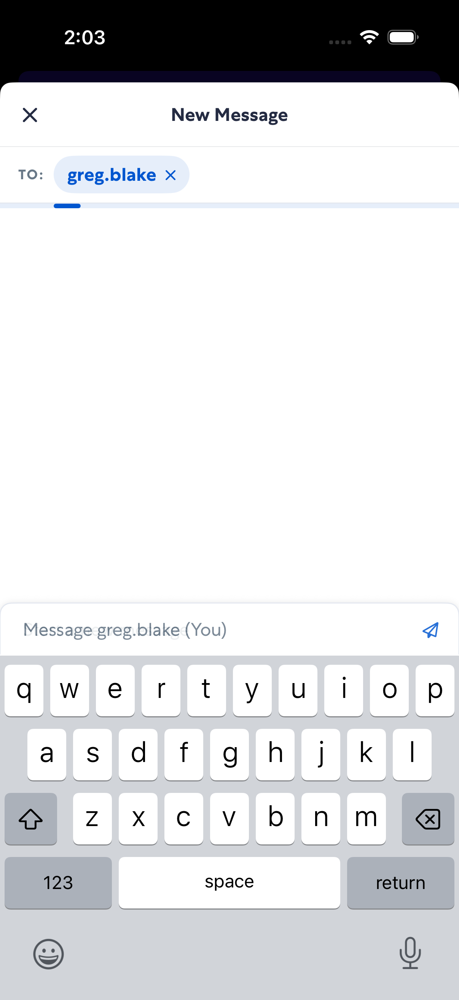
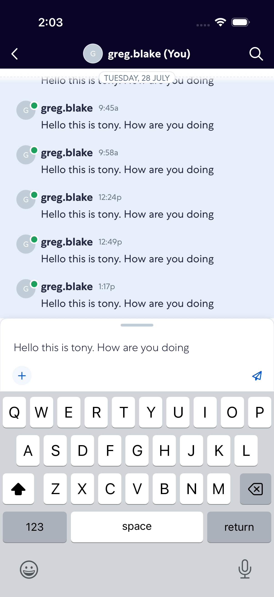

# newMessage

- Status: PASS
- Duration: 30s
- Lane: main-suite
- Device: iPhone 17 Pro
- Appium port: 4723
- Started: 2026-08-05T18:02:54.697Z
- Finished: 2026-08-05T18:03:24.661Z

## Steps

### Step 1: Start Conversation

### Step 2: Typed Recipient

### Step 3: Selected Recipient

### Step 4: Message Typed

