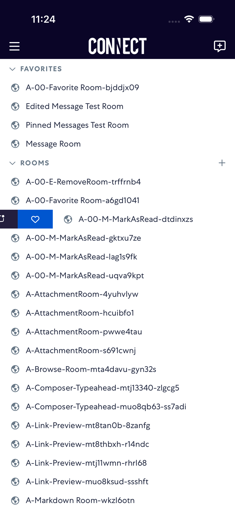
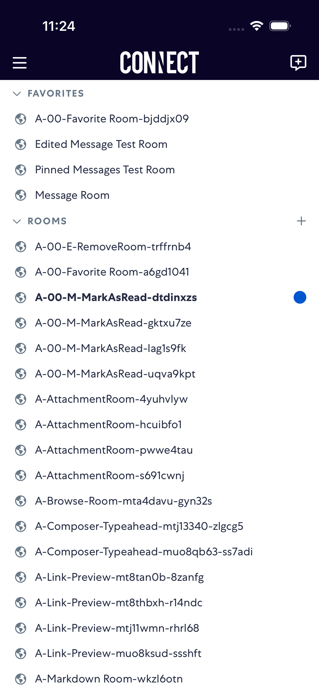
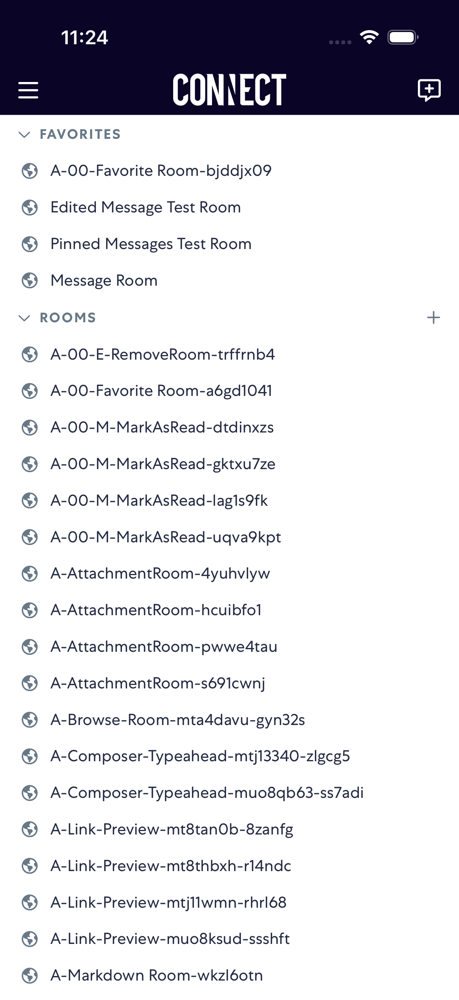

# markAsRead

- Status: PASS
- Duration: 47s
- Lane: markAsRead-latest
- Appium port: 4723
- Started: 2026-09-30T15:23:36.293Z
- Finished: 2026-09-30T15:24:23.203Z

## Phase Timings

| Phase | Duration |
| --- | --- |
| Session creation | 0ms |
| Login/readiness | 6s |
| Test body | 40s |
| Screenshot capture | 587ms |
| Recovery | 0ms |
| Report generation | 0ms |

## Steps

### Step 1: Before Swipe Right

### Step 2: After Swipe Right

### Step 3: After Mark Unread

### Step 4: After Mark Read

