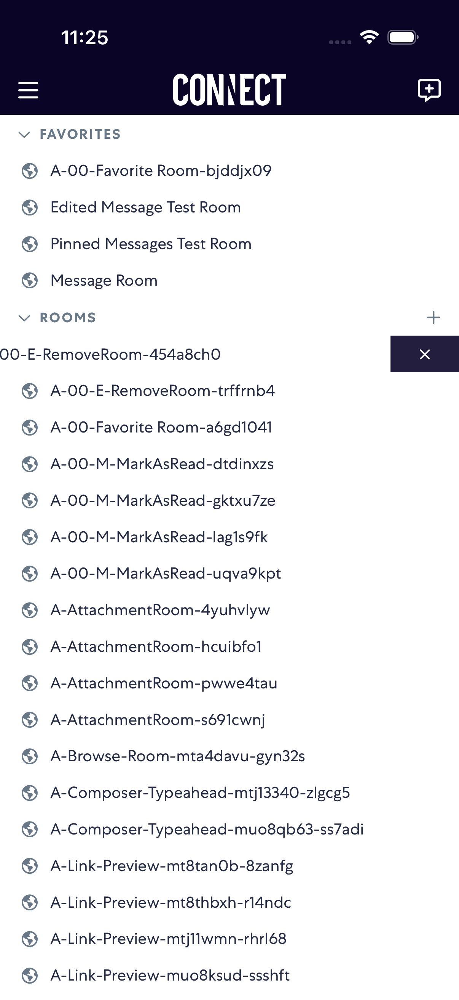
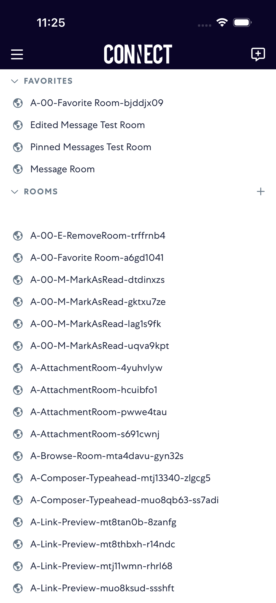
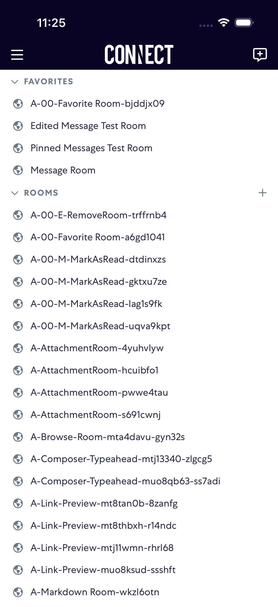

# removeRoom

- Status: PASS
- Duration: 42s
- Lane: removeRoom-latest
- Appium port: 4723
- Started: 2026-09-30T15:24:45.554Z
- Finished: 2026-09-30T15:25:27.177Z

## Phase Timings

| Phase | Duration |
| --- | --- |
| Session creation | 0ms |
| Login/readiness | 6s |
| Test body | 35s |
| Screenshot capture | 672ms |
| Recovery | 0ms |
| Report generation | 0ms |

## Steps

### Step 1: Before Swipe Left

### Step 2: After Swipe Left

### Step 3: After Tap Remove

### Step 4: After Room Removed

