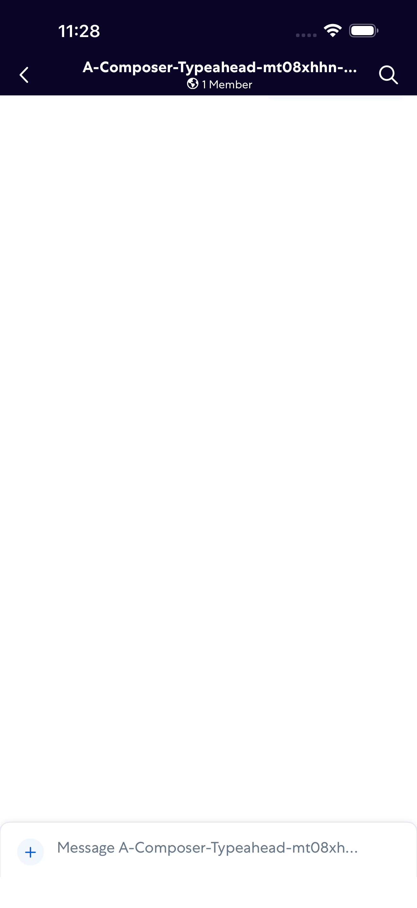
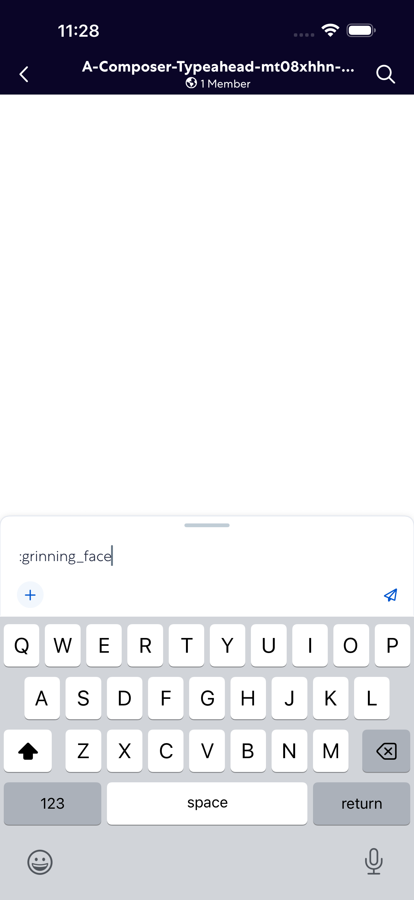

# ComposerTypeahead

- Status: FAIL
- Duration: 44s
- Lane: Conversation-List
- Logical category: ConversationView
- Device: iPhone 17 Pro Max
- Appium port: 4725
- Started: 2026-08-19T15:28:13.787Z
- Finished: 2026-08-19T15:28:57.334Z

## Failure

```text
Visible control with source label ":grinning_face:" did not appear
```

## Phase Timings

| Phase | Duration |
| --- | --- |
| Session creation | 0ms |
| Login/readiness | 3s |
| Test body | 40s |
| Screenshot capture | 332ms |
| Recovery | 21s |
| Report generation | 0ms |

## Steps

### Step 1: Room Opened



### Step 2: ERROR - Failed here



**Failure at this step:**

```text
Visible control with source label ":grinning_face:" did not appear
```
