# ConversationList

- Status: PASS
- Duration: 54s
- Lane: Conversation-List-settings
- Device: iPhone 17 Pro Max
- Appium port: 4725
- Started: 2026-08-18T19:20:31.937Z
- Finished: 2026-08-18T19:21:26.030Z

## Steps

### Step 1: Layout Classic After Switch In Menu

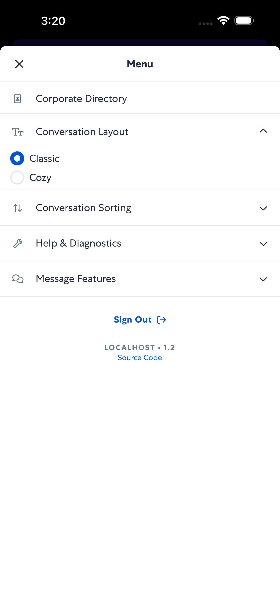

### Step 2: Layout Classic Conversation List

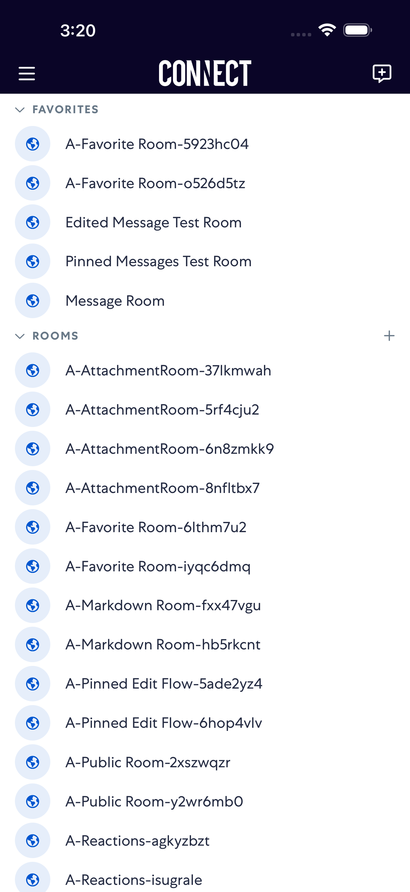

### Step 3: Layout Classic Menu Open

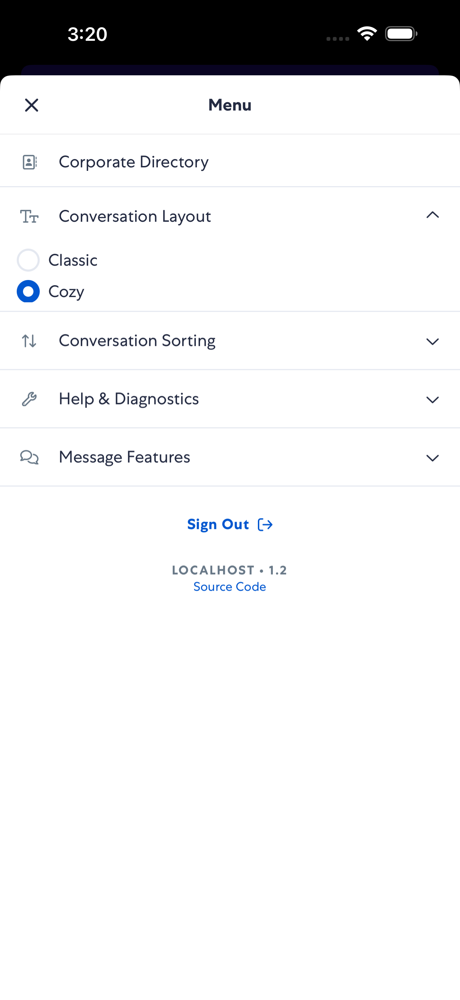

### Step 4: Layout Cozy After Switch In Menu

### Step 5: Layout Cozy Conversation List

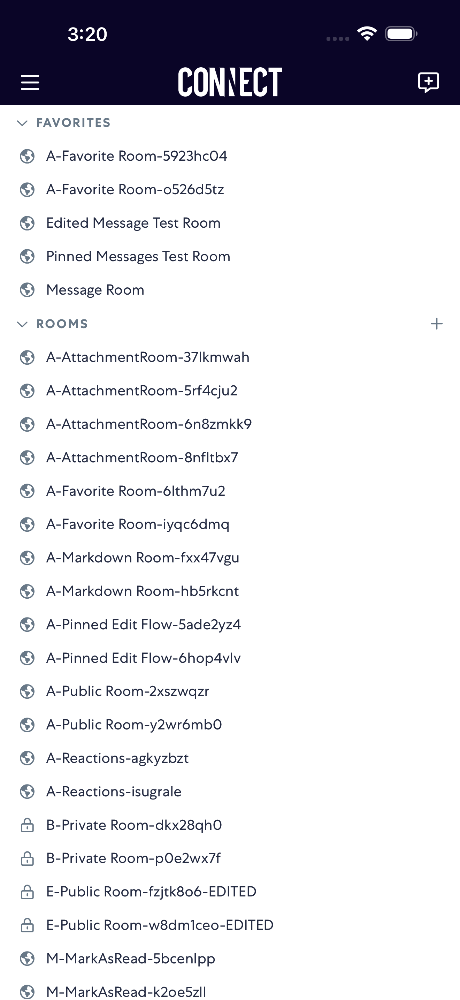

### Step 6: Layout Cozy Menu Open

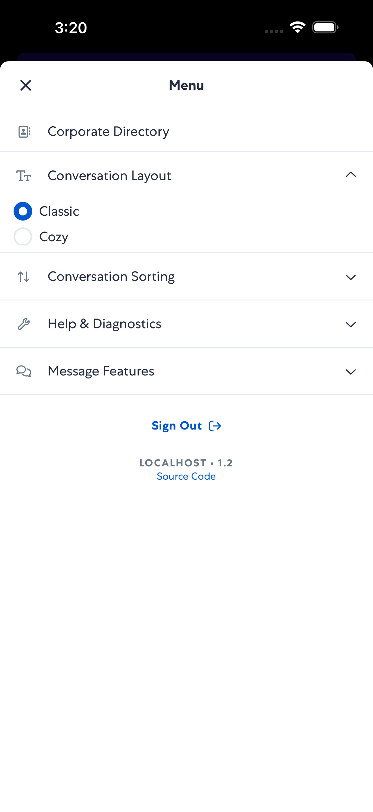

### Step 7: Sort Alphabetically After Switch In Menu

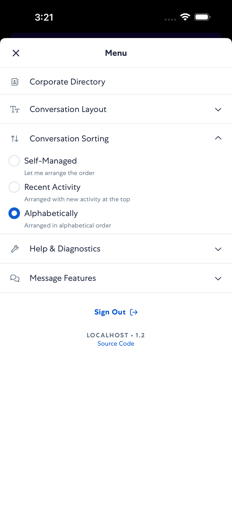

### Step 8: Sort Alphabetically Conversation List

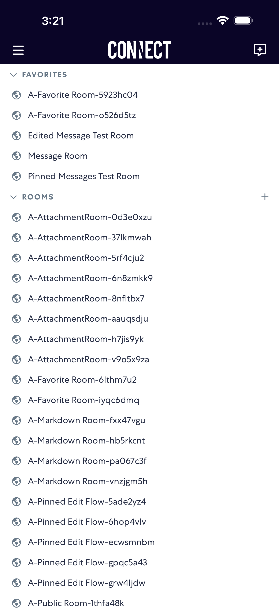

### Step 9: Sort Alphabetically Menu Open

### Step 10: Sort Recent Activity After Switch In Menu

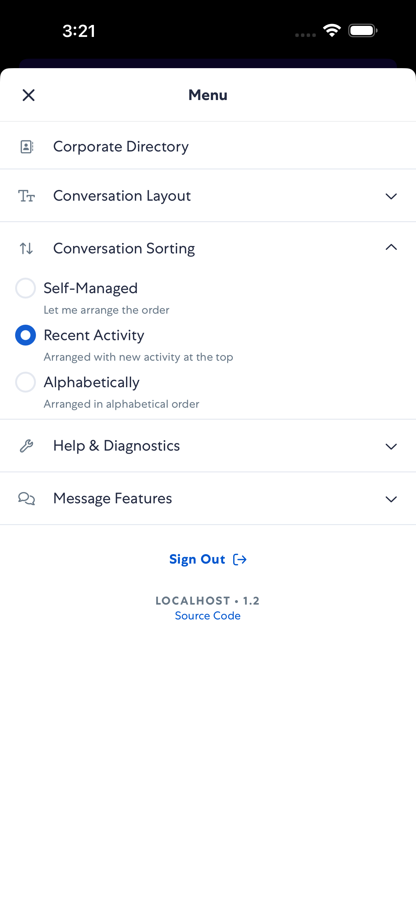

### Step 11: Sort Recent Activity Conversation List

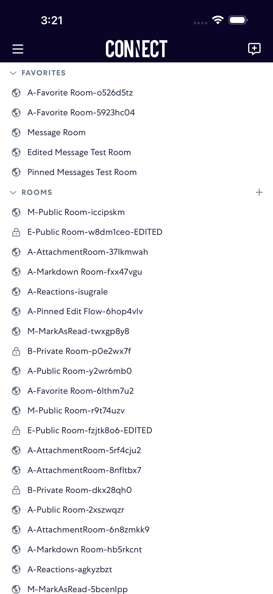

### Step 12: Sort Recent Activity Menu Open

### Step 13: Sort Self Managed After Switch In Menu

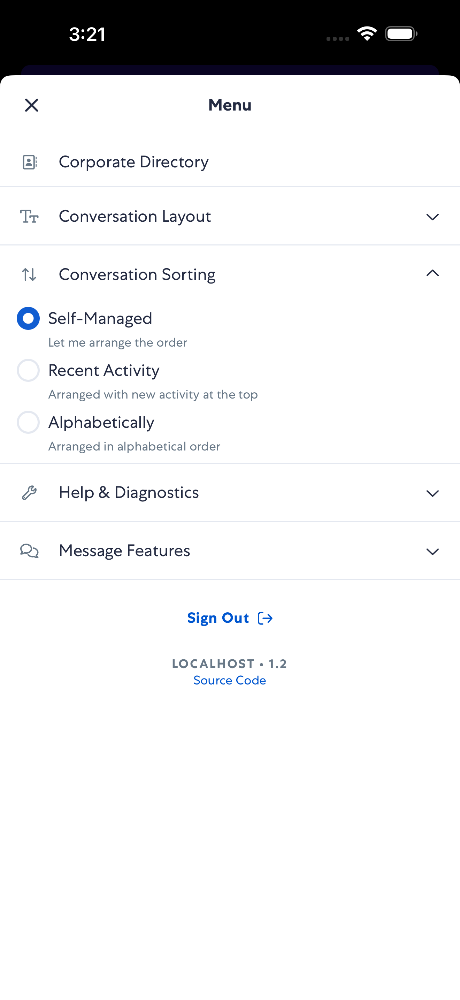

### Step 14: Sort Self Managed Conversation List

### Step 15: Sort Self Managed Menu Open

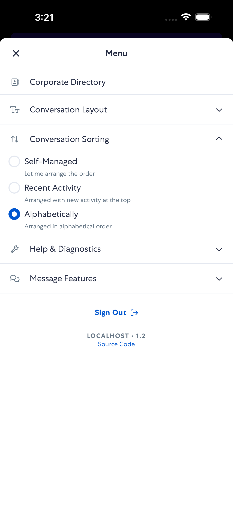
