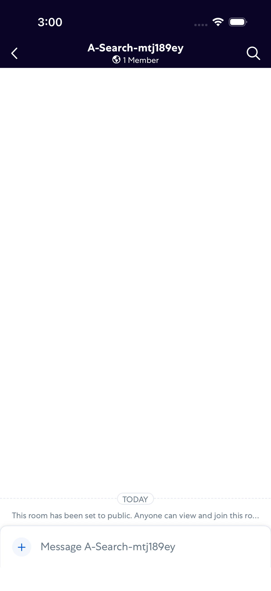
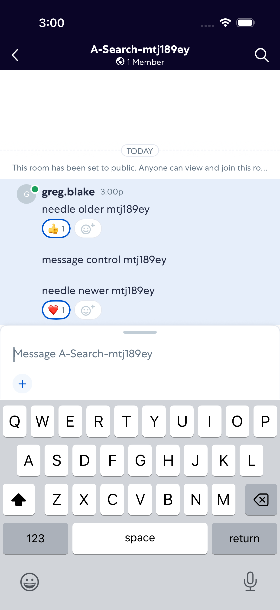
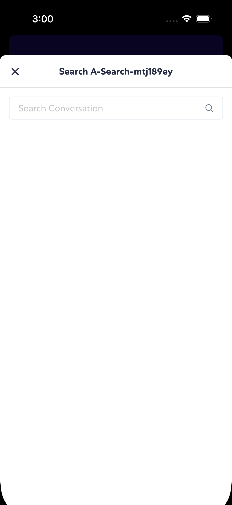
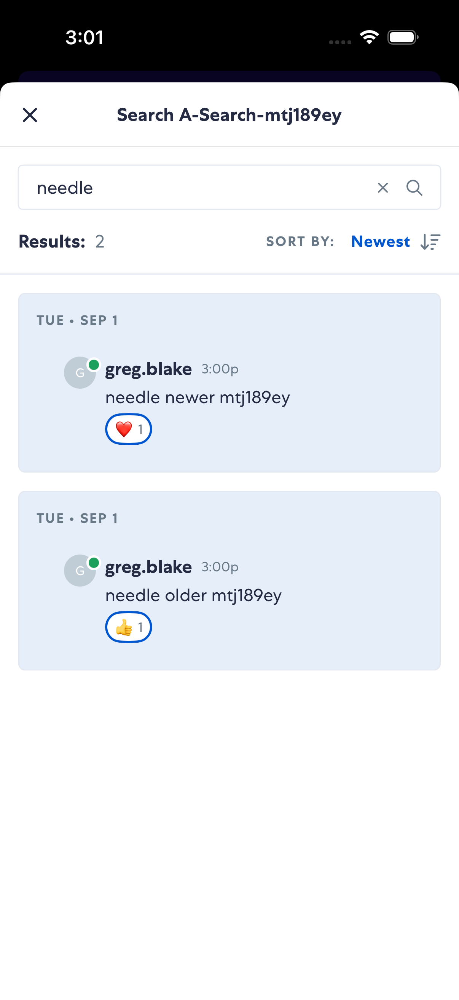
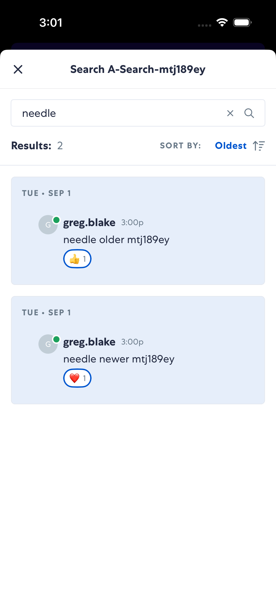
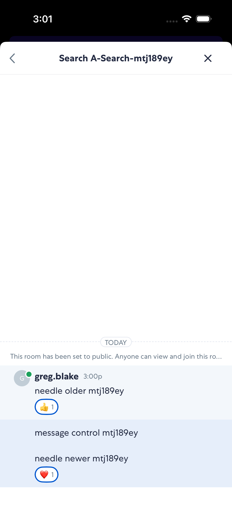
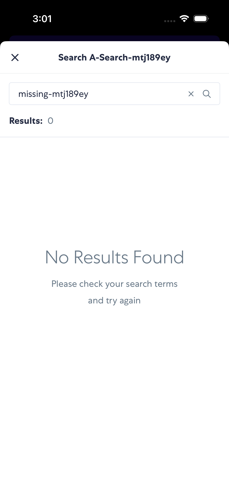

# ConversationSearch

- Status: PASS
- Duration: 1m 5s
- Lane: ConversationView
- Logical category: ConversationView
- Device: iPhone 17
- Appium port: 4727
- Started: 2026-09-01T19:00:13.536Z
- Finished: 2026-09-01T19:01:18.366Z

## Phase Timings

| Phase | Duration |
| --- | --- |
| Session creation | 0ms |
| Login/readiness | 7s |
| Test body | 57s |
| Screenshot capture | 1s |
| Recovery | 0ms |
| Report generation | 0ms |
| Room creation (test-owned) | 4s |

## Steps

### Step 1: Room Created

### Step 2: Search Messages Seeded With Reactions

### Step 3: Search Opened

### Step 4: Matching Results Newest First

### Step 5: Matching Results Oldest First

### Step 6: Selected Result Context

### Step 7: No Results

### Step 8: Returned To Conversation

