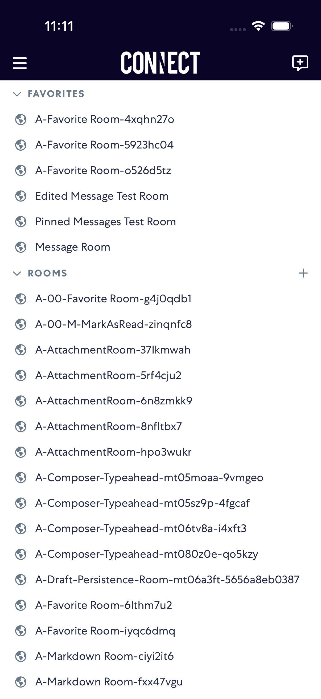

# CreateRoom

- Status: FAIL
- Duration: 1m 56s
- Lane: main-suite
- Logical category: main-suite
- Device: iPhone 17 Pro
- Appium port: 4723
- Started: 2026-08-19T15:09:47.210Z
- Finished: 2026-08-19T15:11:42.913Z

## Failure

```text
element ("~createRoomButton") still not displayed after 20000ms
```

## Phase Timings

| Phase | Duration |
| --- | --- |
| Session creation | 0ms |
| Login/readiness | 38s |
| Test body | 1m 15s |
| Screenshot capture | 3s |
| Recovery | 7s |
| Report generation | 0ms |

## Steps

### Step 1: ERROR - Failed here



**Failure at this step:**

```text
element ("~createRoomButton") still not displayed after 20000ms
```

### Step 2: Public Create Room


### Step 3: Public Room Name


### Step 4: Rooms List After Public


