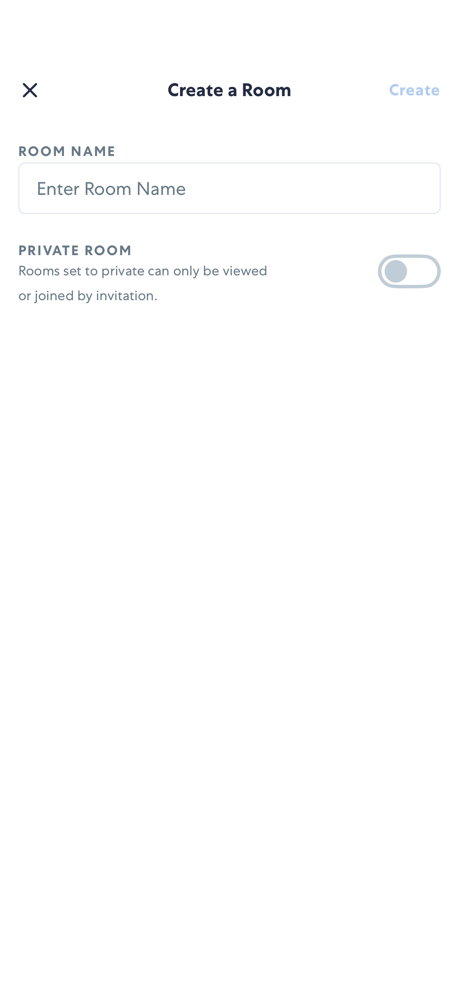
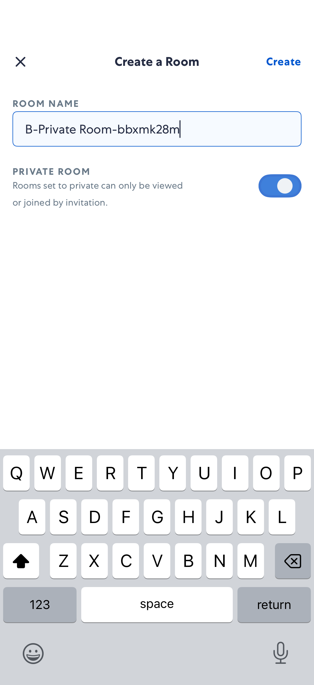
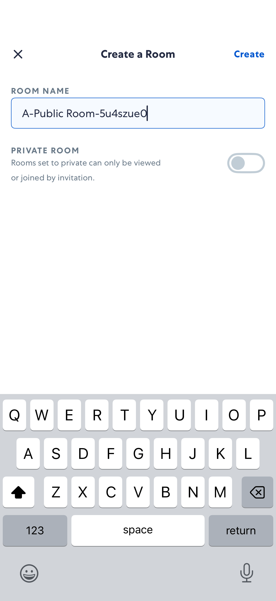
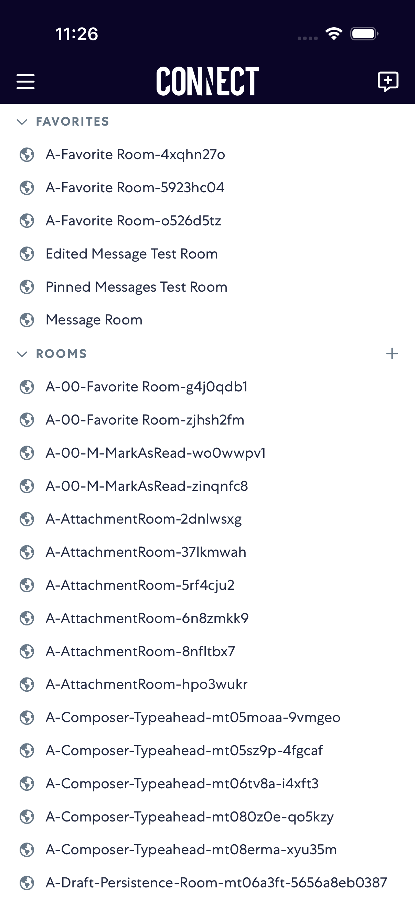

# CreateRoom

- Status: PASS
- Duration: 55s
- Lane: main-suite
- Logical category: main-suite
- Device: iPhone 17 Pro
- Appium port: 4723
- Started: 2026-08-19T15:25:50.535Z
- Finished: 2026-08-19T15:26:45.568Z

## Phase Timings

| Phase | Duration |
| --- | --- |
| Session creation | 0ms |
| Login/readiness | 3s |
| Test body | 50s |
| Screenshot capture | 2s |
| Recovery | 0ms |
| Report generation | 0ms |
| Room creation (test-owned) | 11s |

## Steps

### Step 1: Private Create Room

### Step 2: Private Room Toggle

### Step 3: Public Create Room

### Step 4: Public Room Name

### Step 5: Rooms List After Public

