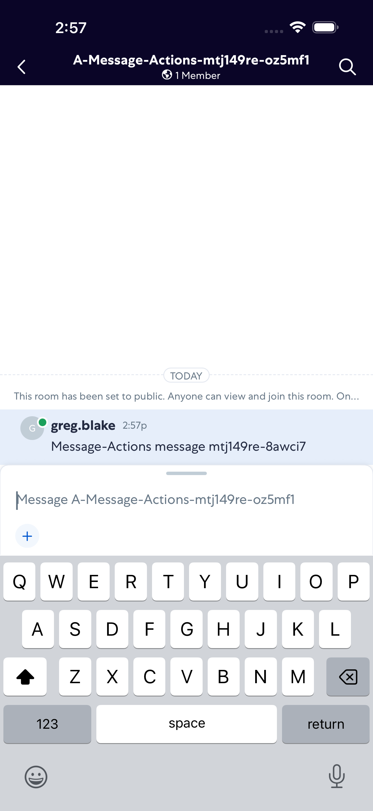
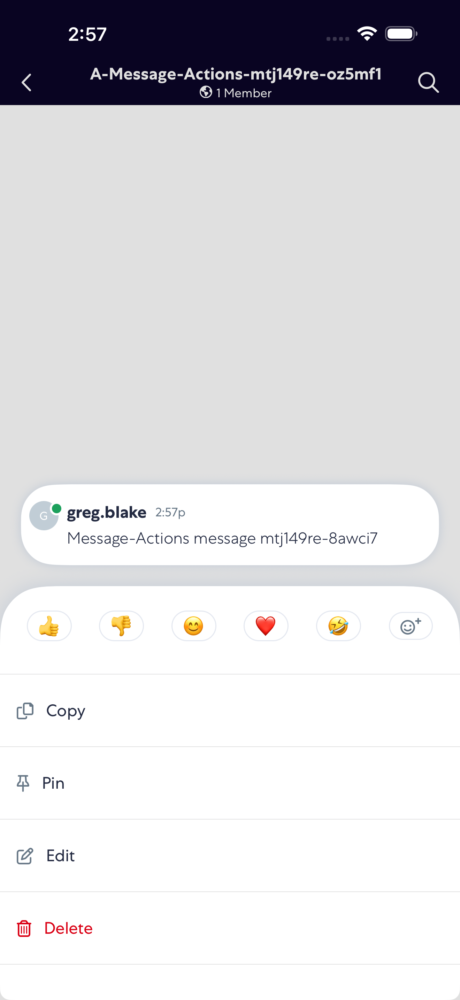
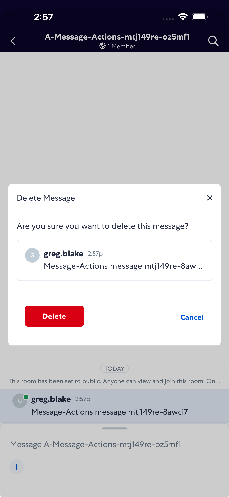
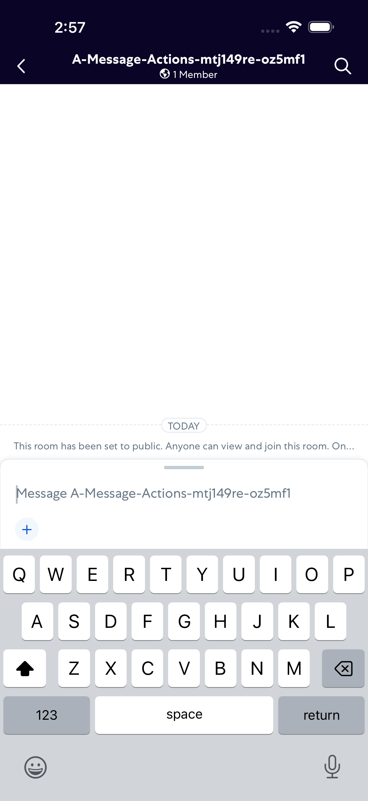

# MessageActions

- Status: PASS
- Duration: 33s
- Lane: Conversation-List
- Logical category: ConversationView
- Device: iPhone 17 Pro Max
- Appium port: 4725
- Started: 2026-09-01T18:57:11.931Z
- Finished: 2026-09-01T18:57:44.837Z

## Phase Timings

| Phase | Duration |
| --- | --- |
| Session creation | 0ms |
| Login/readiness | 2s |
| Test body | 30s |
| Screenshot capture | 732ms |
| Recovery | 0ms |
| Report generation | 0ms |
| Room creation (test-owned) | 6s |

## Steps

### Step 1: Message Sent

### Step 2: Copy Action Open

### Step 3: Delete Action Open

### Step 4: Delete Confirmation

### Step 5: Message Deleted

