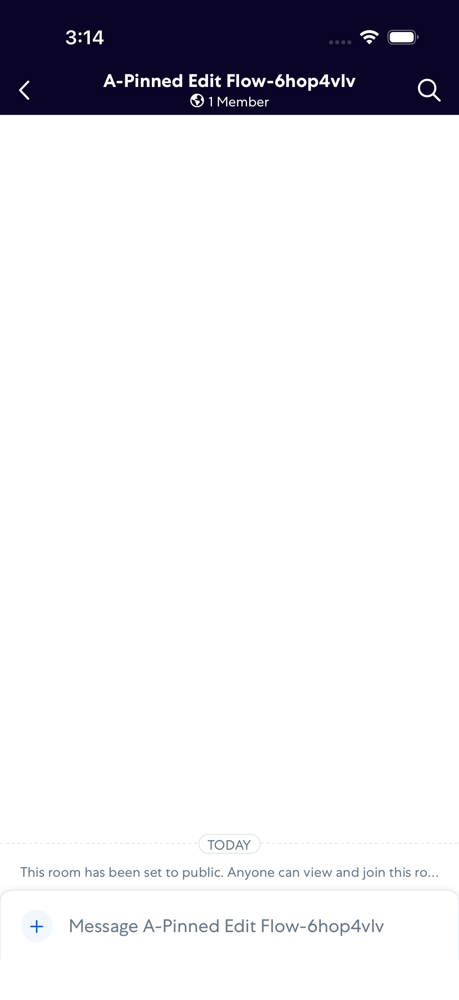
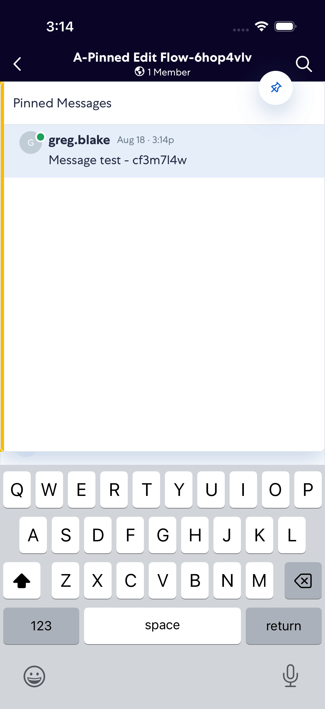
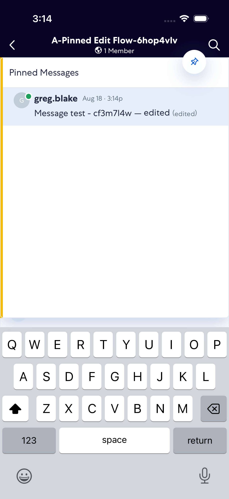
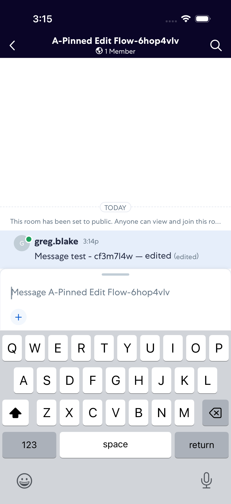

# PinnedMessageEditFlow

- Status: PASS
- Duration: 1m 8s
- Lane: ConversationView
- Device: iPhone 17
- Appium port: 4727
- Started: 2026-08-18T19:13:54.520Z
- Finished: 2026-08-18T19:15:02.490Z

## Steps

### Step 1: Room Opened

### Step 2: Pin Shows Original

### Step 3: Pin Shows Edited

### Step 4: Unpinned Drawer Closed

