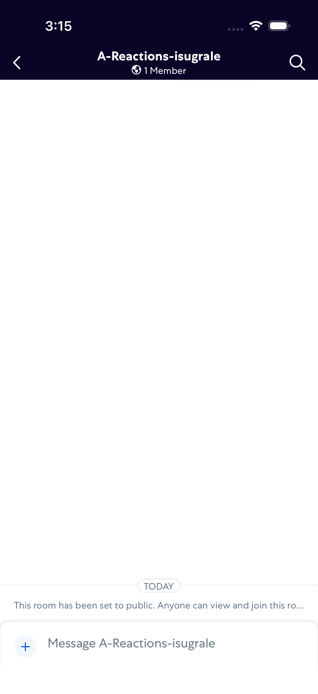
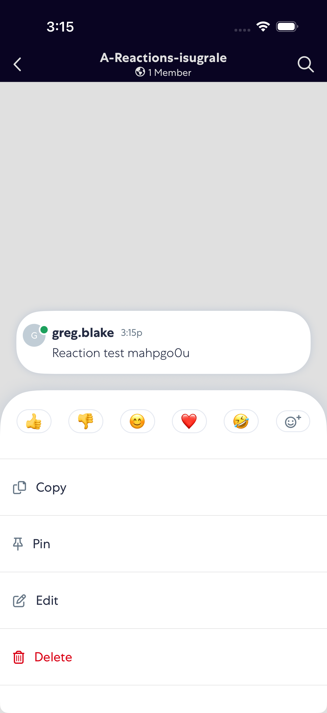
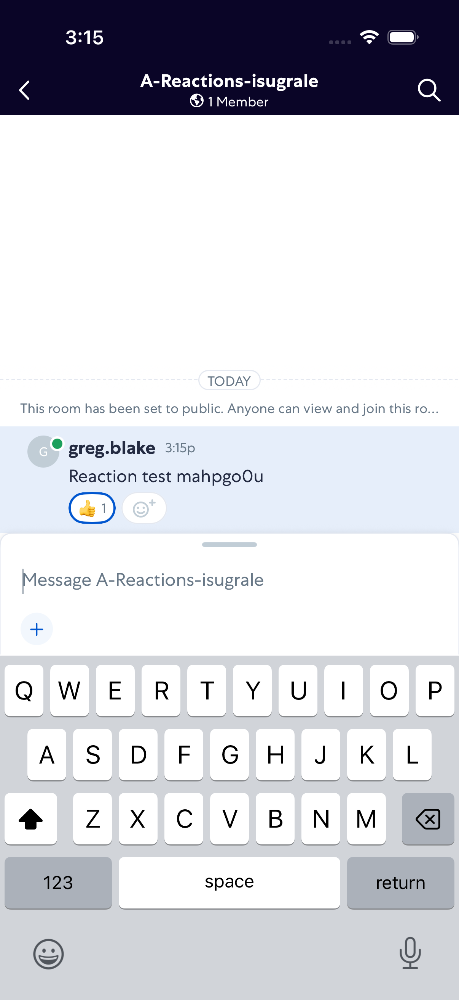
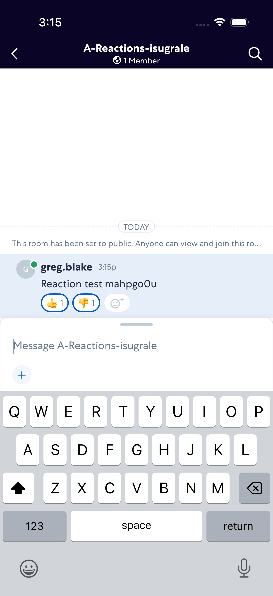
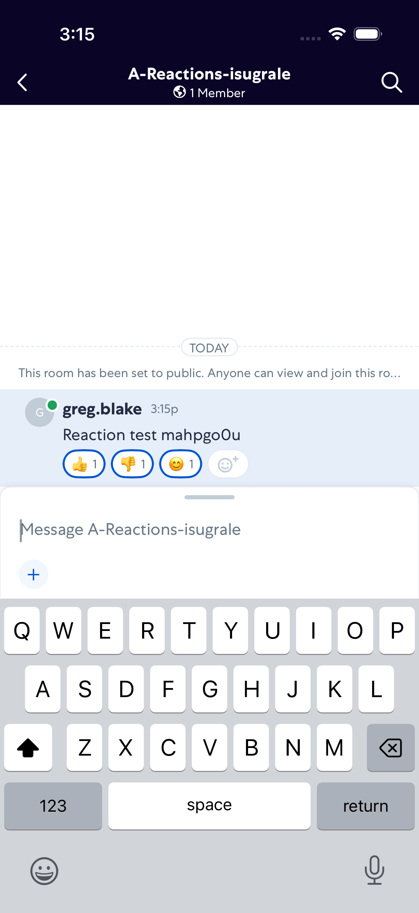
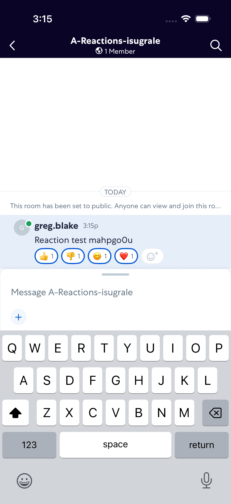
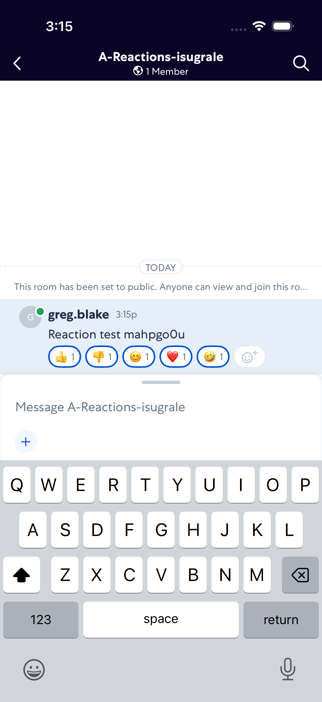
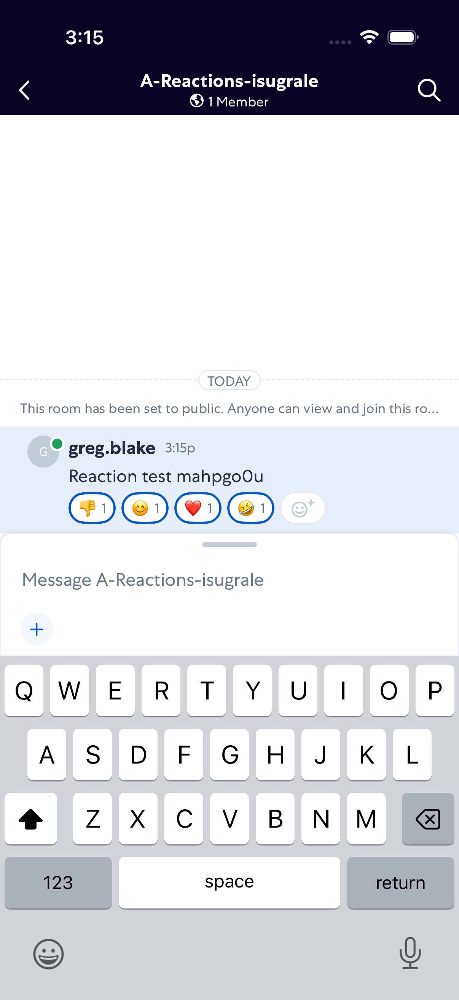
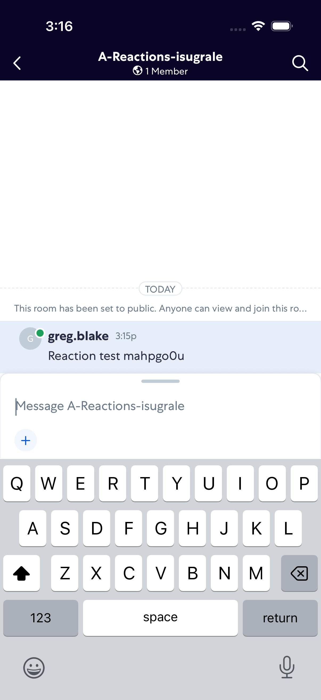

# Reactions

- Status: PASS
- Duration: 1m 3s
- Lane: ConversationView
- Device: iPhone 17
- Appium port: 4727
- Started: 2026-08-18T19:15:02.495Z
- Finished: 2026-08-18T19:16:05.147Z

## Steps

### Step 1: Room Opened

### Step 2: Message Sent

### Step 3: Reaction Picker Open

### Step 4: Thumbs Up Added

### Step 5: Thumbs Down Added

### Step 6: Smile Added

### Step 7: Heart Added

### Step 8: Laugh Added

### Step 9: Thumbs Up Removed

### Step 10: Thumbs Down Removed

### Step 11: Smile Removed

### Step 12: Heart Removed

### Step 13: Laugh Removed

