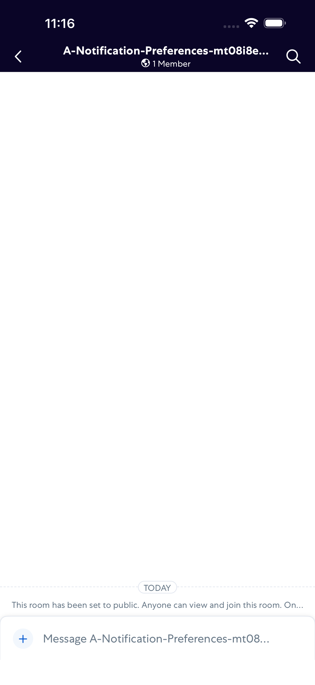
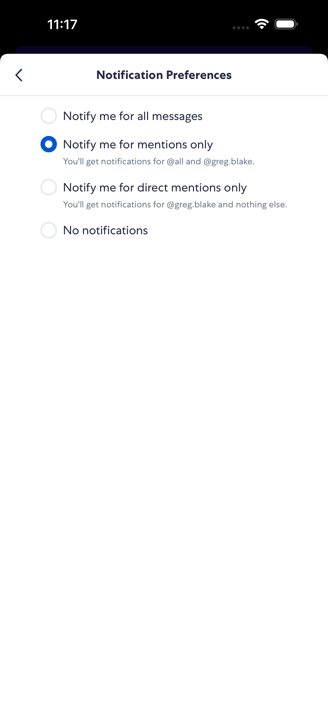
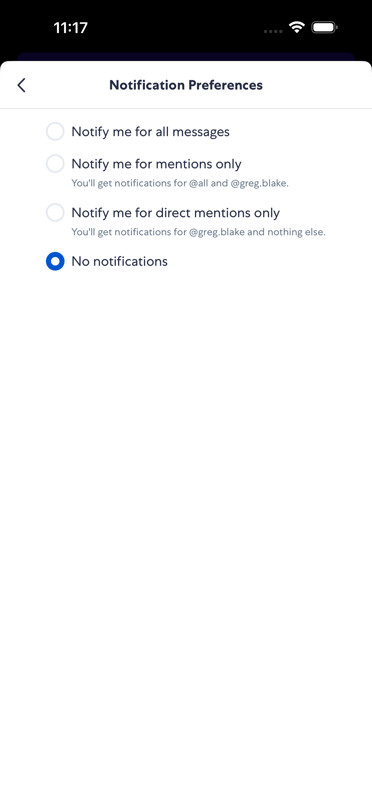
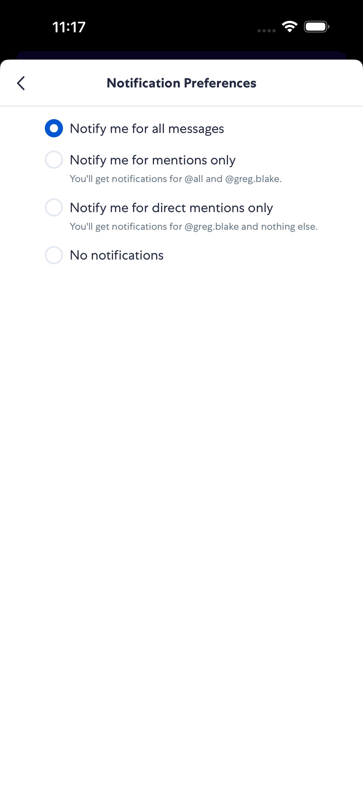

# RoomNotificationPreferences

- Status: PASS
- Duration: 1m 42s
- Lane: Conversation-List
- Logical category: ConversationView
- Device: iPhone 17 Pro Max
- Appium port: 4725
- Started: 2026-08-19T15:16:00.698Z
- Finished: 2026-08-19T15:17:42.426Z

## Phase Timings

| Phase | Duration |
| --- | --- |
| Session creation | 0ms |
| Login/readiness | 25s |
| Test body | 1m 14s |
| Screenshot capture | 3s |
| Recovery | 0ms |
| Report generation | 0ms |
| Room creation (test-owned) | 9s |

## Steps

### Step 1: Room Opened

### Step 2: Preferences Open

### Step 3: Preference Selected

### Step 4: Preference Persisted

### Step 5: Restore Persisted

