# attachments

- Status: PASS
- Duration: 1m 43s
- Lane: ConversationView
- Logical category: ConversationView
- Device: iPhone 17
- Appium port: 4727
- Started: 2026-09-01T18:56:06.082Z
- Finished: 2026-09-01T18:57:49.309Z

## Phase Timings

| Phase | Duration |
| --- | --- |
| Session creation | 0ms |
| Login/readiness | 12s |
| Test body | 1m 28s |
| Screenshot capture | 3s |
| Recovery | 0ms |
| Report generation | 0ms |

## Steps

### Step 1: In Room

### Step 2: Share Options Dialog

### Step 3: Photo Picker Open

### Step 4: After Tap All Photos

### Step 5: Attachment In Composer

### Step 6: After Send Attachment

### Step 7: Share Options Dialog For File

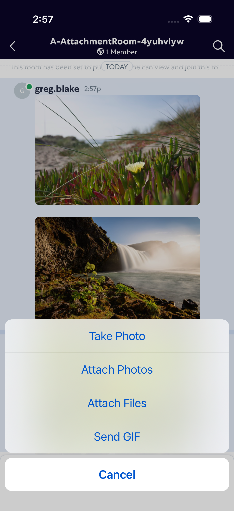

### Step 8: File Picker Open

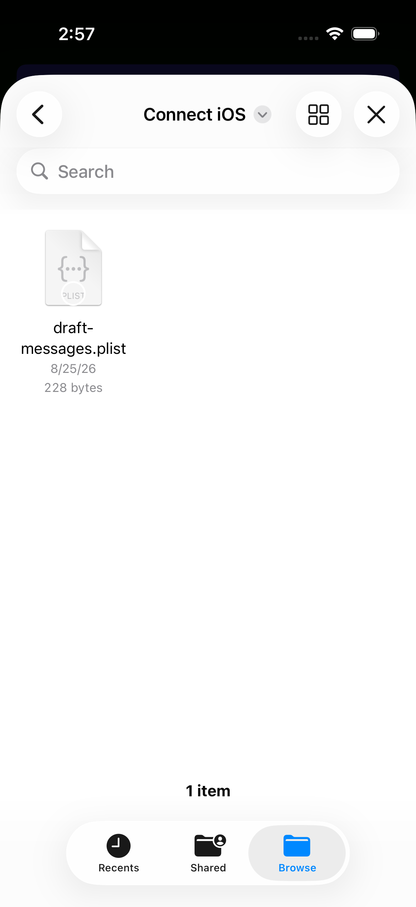

### Step 9: Files Browse

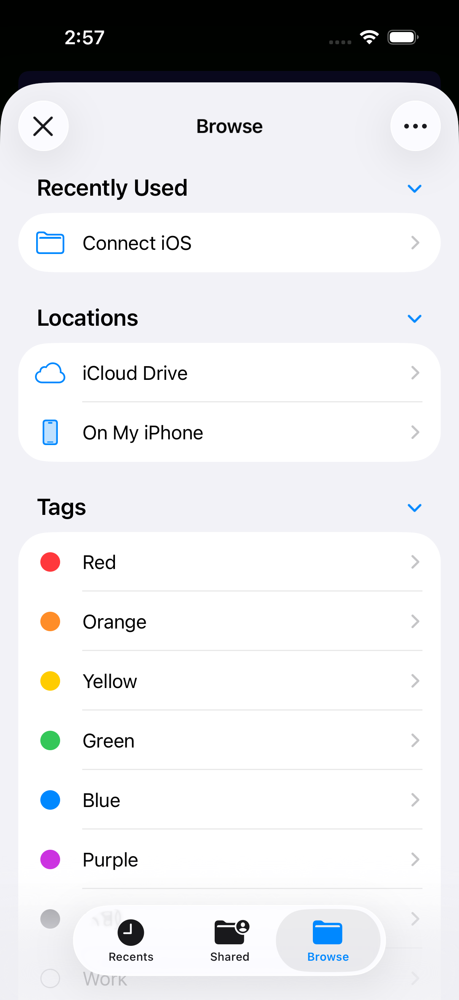

### Step 10: Files On My Iphone

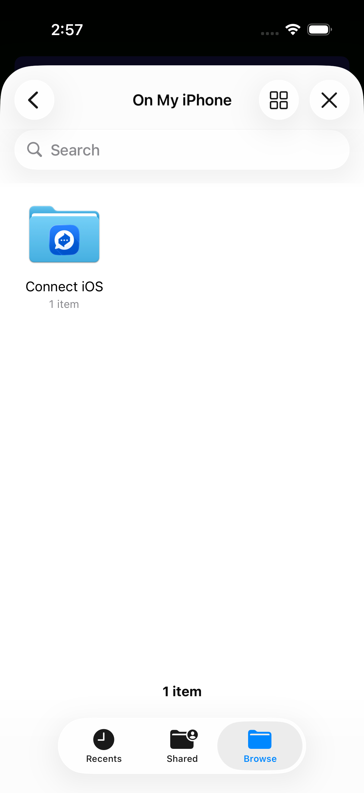

### Step 11: Files Connect Ios

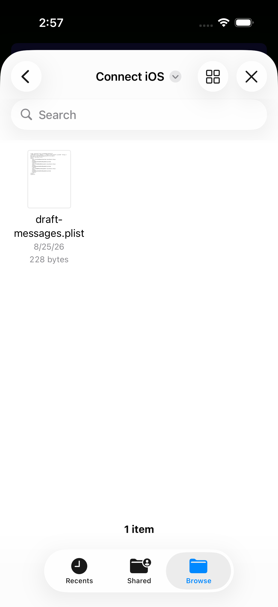

### Step 12: File Selected

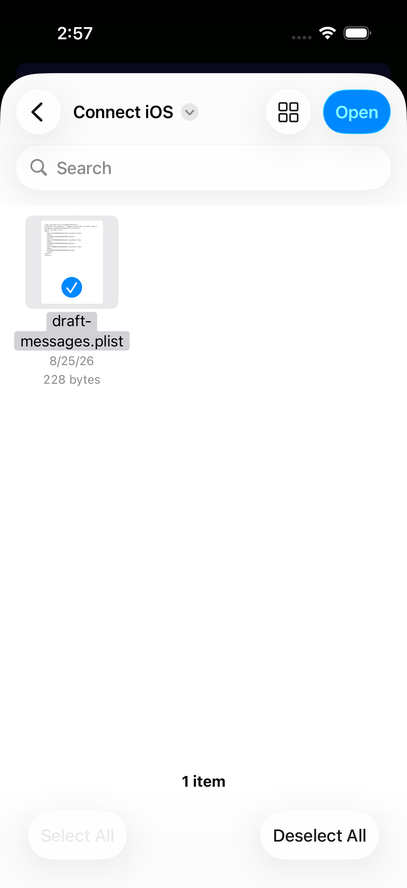

### Step 13: File Attachment In Composer

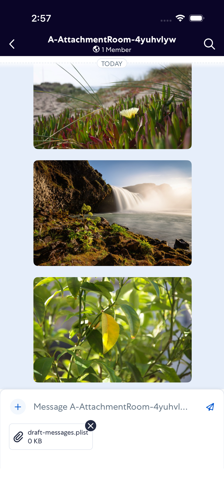

### Step 14: After Send File Attachment

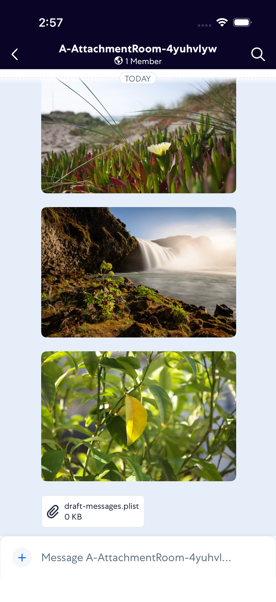

### Step 15: Share Options Dialog For Gif

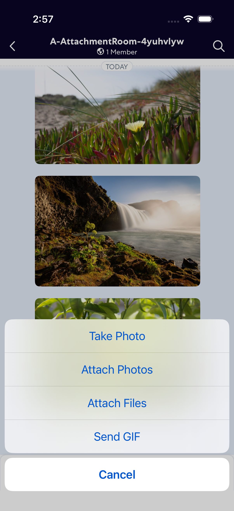

### Step 16: Gif Picker Open

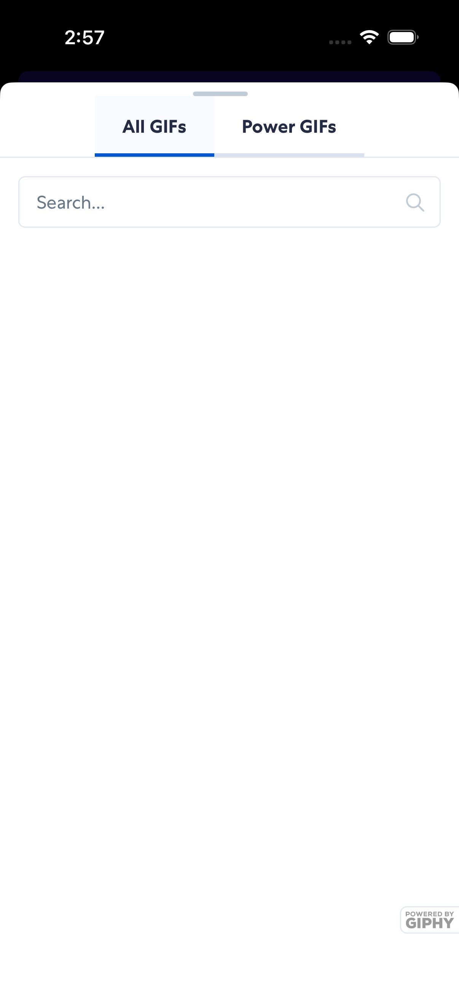

### Step 17: After Send Gif

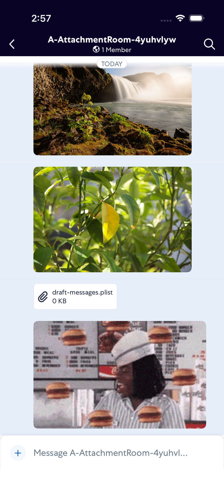
