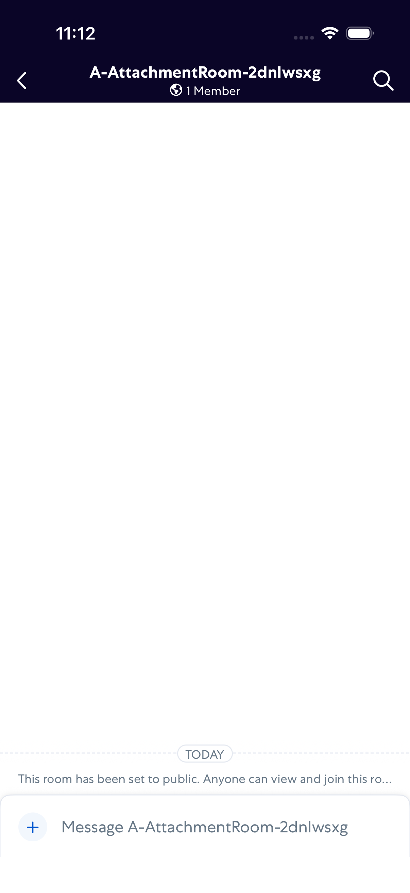
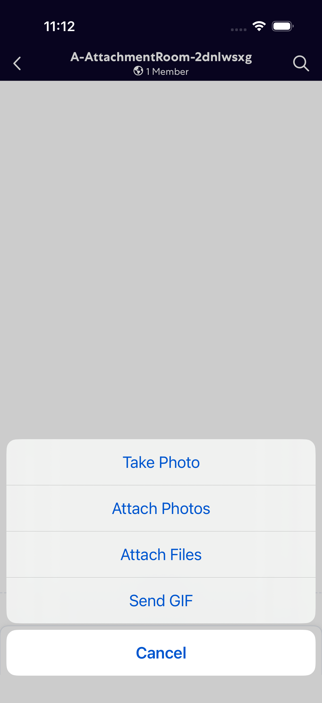
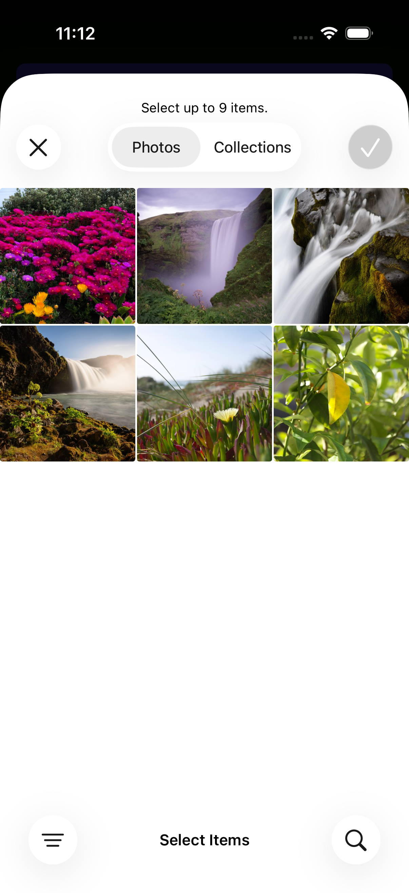
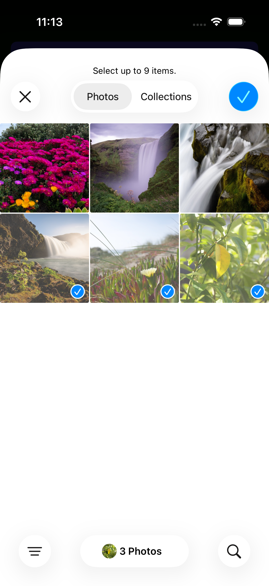
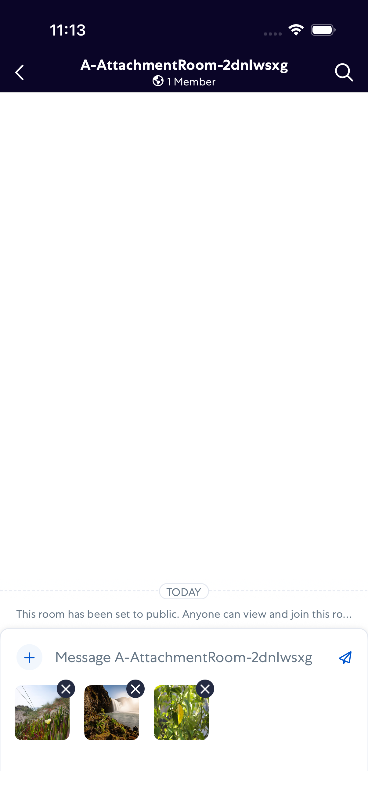
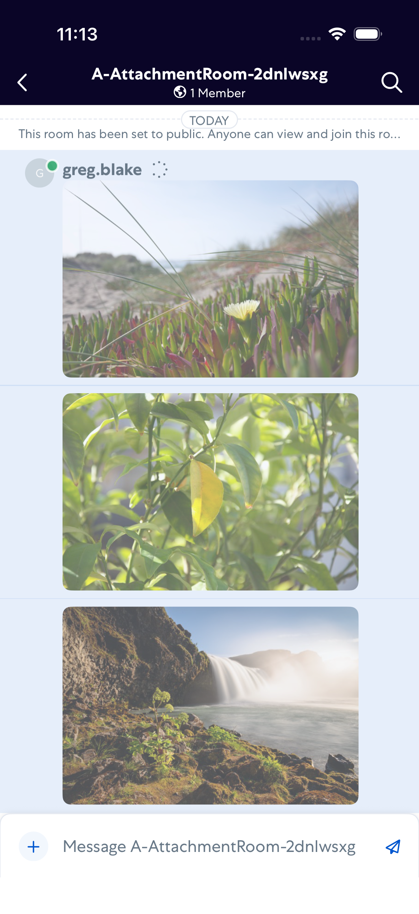
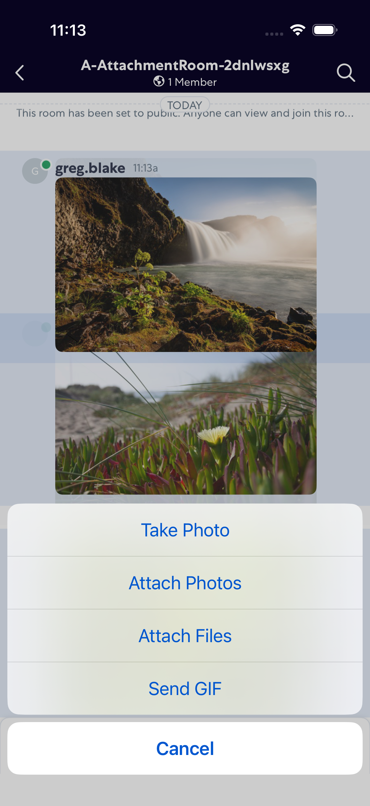
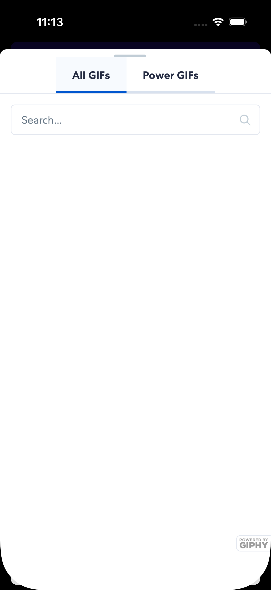
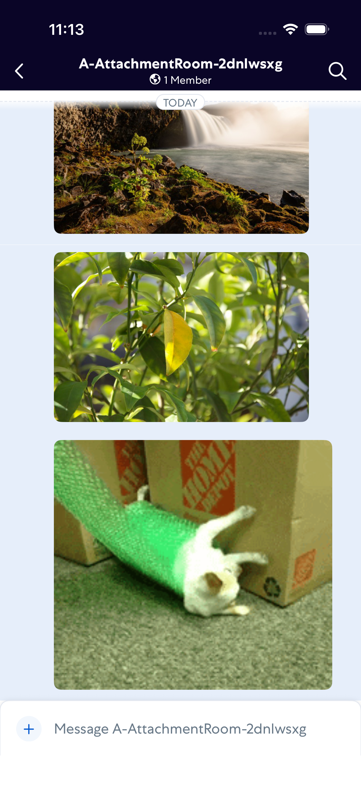

# attachments

- Status: PASS
- Duration: 2m 8s
- Lane: ConversationView
- Logical category: ConversationView
- Device: iPhone 17
- Appium port: 4727
- Started: 2026-08-19T15:11:30.697Z
- Finished: 2026-08-19T15:13:38.211Z

## Phase Timings

| Phase | Duration |
| --- | --- |
| Session creation | 0ms |
| Login/readiness | 22s |
| Test body | 1m 37s |
| Screenshot capture | 8s |
| Recovery | 0ms |
| Report generation | 0ms |

## Steps

### Step 1: In Room

### Step 2: Share Options Dialog

### Step 3: Photo Picker Open

### Step 4: After Tap All Photos

### Step 5: Attachment In Composer

### Step 6: After Send Attachment

### Step 7: Share Options Dialog For Gif

### Step 8: Gif Picker Open

### Step 9: After Send Gif

