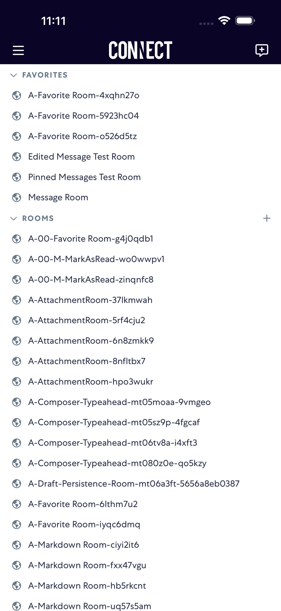
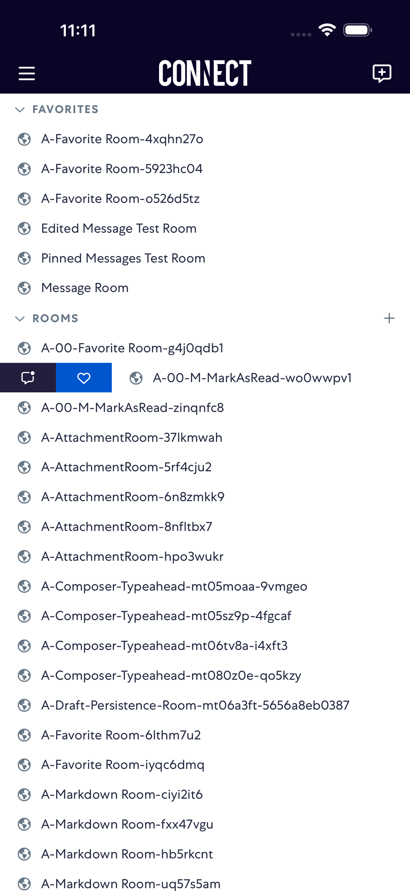
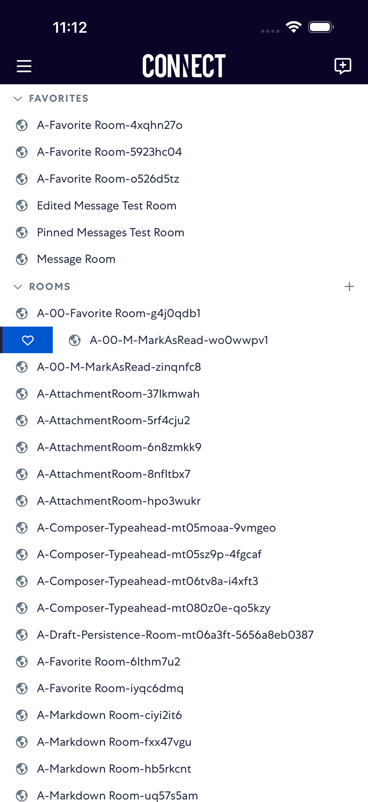
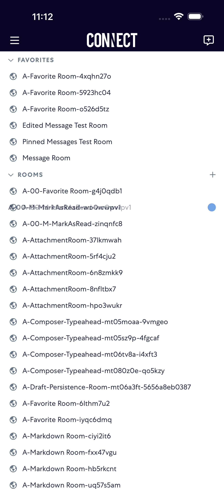

# markAsRead

- Status: PASS
- Duration: 51s
- Lane: Conversation-List
- Logical category: Conversation-List
- Device: iPhone 17 Pro Max
- Appium port: 4725
- Started: 2026-08-19T15:11:16.781Z
- Finished: 2026-08-19T15:12:08.269Z

## Phase Timings

| Phase | Duration |
| --- | --- |
| Session creation | 0ms |
| Login/readiness | 4s |
| Test body | 46s |
| Screenshot capture | 2s |
| Recovery | 0ms |
| Report generation | 0ms |

## Steps

### Step 1: Before Swipe Right

### Step 2: After Swipe Right

### Step 3: After Mark Unread

### Step 4: After Mark Read

