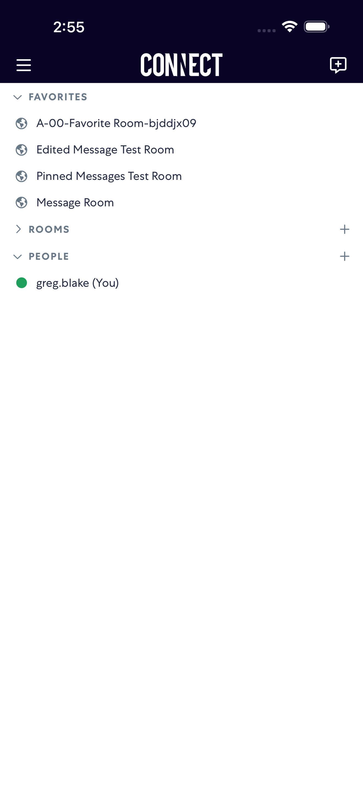

# markAsRead

- Status: FAIL
- Duration: 1m 5s
- Lane: Conversation-List
- Logical category: Conversation-List
- Device: iPhone 17 Pro Max
- Appium port: 4725
- Started: 2026-09-01T18:54:11.422Z
- Finished: 2026-09-01T18:55:16.300Z

## Failure

```text
None of [A-00-M-MarkAsRead-gktxu7ze] became visible after 24 list scroll(s)
```

## Phase Timings

| Phase | Duration |
| --- | --- |
| Session creation | 0ms |
| Login/readiness | 9s |
| Test body | 56s |
| Screenshot capture | 133ms |
| Recovery | 3s |
| Report generation | 0ms |

## Steps

### Step 1: ERROR - Failed here



**Failure at this step:**

```text
None of [A-00-M-MarkAsRead-gktxu7ze] became visible after 24 list scroll(s)
```
