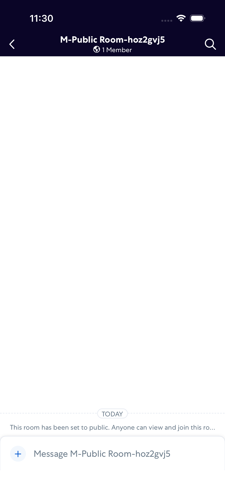
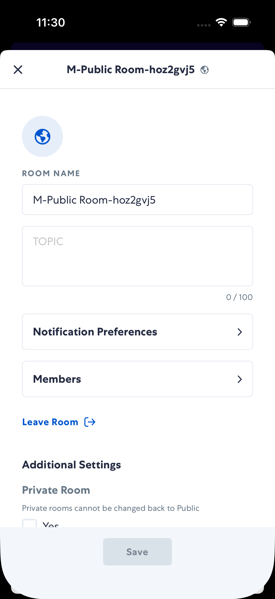
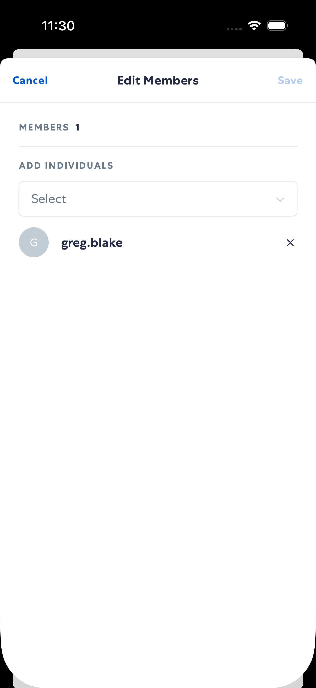
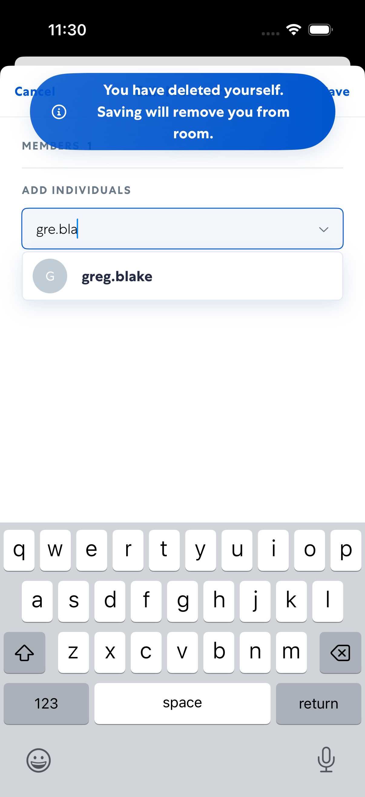
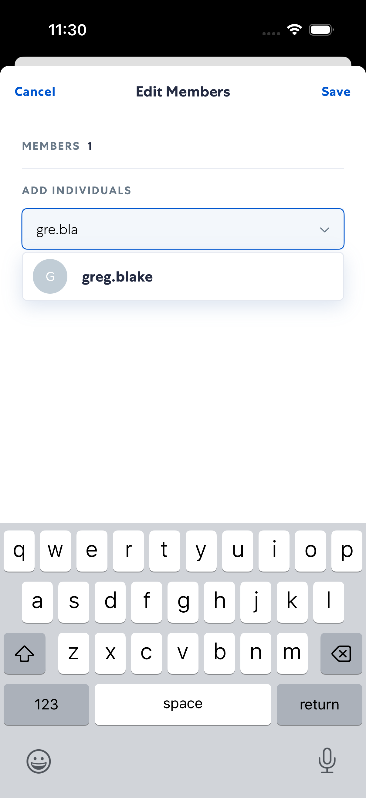
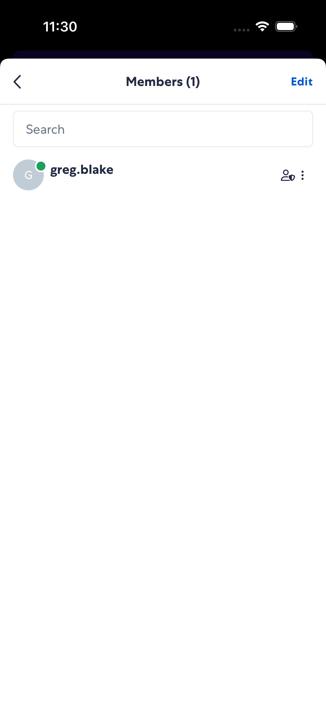
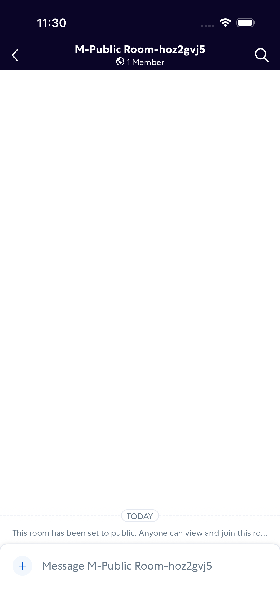
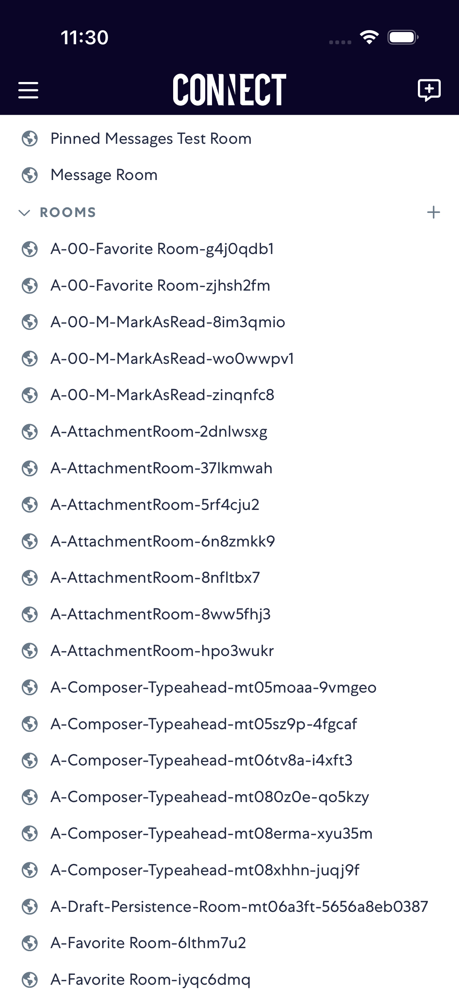

# membersRoom

- Status: PASS
- Duration: 1m 6s
- Lane: ConversationView
- Logical category: ConversationView
- Device: iPhone 17
- Appium port: 4727
- Started: 2026-08-19T15:29:44.671Z
- Finished: 2026-08-19T15:30:50.784Z

## Phase Timings

| Phase | Duration |
| --- | --- |
| Session creation | 0ms |
| Login/readiness | 19s |
| Test body | 46s |
| Screenshot capture | 2s |
| Recovery | 0ms |
| Report generation | 0ms |

## Steps

### Step 1: In Room

### Step 2: Edit Modal Open

### Step 3: Members Screen

### Step 4: Edit Members

### Step 5: After Remove X

### Step 6: After Type Invitee

### Step 7: After Select Invitee

### Step 8: After Cancel

### Step 9: After Back

### Step 10: After Close

### Step 11: After Back To List

