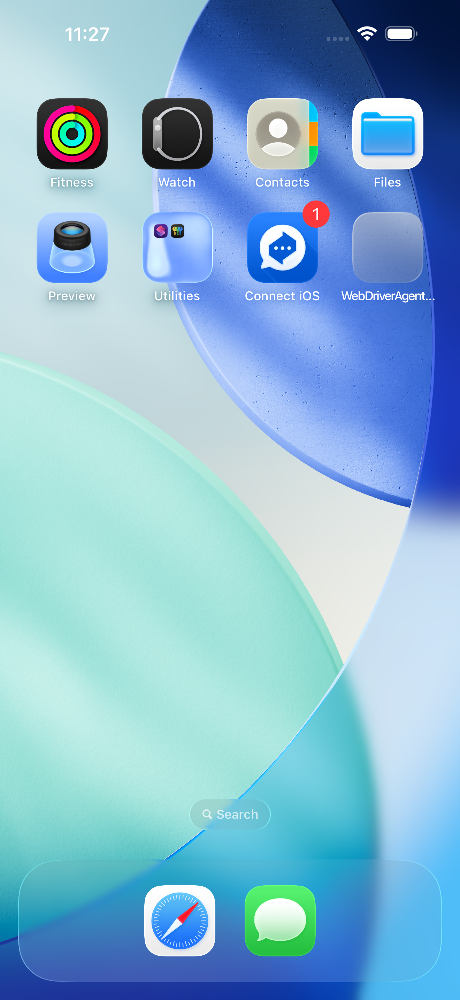
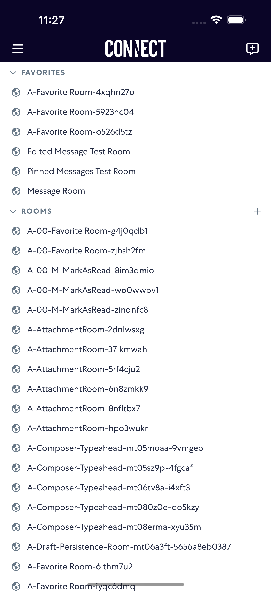
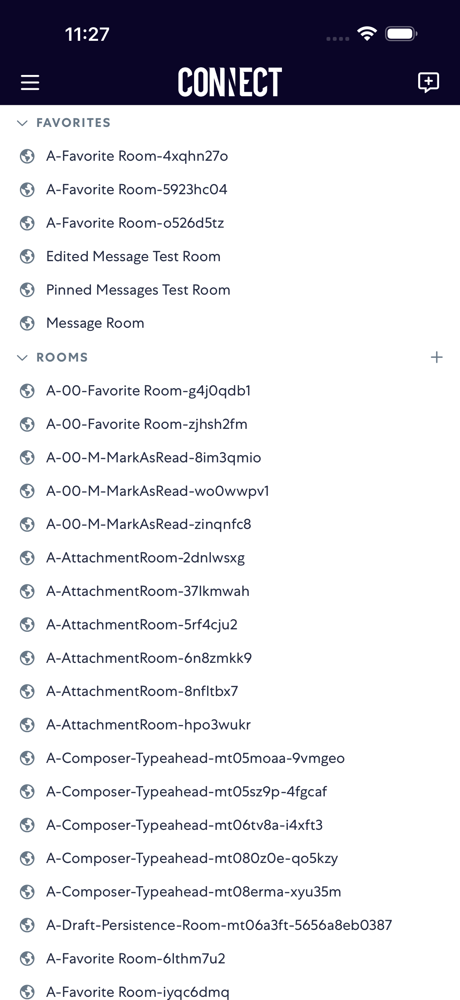

# notifications

- Status: PASS
- Duration: 17s
- Lane: Conversation-List
- Logical category: Conversation-List
- Device: iPhone 17 Pro Max
- Appium port: 4725
- Started: 2026-08-19T15:27:20.226Z
- Finished: 2026-08-19T15:27:36.907Z

## Phase Timings

| Phase | Duration |
| --- | --- |
| Session creation | 0ms |
| Login/readiness | 5s |
| Test body | 11s |
| Screenshot capture | 995ms |
| Recovery | 0ms |
| Report generation | 0ms |

## Steps

### Step 1: Before Push

### Step 2: After Push

### Step 3: After Tap Notification

### Step 4: In App After Notification

