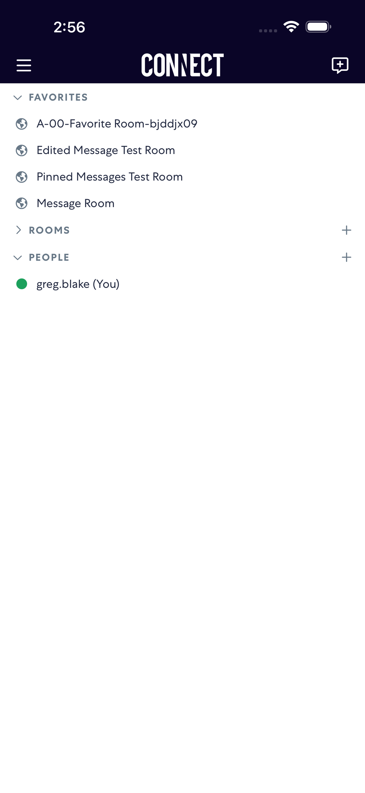

# removeRoom

- Status: FAIL
- Duration: 55s
- Lane: Conversation-List
- Logical category: Conversation-List
- Device: iPhone 17 Pro Max
- Appium port: 4725
- Started: 2026-09-01T18:55:18.807Z
- Finished: 2026-09-01T18:56:13.364Z

## Failure

```text
None of [A-00-E-RemoveRoom-trffrnb4] became visible after 24 list scroll(s)
```

## Phase Timings

| Phase | Duration |
| --- | --- |
| Session creation | 0ms |
| Login/readiness | 2s |
| Test body | 53s |
| Screenshot capture | 157ms |
| Recovery | 3s |
| Report generation | 0ms |

## Steps

### Step 1: ERROR - Failed here



**Failure at this step:**

```text
None of [A-00-E-RemoveRoom-trffrnb4] became visible after 24 list scroll(s)
```
