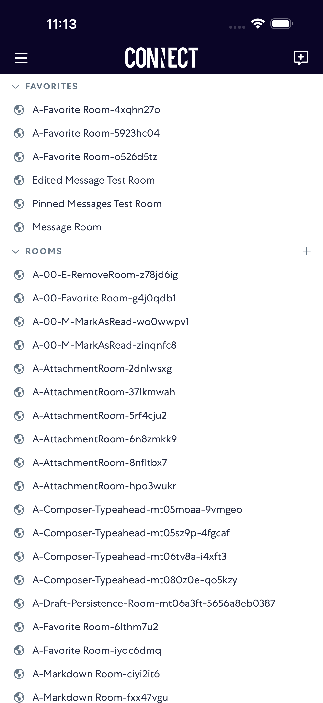
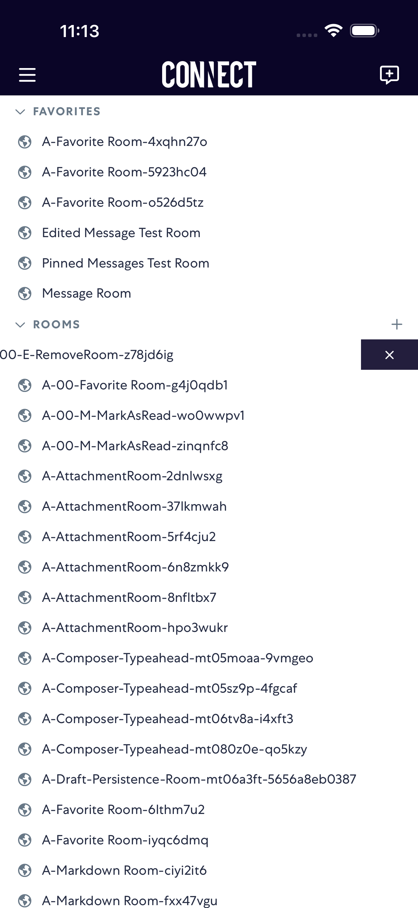
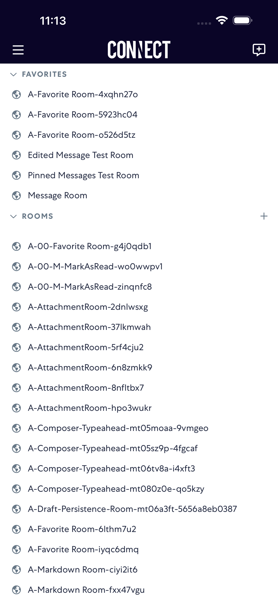
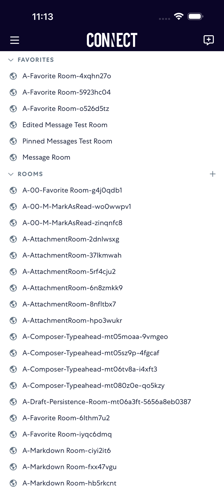

# removeRoom

- Status: PASS
- Duration: 1m 4s
- Lane: Conversation-List
- Logical category: Conversation-List
- Device: iPhone 17 Pro Max
- Appium port: 4725
- Started: 2026-08-19T15:12:34.844Z
- Finished: 2026-08-19T15:13:38.523Z

## Phase Timings

| Phase | Duration |
| --- | --- |
| Session creation | 0ms |
| Login/readiness | 4s |
| Test body | 57s |
| Screenshot capture | 2s |
| Recovery | 0ms |
| Report generation | 0ms |

## Steps

### Step 1: Before Swipe Left

### Step 2: After Swipe Left

### Step 3: After Tap Remove

### Step 4: After Room Removed

