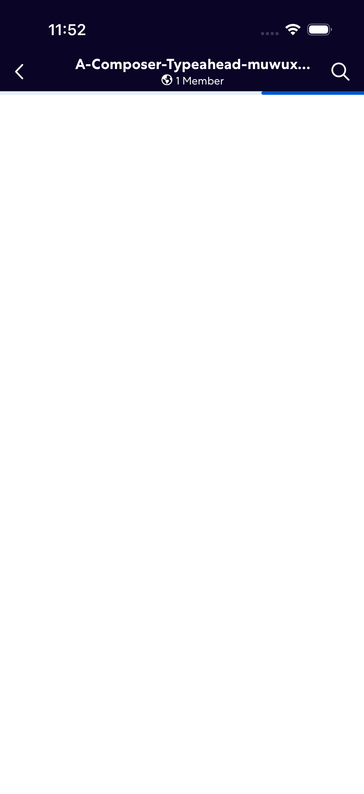
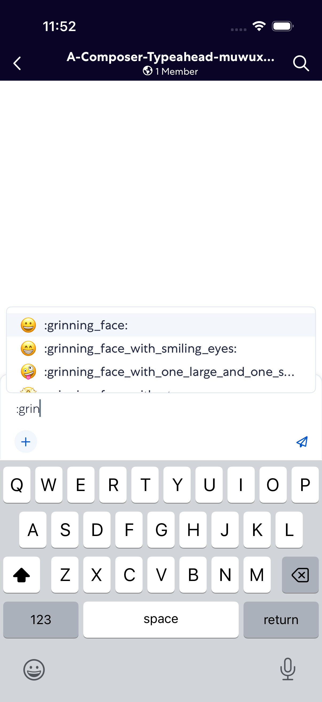
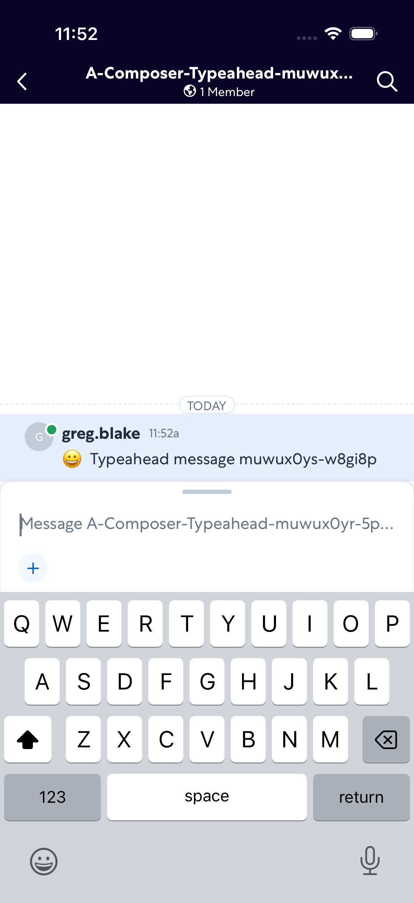

# ComposerTypeahead

- Status: PASS
- Duration: 1m 4s
- Lane: main-suite
- Logical category: ConversationView
- Device: iPhone 17 Pro
- Appium port: 4723
- Started: 2026-10-06T15:51:48.265Z
- Finished: 2026-10-06T15:52:51.936Z

## Phase Timings

| Phase | Duration |
| --- | --- |
| Session creation | 0ms |
| Login/readiness | 19s |
| Test body | 44s |
| Screenshot capture | 464ms |
| Recovery | 0ms |
| Report generation | 0ms |
| Room creation (test-owned) | 16s |

## Steps

### Step 1: Room Opened

### Step 2: Emoji Typeahead

### Step 3: Typeahead Message Sent

