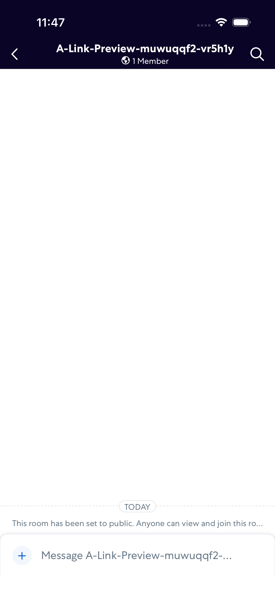
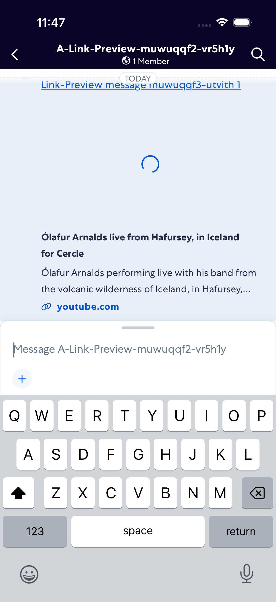
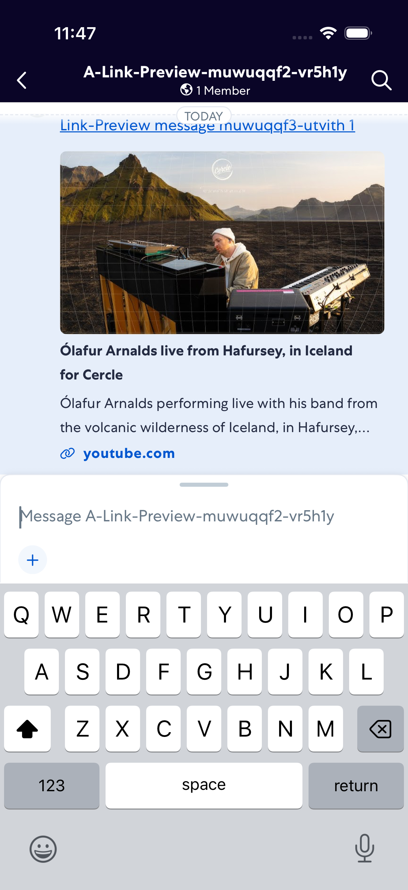
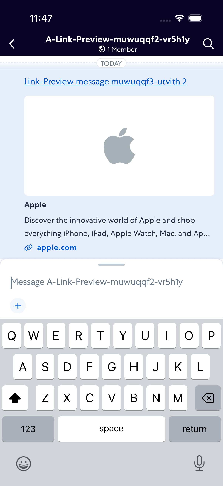
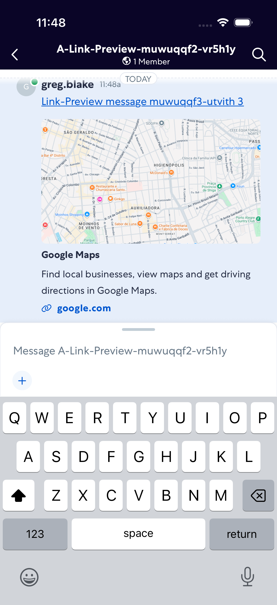

# LinkPreviews

- Status: PASS
- Duration: 56s
- Lane: ConversationView
- Logical category: ConversationView
- Device: iPhone 17
- Appium port: 4727
- Started: 2026-10-06T15:47:07.426Z
- Finished: 2026-10-06T15:48:02.998Z

## Phase Timings

| Phase | Duration |
| --- | --- |
| Session creation | 0ms |
| Login/readiness | 6s |
| Test body | 48s |
| Screenshot capture | 1s |
| Recovery | 0ms |
| Report generation | 0ms |
| Room creation (test-owned) | 12s |

## Steps

### Step 1: Room Opened

### Step 2: Youtube Link Sent

### Step 3: Youtube Preview Loaded

### Step 4: Apple Link Sent

### Step 5: Apple Preview Loaded

### Step 6: Google Maps Link Sent

### Step 7: Google Maps Preview Loaded

