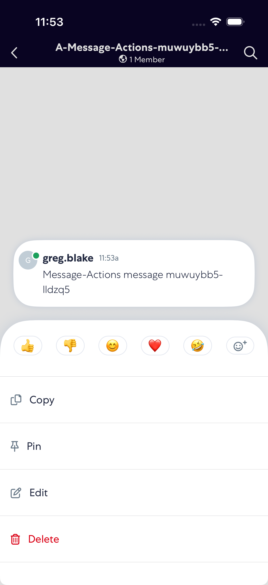
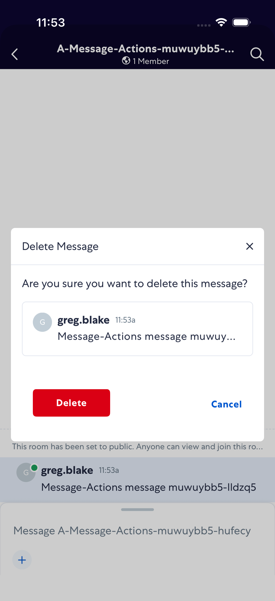
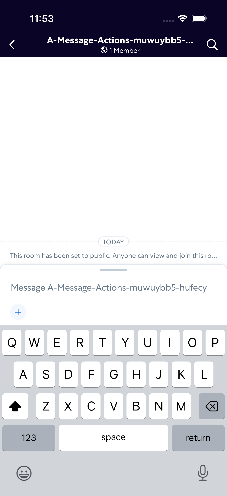

# MessageActions

- Status: PASS
- Duration: 57s
- Lane: main-suite
- Logical category: ConversationView
- Device: iPhone 17 Pro
- Appium port: 4723
- Started: 2026-10-06T15:52:51.946Z
- Finished: 2026-10-06T15:53:49.435Z

## Phase Timings

| Phase | Duration |
| --- | --- |
| Session creation | 0ms |
| Login/readiness | 15s |
| Test body | 41s |
| Screenshot capture | 914ms |
| Recovery | 0ms |
| Report generation | 0ms |
| Room creation (test-owned) | 5s |

## Steps

### Step 1: Message Sent

### Step 2: Copy Action Open

### Step 3: Delete Action Open

### Step 4: Delete Confirmation

### Step 5: Message Deleted

