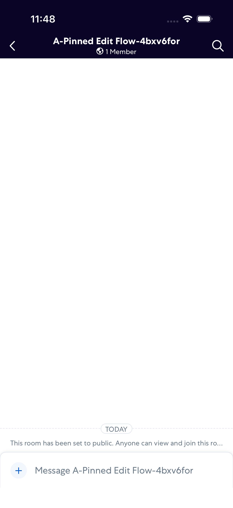
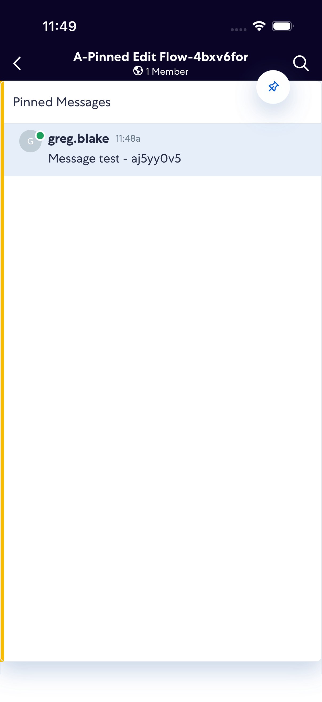
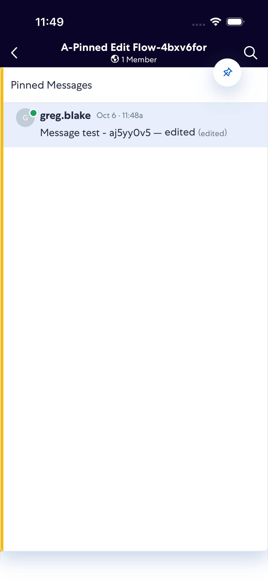
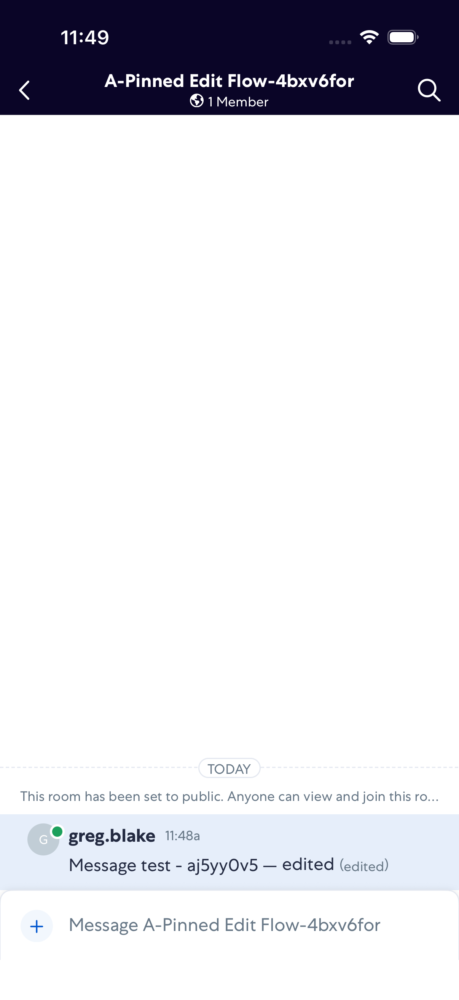

# PinnedMessageEditFlow

- Status: PASS
- Duration: 1m 21s
- Lane: main-suite
- Logical category: ConversationView
- Device: iPhone 17 Pro
- Appium port: 4723
- Started: 2026-10-06T15:48:12.701Z
- Finished: 2026-10-06T15:49:33.943Z

## Phase Timings

| Phase | Duration |
| --- | --- |
| Session creation | 0ms |
| Login/readiness | 13s |
| Test body | 1m 8s |
| Screenshot capture | 630ms |
| Recovery | 0ms |
| Report generation | 0ms |

## Steps

### Step 1: Room Opened

### Step 2: Pin Shows Original

### Step 3: Pin Shows Edited

### Step 4: Unpinned Drawer Closed

