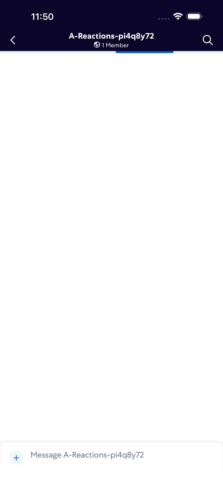
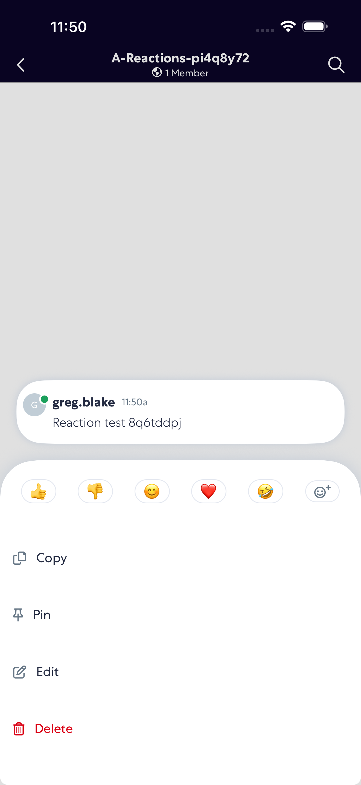
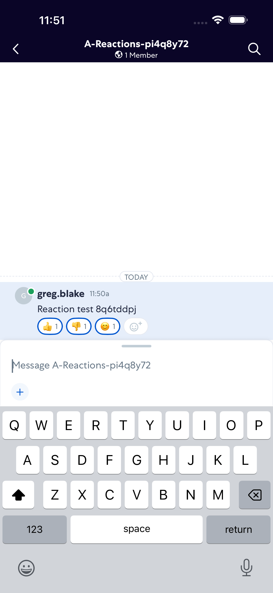
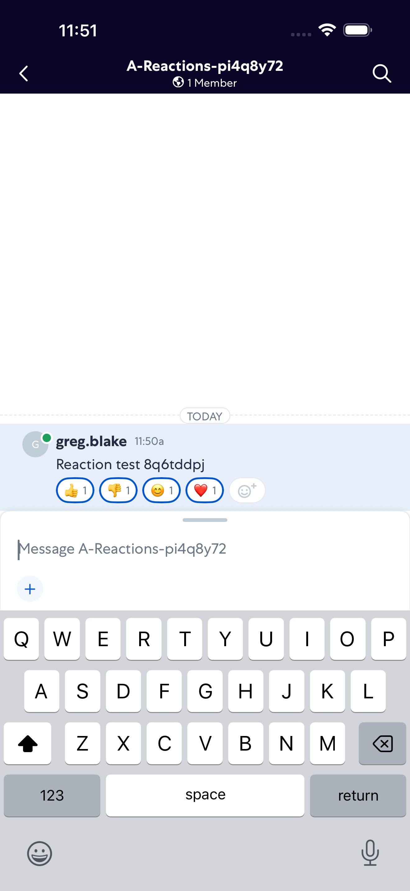
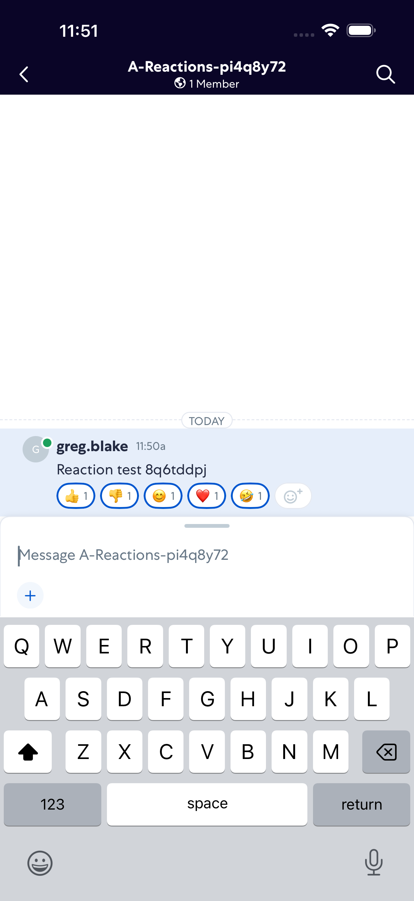
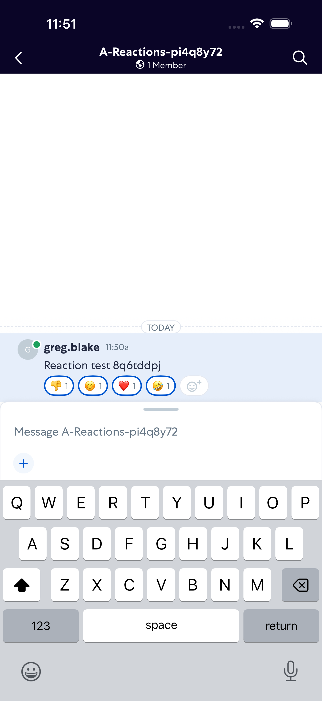
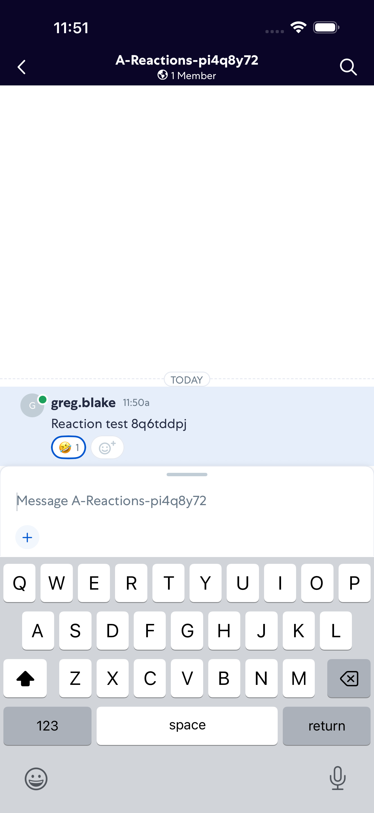
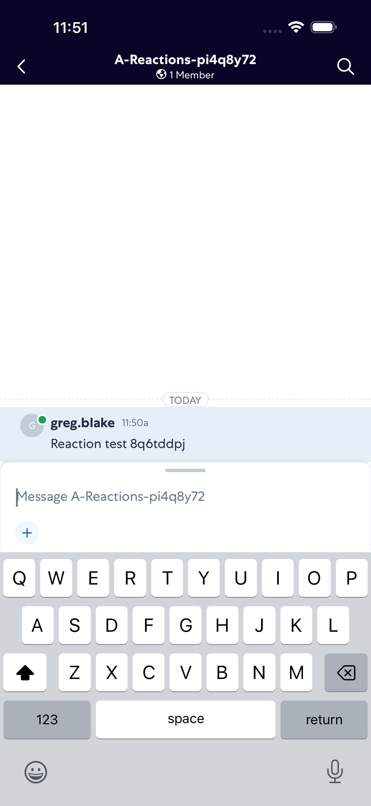

# Reactions

- Status: PASS
- Duration: 1m 46s
- Lane: Conversation-List
- Logical category: ConversationView
- Device: iPhone 17 Pro Max
- Appium port: 4725
- Started: 2026-10-06T15:49:57.604Z
- Finished: 2026-10-06T15:51:43.319Z

## Phase Timings

| Phase | Duration |
| --- | --- |
| Session creation | 0ms |
| Login/readiness | 8s |
| Test body | 1m 36s |
| Screenshot capture | 2s |
| Recovery | 0ms |
| Report generation | 0ms |

## Steps

### Step 1: Room Opened

### Step 2: Message Sent

### Step 3: Reaction Picker Open

### Step 4: Thumbs Up Added

### Step 5: Thumbs Down Added

### Step 6: Smile Added

### Step 7: Heart Added

### Step 8: Laugh Added

### Step 9: Thumbs Up Removed

### Step 10: Thumbs Down Removed

### Step 11: Smile Removed

### Step 12: Heart Removed

### Step 13: Laugh Removed

