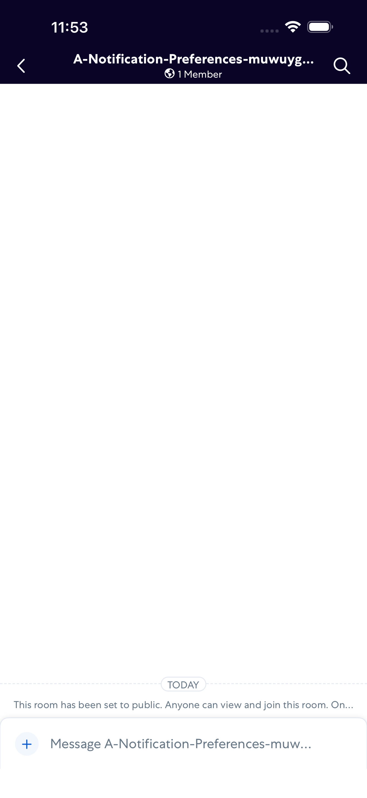
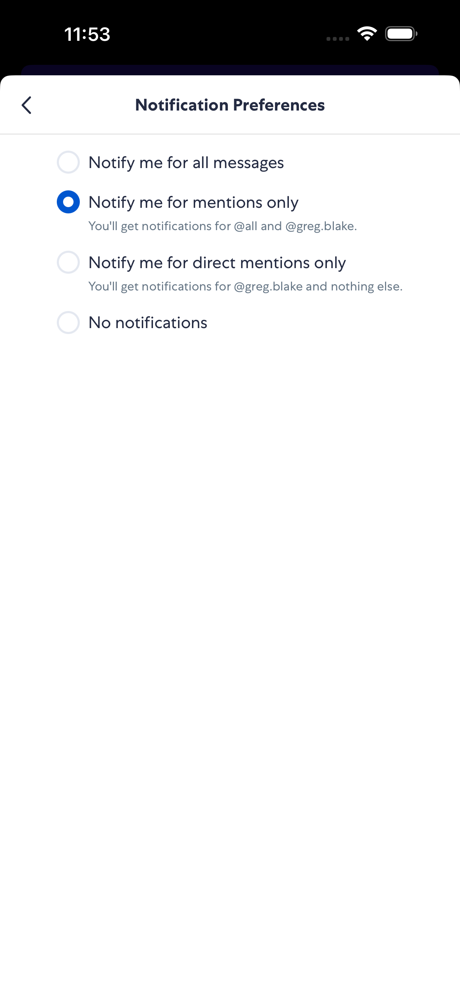
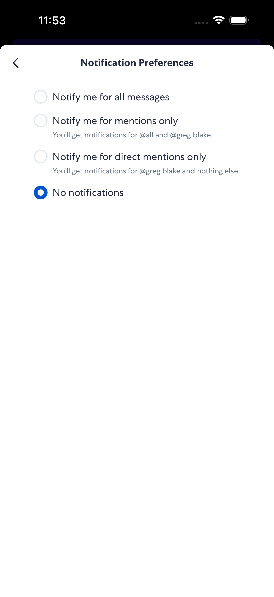
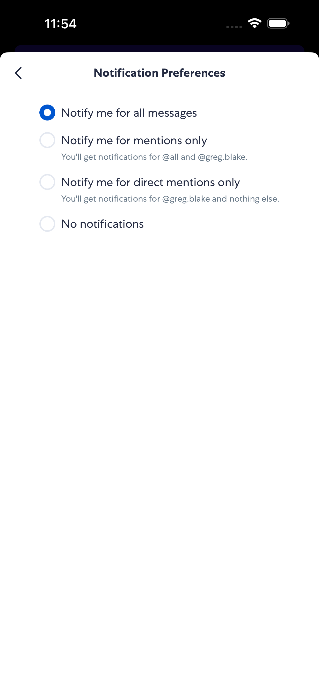

# RoomNotificationPreferences

- Status: PASS
- Duration: 1m 23s
- Lane: Conversation-List
- Logical category: ConversationView
- Device: iPhone 17 Pro Max
- Appium port: 4725
- Started: 2026-10-06T15:52:52.303Z
- Finished: 2026-10-06T15:54:15.405Z

## Phase Timings

| Phase | Duration |
| --- | --- |
| Session creation | 0ms |
| Login/readiness | 22s |
| Test body | 1m 1s |
| Screenshot capture | 691ms |
| Recovery | 0ms |
| Report generation | 0ms |
| Room creation (test-owned) | 9s |

## Steps

### Step 1: Room Opened

### Step 2: Preferences Open

### Step 3: Preference Selected

### Step 4: Preference Persisted

### Step 5: Restore Persisted

