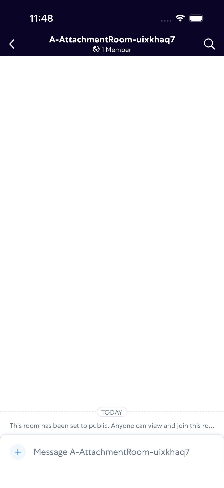
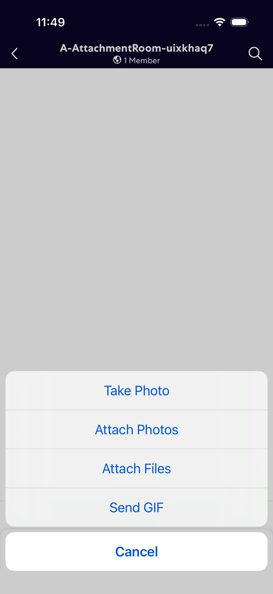
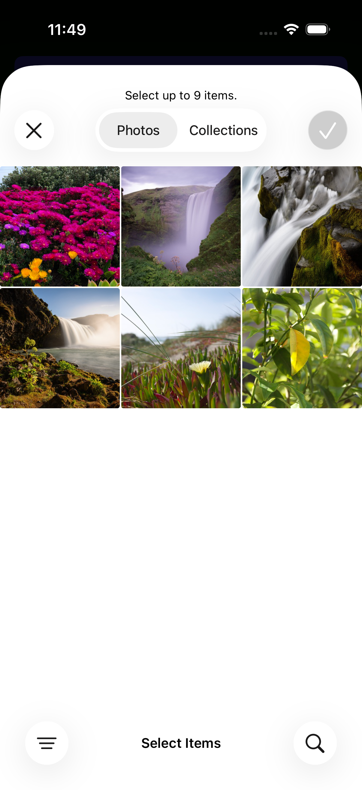
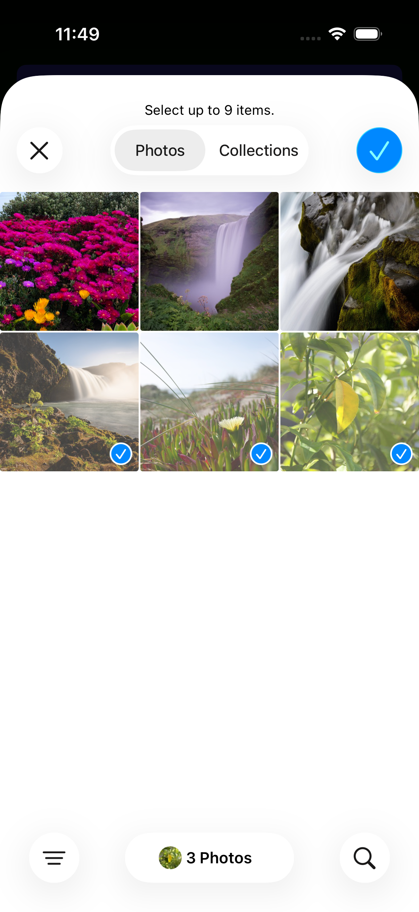
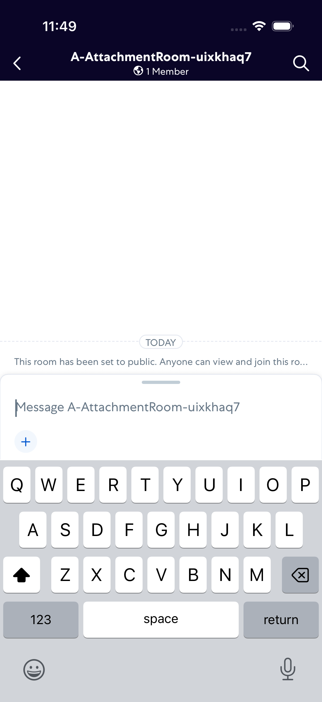
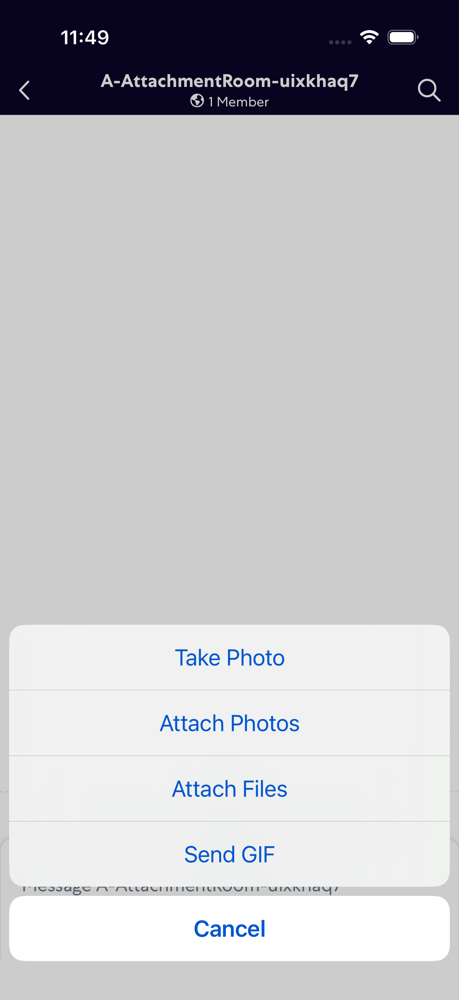
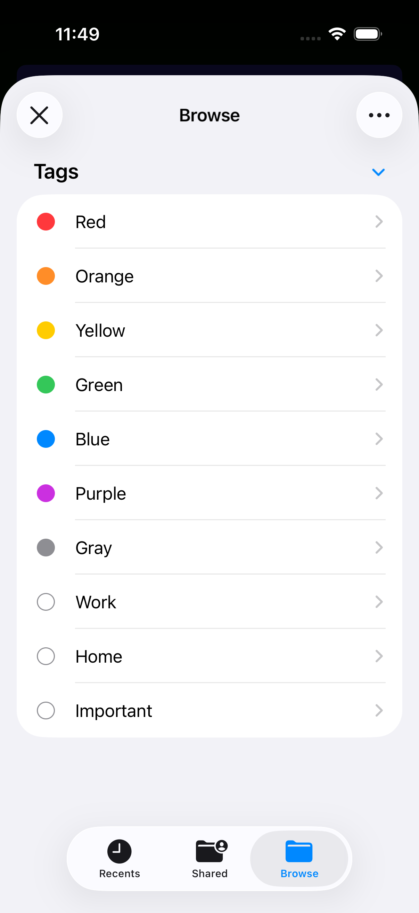
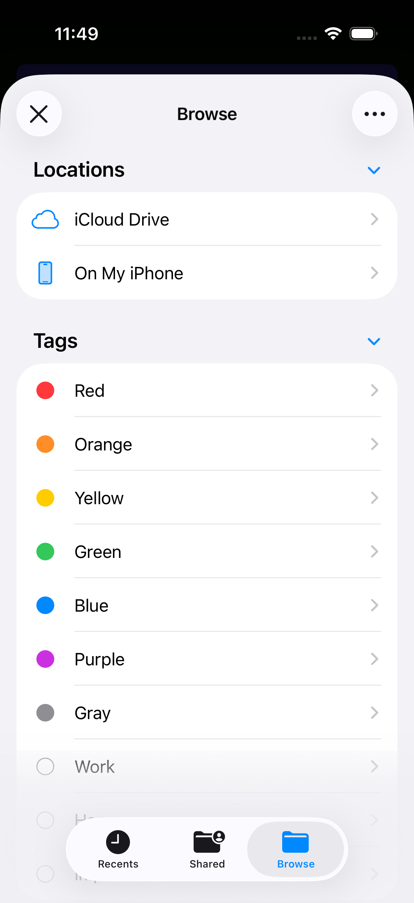
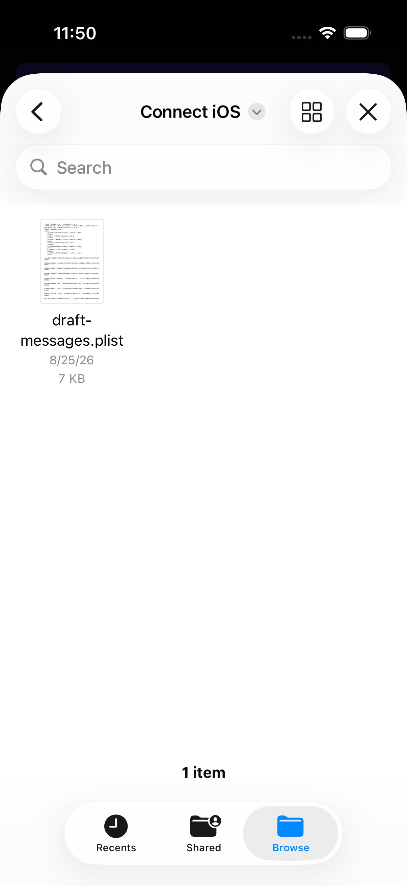

# attachments

- Status: FAIL
- Duration: 2m 9s
- Lane: ConversationView
- Logical category: ConversationView
- Device: iPhone 17
- Appium port: 4727
- Started: 2026-10-06T15:48:03.003Z
- Finished: 2026-10-06T15:50:11.570Z

## Failure

```text
attachments: Files picker item "Connect iOS" did not appear
```

## Phase Timings

| Phase | Duration |
| --- | --- |
| Session creation | 0ms |
| Login/readiness | 23s |
| Test body | 1m 44s |
| Screenshot capture | 2s |
| Recovery | 266ms |
| Report generation | 0ms |

## Steps

### Step 1: In Room



### Step 2: Share Options Dialog



### Step 3: Photo Picker Open



### Step 4: After Tap All Photos



### Step 5: Attachment In Composer


### Step 6: After Send Attachment



### Step 7: Share Options Dialog For File



### Step 8: File Picker Open



### Step 9: Files Browse



### Step 10: ERROR - Failed here



**Failure at this step:**

```text
attachments: Files picker item "Connect iOS" did not appear
```
