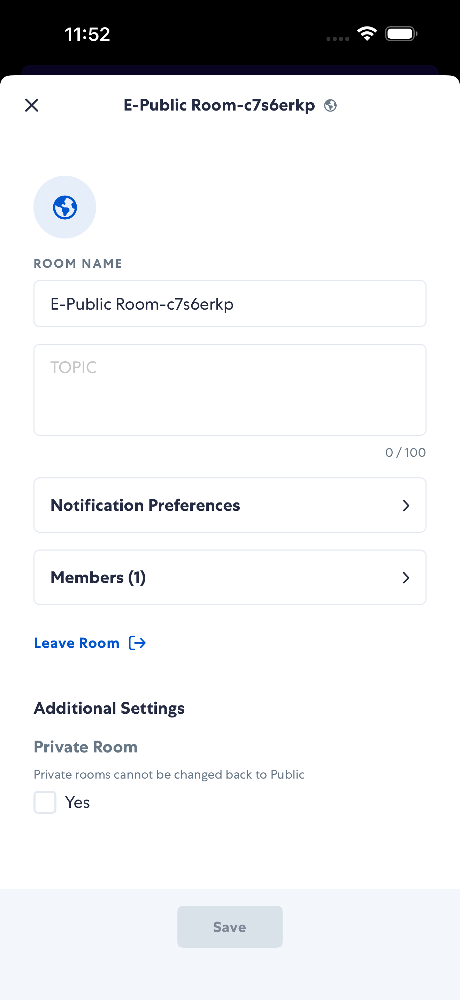
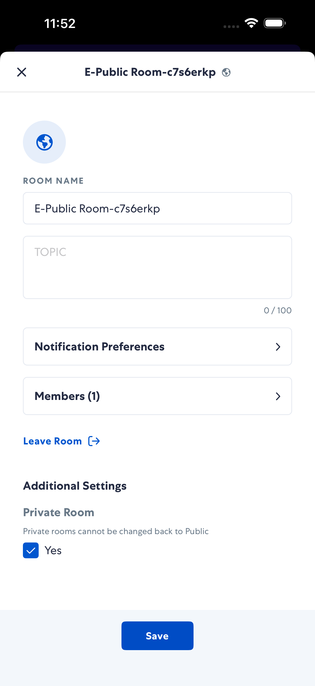
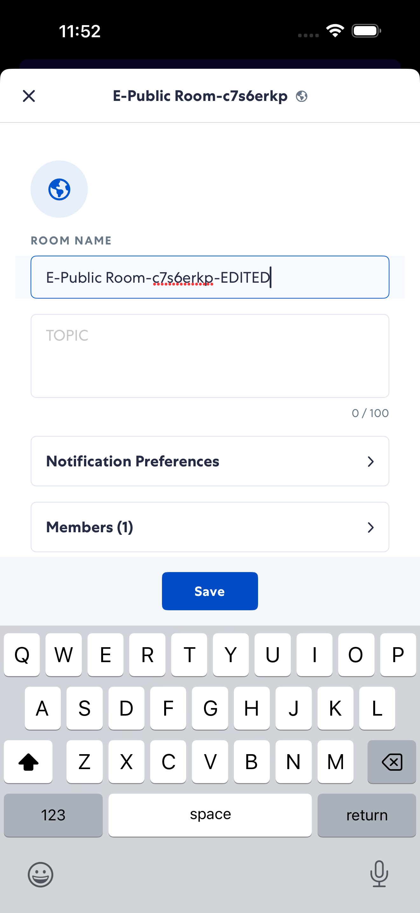
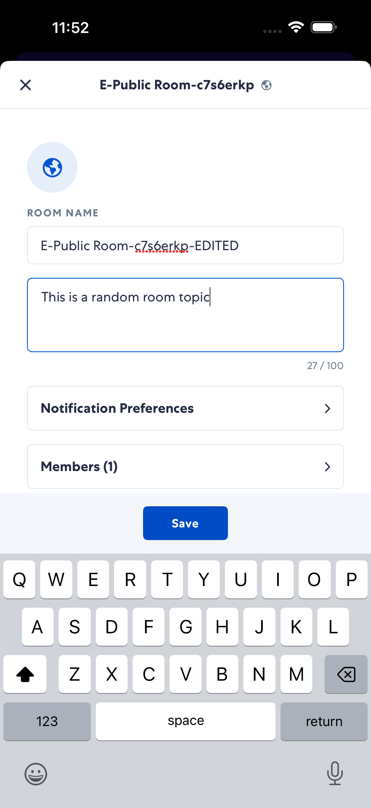
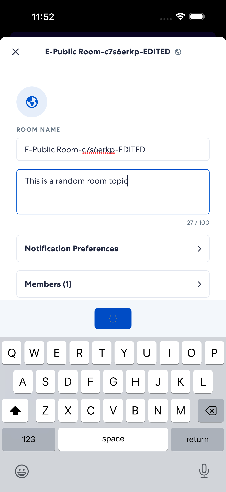
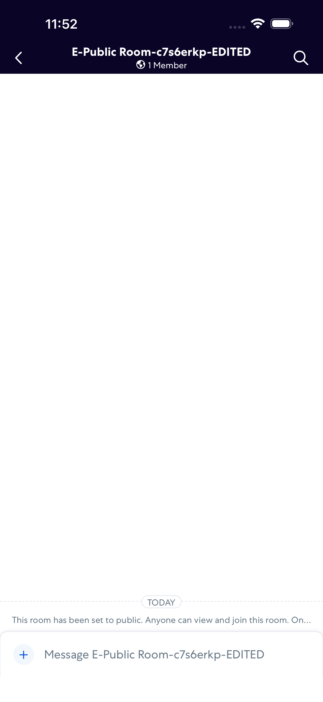
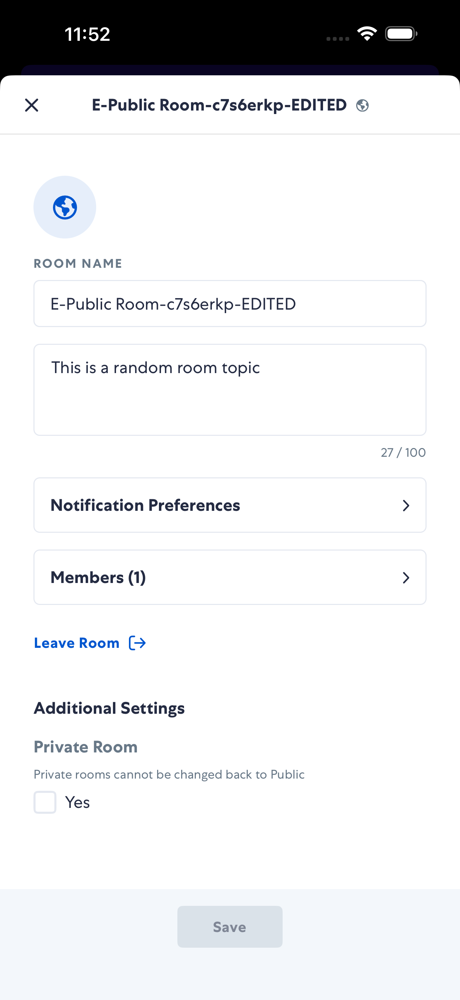

# editRoom

- Status: PASS
- Duration: 1m 9s
- Lane: Conversation-List
- Logical category: ConversationView
- Device: iPhone 17 Pro Max
- Appium port: 4725
- Started: 2026-10-06T15:51:43.331Z
- Finished: 2026-10-06T15:52:52.296Z

## Phase Timings

| Phase | Duration |
| --- | --- |
| Session creation | 0ms |
| Login/readiness | 18s |
| Test body | 50s |
| Screenshot capture | 1s |
| Recovery | 0ms |
| Report generation | 0ms |

## Steps

### Step 1: In Room

### Step 2: Edit Modal Open

### Step 3: After Toggle Private

### Step 4: After Name Edited

### Step 5: After Topic Filled

### Step 6: After Save

### Step 7: After Close

### Step 8: Reopened Saved Settings

