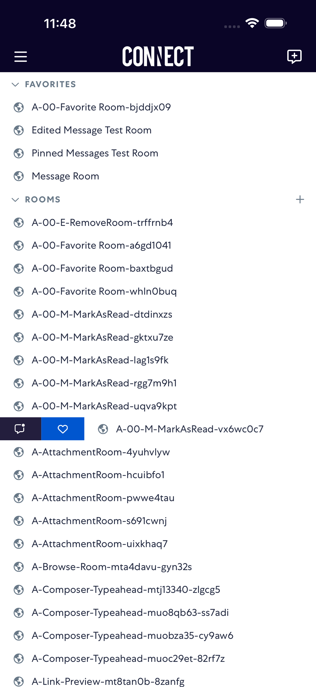
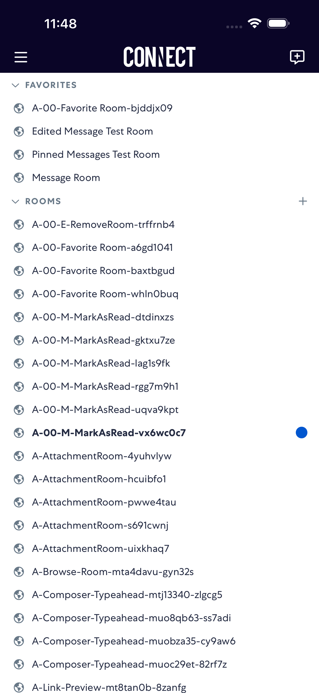
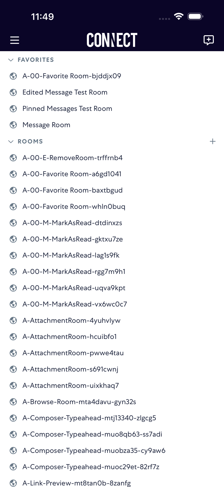

# markAsRead

- Status: PASS
- Duration: 59s
- Lane: Conversation-List
- Logical category: Conversation-List
- Device: iPhone 17 Pro Max
- Appium port: 4725
- Started: 2026-10-06T15:48:05.507Z
- Finished: 2026-10-06T15:49:04.216Z

## Phase Timings

| Phase | Duration |
| --- | --- |
| Session creation | 0ms |
| Login/readiness | 7s |
| Test body | 51s |
| Screenshot capture | 735ms |
| Recovery | 0ms |
| Report generation | 0ms |

## Steps

### Step 1: Before Swipe Right

### Step 2: After Swipe Right

### Step 3: After Mark Unread

### Step 4: After Mark Read

