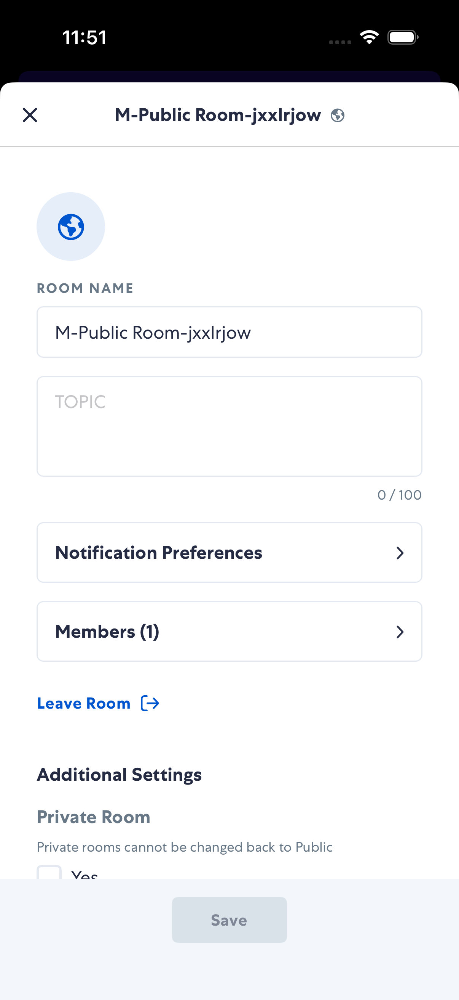

# membersRoom

- Status: FAIL
- Duration: 2m 4s
- Lane: ConversationView
- Logical category: ConversationView
- Device: iPhone 17
- Appium port: 4727
- Started: 2026-10-06T15:50:11.856Z
- Finished: 2026-10-06T15:52:15.412Z

## Failure

```text
membersRoom: Add Individuals field did not appear
```

## Phase Timings

| Phase | Duration |
| --- | --- |
| Session creation | 0ms |
| Login/readiness | 53s |
| Test body | 1m 9s |
| Screenshot capture | 693ms |
| Recovery | 440ms |
| Report generation | 0ms |

## Steps

### Step 1: In Room


### Step 2: Edit Modal Open



### Step 3: Members Screen


### Step 4: ERROR - Failed here


**Failure at this step:**

```text
membersRoom: Add Individuals field did not appear
```
