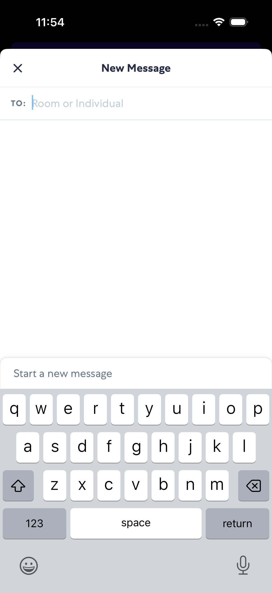
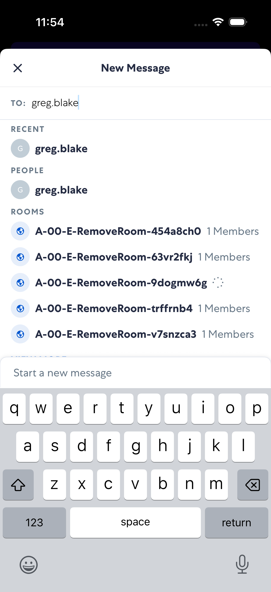
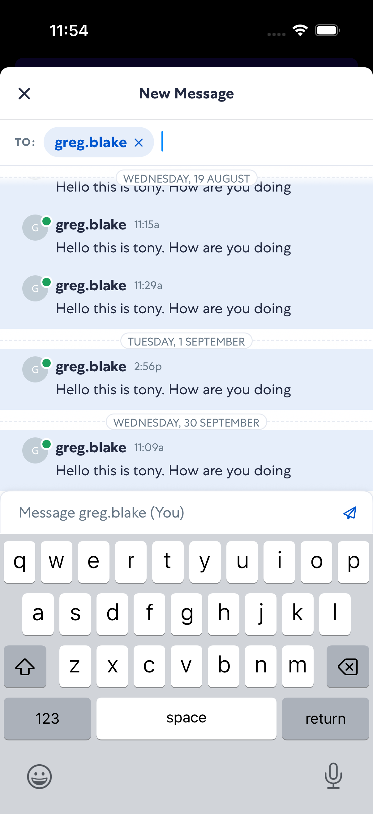
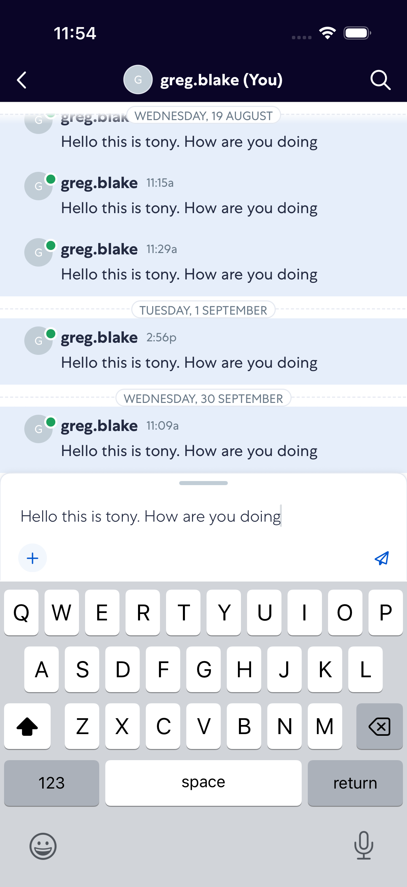

# newMessage

- Status: PASS
- Duration: 38s
- Lane: main-suite
- Logical category: main-suite
- Device: iPhone 17 Pro
- Appium port: 4723
- Started: 2026-10-06T15:53:49.443Z
- Finished: 2026-10-06T15:54:27.635Z

## Phase Timings

| Phase | Duration |
| --- | --- |
| Session creation | 0ms |
| Login/readiness | 16s |
| Test body | 22s |
| Screenshot capture | 503ms |
| Recovery | 0ms |
| Report generation | 0ms |

## Steps

### Step 1: Start Conversation

### Step 2: Typed Recipient

### Step 3: Selected Recipient

### Step 4: Message Typed

